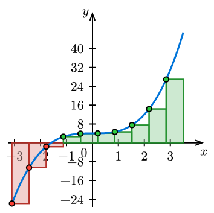
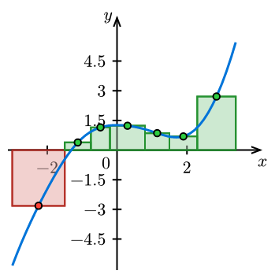
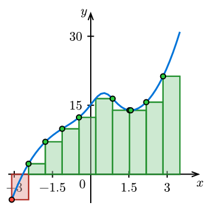
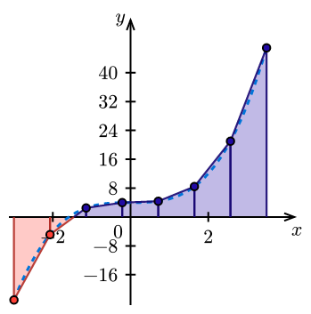

# IntSketcher

**IntSketcher** is a [Typst](https://typst.app/) package built on
[CeTZ](https://github.com/cetz-package/cetz) designed to visualize Riemann sums
and Darboux sums. It allows you to easily draw left, right, midpoint, and
trapezoidal sums, as well as lower and upper Darboux sums, for any given function.

## Features

- **Riemann Sums**: Supports "left", "right", and "mid" methods.
- **Darboux Sums**: Supports "lower" and "upper" sums.
- **Trapezoidal Rule**: Specialized function for trapezoidal visualizations.
- **Custom Partitions**: Support for both uniform grids and custom
tagged/untagged partitions.

## Usage

First, import the package into your Typst file:

```typst
#import "@preview/intsketcher:0.5.0": intsketcher, trapezoidal
```

## Examples

The following examples demonstrate how to use `intsketcher` and `trapezoidal`
within a CeTZ `canvas`.

### 1. Left-Hand Riemann Sum
Draws rectangles based on the function value at the left of each sub-interval.

```typst
#import "@preview/cetz:0.4.2": canvas
#import "@preview/intsketcher:0.5.0": intsketcher

#canvas({
  intsketcher(
    x => calc.pow(x, 3) + 4,
    method: "left",
    start: -3.1,
    end: 3.5,
    n: 10,
    plot-x-tick-step: 1,
  )
})
```



### 2. Midpoint Riemann Sum with Custom Partition
You can define a specific partition manually for non-uniform intervals.

```typst
#import "@preview/cetz:0.4.2": canvas
#import "@preview/intsketcher:0.5.0": intsketcher

#canvas({
  intsketcher(
    x => 0.17 * calc.pow(x, 3) + 1.5 * calc.sin(calc.cos(x)),
    method: "mid",
    partition: (-3, -1.5, -0.75, -0.2, 0.8, 1.5, 2.3, 3.4),
    plot-x-tick-step: 2,
  )
})
```



### 3. Lower Darboux Sum
Visualizes the lower sum by finding the minimum value within each interval.

```typst
#import "@preview/cetz:0.4.2": canvas
#import "@preview/intsketcher:0.5.0": intsketcher

#canvas({
  intsketcher(
    x => calc.pow(x, 3) + 4,
    method: "lower",
    start: -3.1,
    end: 3.5,
    n: 10,
  )
})
```



### 4. Trapezoidal Rule
A dedicated function for drawing trapezoids instead of rectangles.

```typst
#import "@preview/cetz:0.4.2": canvas
#import "@preview/intsketcher:0.5.0": trapezoidal

#canvas({
  trapezoidal(
    x => calc.pow(x, 3) + 4,
    start: -3,
    end: 3.5,
    n: 7,
    positive-color: rgb("#210aa4"),
    plot-x-tick-step: 2,
  )
})
```



## Parameters

### `intsketcher`
- **`fn`**: The function to sketch (e.g., `x => x * x`).
- **`method`**: The calculation method: `"left"`, `"right"`, `"mid"`, `"lower"`,
or `"upper"`.
- **`start` / `end`**: The domain to calculate the sum over.
- **`n`**: Number of sub-intervals (for uniform partitions).
- **`partition`**: An array of x-coordinates for a custom partition.
- **`tags`**: An array of x-coordinates for tagged Riemann sums.
- **`sample-points`**: Number of sample points in each subinterval for Darboux
sums.

### `trapezoidal`
- **`fn`**: The function to sketch.
- **`start` / `end`**: Range of the approximation.
- **`n`**: Number of trapezoids.
- **`partition`**: An array of x-coordinates for a custom partition.

### Common display parameters
Here're some display parameters.  Please refer to the manual for details.
- **`positive-color`**: Color for the area above the x-axis.
- **`negative-color`**: Color for the area below the x-axis.
- **`dot-radius`**: A number (in pixels) for the radius of dots.
- **`size`**: The width and height of the plot area, given as a tuple like `(5, 5)`.

## License

This package is licensed under the MIT License.
Created by Kainoa Kanter and Vincent Tam.