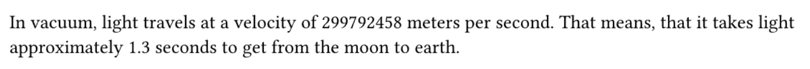
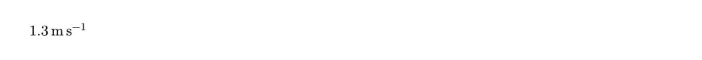

# Invaria

This is a Typst package for providing (physical) constants. It is derived from the following sources:

- Fundamental Physical Constants of [NIST](http://physics.nist.gov/constants) (2022 CODATA recommended values)[^1]
  - [PDF](https://physics.nist.gov/cuu/pdf/all.pdf)
  - [Text](https://physics.nist.gov/cuu/Constants/Table/allascii.txt)


## Usage

The constants are grouped into categories just like in the NIST CODATA database. Some variables can occur in multiple of those categories, just use the one that fits you best.

Each constant is a [Typst dictionary](https://typst.app/docs/reference/foundations/dictionary/) and its variable name is the normalized quantity name. The dictionary contains the various information of the constant e.g.
```typst
#let electron-mass = (
  val: 9.1093837139e-31,
  uncert: 2.8e-40,
  unit: "kg",
  symbol: $m_upright(e)$,
  quantity: "electron mass"
)
```

Currently, the following information is included:

| Key      | Description | Additional information |
|----------|-------------|------------------------|
| `val`    | The constant value |  |
| `uncert` | The constants uncertainty<br>(in the unit of the value) | `none` if exact |
| `unit`   | The unit of the constant | See [issue #3](https://github.com/q-wertz/invaria/issues/3) |
| `symbol` | The symbol as the constant is usually written | Currently LaTeX code, see [issue #10](https://github.com/q-wertz/invaria/issues/10) |
| `quantity` | The name of the constant |  |

**Sidenote:**\
There is also a `.yaml` file containing all the constants.

### Importing Constants

There are various ways to use the imports. A non-exhaustive list of examples:
- Usage by full identifier
  ```
  #import "@preview/invaria:0.2.0"

  #invaria.codata2022.defined-constants.speed-of-light-in-vacuum
  ```
  This could be useful in case you want to compare the same constant from different data sources.
- You can load the CODATA2022 constants only
  ```typst
  #import "@preview/invaria:0.2.0": codata2022

  #codata2022.defined-constants.speed-of-light-in-vacuum
  ```
  Useful if you are using a lot of constants but want to stay in the same data source.
- Only load a single category
  ```typst
  #import "@preview/invaria:0.2.0": codata2022.defined-constants

  #defined-constants.speed-of-light-in-vacuum
  ```
- Only load a single constant
  ```typst
  #import "@preview/invaria:0.2.0": codata2022.defined-constants.speed-of-light-in-vacuum

  #speed-of-light-in-vacuum
  ```
- Load all units from a single category of the CODATA2022 dataset
  ```typst
  #import "@preview/invaria:0.2.0"
  #import invaria.codata2022.universal: *

  #speed-of-light-in-vacuum
  ```
- Load all units from the CODATA2022 dataset
  ```typst
  #import "@preview/invaria:0.2.0"
  #import invaria.codata2022.all: *

  #speed-of-light-in-vacuum
  ```
  Warning: Imports a lot of variables. Increases the probability of naming clashes.


### Using the Constants

You can use the constants and meta information for example in calculations and for typing out in your documents.

```typst
#import "@preview/invaria:0.2.0": codata2022.defined-constants.speed-of-light-in-vacuum

#let earth-moon-dist = 385000e3

In vacuum, light travels at a velocity of #speed-of-light-in-vacuum.val meters per second.
That means, that it takes light approximately #calc.round(earth-moon-dist / speed-of-light-in-vacuum.val, digits: 1) seconds to get from the moon to earth.
```

Output:\



#### Unit Libraries

There are various Typst packages to support number and unit formatting e.g., [zero](https://typst.app/universe/package/zero) and [unify](https://typst.app/universe/package/unify).

⚠️ Currently, quantities are stored as `float` values in this package. As a result, integration with the unit packages does not work seamlessly and can be fiddly in some places. See also [issue #11](https://github.com/q-wertz/invaria/issues/11). Suggestions for improving this are very welcome.

**zero**
- Rendering units using [`quan`](https://github.com/Mc-Zen/zero#1-the-quan-function) (since [version 0.7.0](https://github.com/Mc-Zen/zero/releases/tag/v0.7.0))
  ```typst
  #import "@preview/zero:0.7.0"
  #import "@preview/invaria:0.2.0": codata2022
  #import codata2022: universal.newtonianConstantOfGravitation

  // Number and unit
  #zero.quan[#newtonianConstantOfGravitation.val #newtonianConstantOfGravitation.unit]

  // Number, uncertainty and unit
  #zero.quan[#newtonianConstantOfGravitation.val+-#newtonianConstantOfGravitation.uncert #newtonianConstantOfGravitation.unit]
  ```
- Number formatting using [`num`](https://github.com/Mc-Zen/zero#num)
  ```typst
  #import "@preview/zero:0.7.0"
  #import "@preview/invaria:0.2.0": codata2022.defined-constants.speed-of-light-in-vacuum

  #zero.num(speed-of-light-in-vacuum.val, exponent: "sci")
  ```

**unify**
```typst
#import "@preview/unify:0.8.1": qty
#import "@preview/invaria:0.2.0": codata2022
#import codata2022.all: *

#let earth-moon-dist = 385000e3

// Number and unit
#qty(calc.round(earth-moon-dist / speed-of-light-in-vacuum.val, digits: 1), speed-of-light-in-vacuum.unit)
```

Output:\


## Development

The idea of this library is to use a python script to extracts the information from various data sources, combine it, structure it and output the Typst files.

The tool uses the [NIST allascii table](https://physics.nist.gov/cuu/Constants/Table/allascii.txt) as basis and enriches it with information scraped from the [NIST CODATA website](https://physics.nist.gov/cuu/Constants/index.html).
In theory the website contains all the information. But the original goal was, to read the information from the text and PDF files.
Would still be nice to be independent of the NIST website, but retrieving the information from the PDF turned out to be more complicated than initially expected.

You can use e.g. [`uv`](https://docs.astral.sh/uv/) to run the `extract_tool.py` without caring much about the dependencies:
```shell
uv run -m tools.invaria_extract_tool
```

If you take care about the installation of the packages yourself you can use
```shell
python run tools.invaria_extract_tool
```

The script also fills the tytanic unit test files. The tests creates a table with all the constants and their metadata (e.g. `tests/codata2022/test.typ`).

### Project Structure
```text
├── data-sources                   # The original files from the NIST website
├── gallery                        # Images used in the README.md
├── invaria_pylib                  # Reusable python code for the `tools`
├── LICENSE
├── pyproject.toml
├── README.md
├── src                            # Typst source code
│   ├── CODATA2022                 # Folder containing a full set of constants
│   ├── common_packages.typ        # Package imports required in multiple Typst files
│   └── lib.typ                    # Entrypoint of the Typst package
├── tests                          # Tytanic tests (Typst)
├── tools                          # (Python) scripts assisting in generating the Typst package
│   └── invaria_extract_tool.py
├── typst.toml
└── uv.lock
```

## References
[^1]: Eite Tiesinga, Peter J. Mohr, David B. Newell, and Barry N. Taylor (2024), "The 2022 CODATA Recommended Values of the Fundamental Physical Constants" (Web Version 9.0). Database developed by J. Baker, M. Douma, and S. Kotochigova. Available at https://physics.nist.gov/constants, National Institute of Standards and Technology, Gaithersburg, MD 20899.
