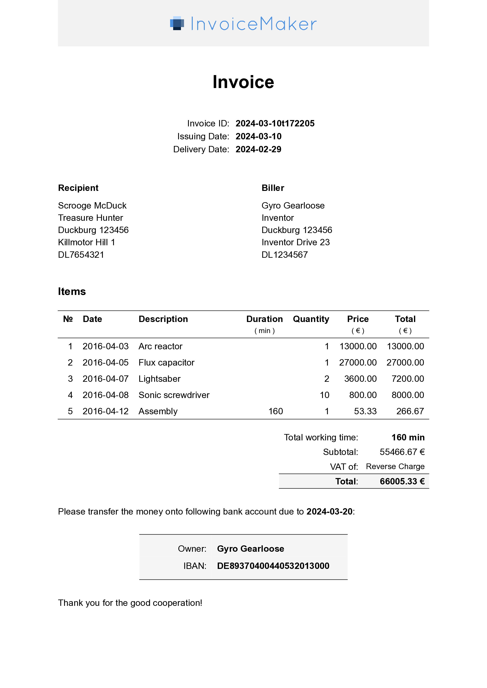

# Invoice Maker

Generate beautiful invoices from a simple data record.




## Features

- **Simple, yet Powerful**
    - Write invoices as simple `.typ` or `.yaml` files
    - Support for cancellations, discounts, and taxes
- **Multilingual**
    - Integrated support for English and German
    - Easy to add more languages by adding a translation dictionary
        (Check out this example:
        [custom-language.typ](
          https://github.com/ad-si/invoice-maker/blob/master/examples/custom-language.typ))
- **Customizable**
    - User your own banner image
    - Customize the colors and fonts
- **Elegant**
    - Modern design with a focus on readability
    - PDFs with a professional look
- **Stable**
    - Visual regression tests to ensure consistent output
- **Free and Open Source**
    - ISC License


## Usage

```typst
#import "@preview/invoice-maker:1.0.0": *

#show: invoice.with(
  language: "en", // or "de"
  banner_image: image("banner.png"),
  invoice_id: "2024-03-10t183205",
  …
)
```

Check out the [GitHub repository](https://github.com/ad-si/invoice-maker)
for more information and examples.
