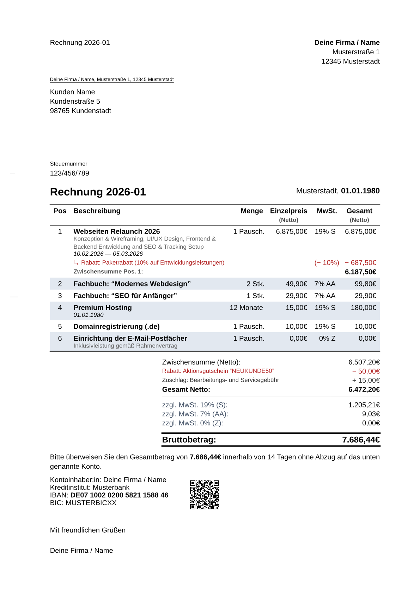
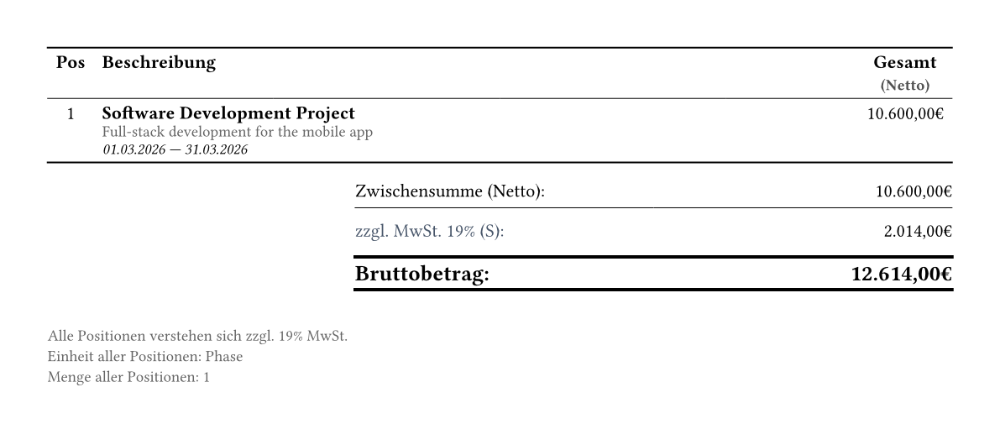
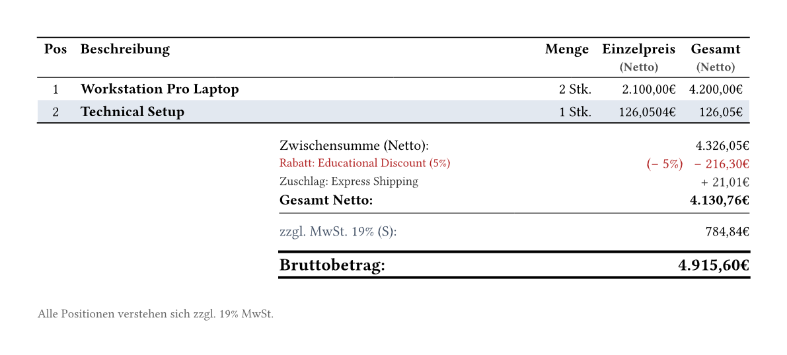
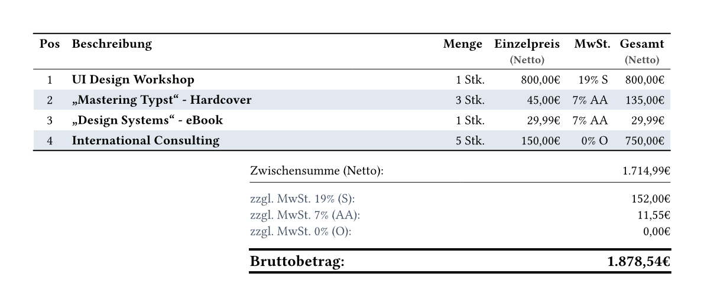

# invoice-pro

Modern Invoice Template for Typst

A professional, compliant, and automated invoice template for [Typst](https://typst.app). This package follows the German **DIN 5008** standard (Form A & B) and automates calculations, VAT handling, and payment details.



## Features

- **DIN 5008 Compliant:** Supports both Form A and Form B layouts via the new Theming API.
- **Block-based API (v0.2.0):** Clean, scoped, and declarative structure using `#line-items`, `#item`, and `#bundle`—inspired by CeTZ.
- **Automatic Calculations:** Handles line items, sub-totals, and VAT (MwSt) automatically.
- **EPC QR-Code (GiroCode):** Generates a scannable banking QR code for easy payment apps using `rustycure`.
- **Advanced Item Modifiers:** Apply specific discounts, surcharges, and tax rates at the item, bundle, or global level.
- **Customizable:** Easy configuration of sender, recipient, payment goals, and bank details.

## Getting Started

### Installation

Import the package at the top of your Typst file:

```typst
#import "@preview/invoice-pro:0.2.0": *
```

### Basic Usage

Here is an example of how to create an invoice using the new v0.2.0 API:

```typst
#import "@preview/invoice-pro:0.2.0": *

#show: invoice.with(
  theme: themes.DIN-5008(form: "A"), // or form: "B"
  sender: (
    name: "Deine Firma / Name",
    address: "Musterstraße 1",
    city: "12345 Musterstadt",
  ),
  recipient: (
    name: "Kunden Name",
    address: "Kundenstraße 5",
    city: "98765 Kundenstadt",
  ),
  invoice-nr: "2026-01",
  tax-nr: "123/456/789",
)

// Add Invoice Items inside a scoped block
#line-items[
  #item(
    [Beratung & Konzeption],
    price: 85.00,
    quantity: 5,
    unit: "Std."
  )

  #item(
    [Webdesign Layout (Pauschale)],
    price: 1200.00,
  )

  #item(
    [Stock-Lizenzen (Bildmaterial)],
    price: 25.00,
    quantity: 4,
  )

  #discount([Projekt-Rabatt (Stammkunde)], amount: 10%)
]

// Payment Terms
#payment-goal(days: 14)

// Bank Details with QR Code
#bank-details(
  bank: "Musterbank",
  iban: "DE07100202005821158846",
  bic: "MUSTERBIC",
)

#signature()
```

## Configuration

### `invoice` arguments

| Argument               | Type                                        | Description                                                                                          |
| :--------------------- | :------------------------------------------ | :--------------------------------------------------------------------------------------------------- |
| `theme`                | `function`                                  | The visual theme to apply to the invoice (e.g., `themes.DIN-5008()`).                                |
| `locale`               | `function`                                  | The locale settings for language and number formatting (e.g., `locale.de`).                          |
| `sender`               | `dictionary`                                | A dictionary containing sender details (e.g., name, address).                                        |
| `recipient`            | `dictionary`                                | A dictionary containing recipient details (e.g., name, address).                                     |
| `date`                 | `datetime`                                  | The date of the invoice. Defaults to today.                                                          |
| `subject`              | `string` \| `content`                       | The subject line of the invoice. Defaults to `"Rechnung"`.                                           |
| `references`           | `none` \| `dictionary` \| `array`           | Reference information for the document header (e.g., customer number).                               |
| `invoice-nr`           | `none` \| `string` \| `content`             | The unique identifier or number of the invoice.                                                      |
| `tax-nr`               | `none` \| `string` \| `content`             | Your unique tax identifier.                                                                          |
| `tax`                  | `auto` \| `ratio` \| `dictionary` \| `none` | The default tax rate to apply if not specified elsewhere. If `auto`, it is inferred from the locale. |
| `tax-mode`             | `string`                                    | Determines if prices are handled as `"inclusive"` or `"exclusive"` of tax.                           |
| `tax-exempt-small-biz` | `bool`                                      | If true, applies small business tax exemption logic according to the locale.                         |
| `body`                 | `content`                                   | The content of the invoice, typically containing line-items and other components.                    |

### Theming

You can customize the underlying layout using the new theming engine:

```typst
#show: invoice.with(
  theme: themes.DIN-5008(
    form: "A", // "A" or "B"
    font: "Liberation Sans",
    hole-mark: true,
    folding-marks: true
  ),
  // ...
)
```

### `line-items` function

The `line-items` block establishes tax settings, global modifiers, and wraps your items.

| Argument           | Type                                     | Description                                                                                                                                      |
| :----------------- | :--------------------------------------- | :----------------------------------------------------------------------------------------------------------------------------------------------- |
| `input-gross`      | `bool` \| `auto`                         | Defines whether the input prices within this container are treated as gross (inclusive of tax) by default. If `auto`, infers from `tax-mode`.    |
| `tax`              | `ratio` \| `dictionary` \| `auto`        | The default tax rate or tax dictionary applied to the items within this container. Defaults to `0%` if not provided.                             |
| `tax-mode`         | `"exclusive"` \| `"inclusive"` \| `auto` | Determines how taxes are calculated globally. Defaults to `"exclusive"` (Net).                                                                   |
| `show-column`      | `dictionary` \| `auto`                   | Dictionary to override automatic table layout visibility. See possible inputs below.                                                             |
| `show-total`       | `bool` \| `auto`                         | Controls whether to display the summary/totals block below the line items table. Defaults to `true`.                                             |
| `show-information` | `bool` \| `auto`                         | Whether to show information notices about details that apply to all items (e.g., if all items share the same delivery date). Defaults to `true`. |
| `body`             | `content`                                | The content block containing nested `#item`, `#bundle`, `#discount`, and `#surcharge` elements.                                                  |

#### `show-column` inputs

You can selectively toggle specific columns or elements within the line items table by passing a dictionary to the `show-column` argument. For example: `#line-items(show-column: (pos: false, tax-rate: false))[...]`

| Key           | Type             | Description                                                                     |
| :------------ | :--------------- | :------------------------------------------------------------------------------ |
| `pos`         | `bool` \| `auto` | Visibility of the position/index column (e.g., 1, 2, 3).                        |
| `description` | `bool` \| `auto` | Visibility of the description text under the item name.                         |
| `modifier`    | `bool` \| `auto` | Visibility of individual modifier rows (discounts/surcharges) applied to items. |
| `date`        | `bool` \| `auto` | Visibility of the date text below the item name.                                |
| `quantity`    | `bool` \| `auto` | Visibility of the quantity column.                                              |
| `unit`        | `bool` \| `auto` | Visibility of the unit text (e.g., "Std.", "Stk.") next to the quantity.        |
| `unit-price`  | `bool` \| `auto` | Visibility of the individual unit price column.                                 |
| `total-price` | `bool` \| `auto` | Visibility of the calculated total price column for the item.                   |
| `tax-rate`    | `bool` \| `auto` | Visibility of the tax rate column.                                              |

### `item` function

Represents a single line item, product, or service on the invoice. It automatically calculates base prices, totals, and applies relevant taxes and modifiers.

| Argument        | Type                                                | Description                                                                                                               |
| :-------------- | :-------------------------------------------------- | :------------------------------------------------------------------------------------------------------------------------ |
| `name`          | `string` \| `content`                               | The name or title of the item.                                                                                            |
| `description`   | `string` \| `content` \| `auto` \| `none`           | Additional details or description about the item.                                                                         |
| `quantity`      | `int` \| `float` \| `decimal` \| `string` \| `auto` | The amount being billed. Automatically defaults to `1`.                                                                   |
| `base-quantity` | `int` \| `float` \| `decimal` \| `string` \| `auto` | The reference quantity for the price, useful for calculating price-per-unit ratios. Automatically defaults to `1`.        |
| `unit`          | `string` \| `content` \| `auto` \| `none`           | The unit of measurement (e.g., `"Std."`, `"Stk."`).                                                                       |
| `date`          | `datetime` \| `array` \| `auto` \| `none`           | The date or a date range `(start, end)` the item or service was provided.                                                 |
| `price`         | `int` \| `float` \| `decimal` \| `string` \| `auto` | The price per unit. _Note: You must specify either `price` or `total`, but not both_.                                     |
| `total`         | `int` \| `float` \| `decimal` \| `string` \| `auto` | The total price for the item. _Note: You must specify either `price` or `total`, but not both_.                           |
| `input-gross`   | `bool` \| `auto`                                    | Indicates if the provided price/total already includes tax.                                                               |
| `tax`           | `ratio` \| `dictionary` \| `auto`                   | The specific tax rate or tax dictionary for this item. Defaults to a zero tax rate.                                       |
| `item-id`       | `string` \| `dictionary` \| `auto` \| `none`        | An identifier for the item, such as an EAN/GTIN/ISBN string, or a dictionary with `seller`, `buyer`, and `standard` keys. |
| `reference`     | `string` \| `auto` \| `none`                        | An optional reference string for the item.                                                                                |
| `modifier`      | `array` \| `content` \| `auto` \| `none`            | Specific modifiers (like `#discount` or `#surcharge`) applied specifically to this item.                                  |

### `bundle` function

A container used to group multiple items together under a single overarching item. It aggregates the totals and dates of its bundled children and acts as a virtual item within the invoice.

| Argument        | Type                                                | Description                                                                                                                                |
| :-------------- | :-------------------------------------------------- | :----------------------------------------------------------------------------------------------------------------------------------------- |
| `name`          | `string` \| `content`                               | The name or title of the bundle.                                                                                                           |
| `description`   | `string` \| `content` \| `auto` \| `none`           | Additional details about the bundle. If set to `auto`, it automatically generates a description by joining the names of its bundled items. |
| `quantity`      | `int` \| `float` \| `decimal` \| `string` \| `auto` | The quantity of the entire bundle. Automatically defaults to `1`.                                                                          |
| `base-quantity` | `int` \| `float` \| `decimal` \| `string` \| `auto` | The reference quantity for the bundle's price calculation. Automatically defaults to `1`.                                                  |
| `unit`          | `string` \| `content` \| `auto` \| `none`           | The unit of measurement for the bundle.                                                                                                    |
| `date`          | `datetime` \| `array` \| `auto` \| `none`           | The date or date range for the bundle. If `auto`, it calculates a single date or date range based on the dates of the bundled items.       |
| `input-gross`   | `bool` \| `auto`                                    | Passed through the context to indicate if the bundle's internal calculations should be treated as gross (inclusive of tax).                |
| `tax`           | `ratio` \| `dictionary` \| `auto`                   | Passed through the context to set a default tax rate for the bundle's items. Defaults to a zero tax rate.                                  |
| `item-id`       | `string` \| `dictionary` \| `auto` \| `none`        | An identifier for the bundle, such as an EAN/GTIN/ISBN string, or a dictionary with `seller`, `buyer`, and `standard` keys.                |
| `reference`     | `string` \| `auto` \| `none`                        | An optional reference string for the bundle.                                                                                               |
| `body`          | `content`                                           | The content block containing the individual `item`s or nested `bundle`s that make up this bundle.                                          |

```typ
#line-items[
  #bundle(
    [Software Development Project],
    description: [Full-stack development for the mobile app],
    date: (date(1, 3, 2026), date(31, 3, 2026)),
    unit: "Phase",
  )[
    #item([Backend Development], quantity: 40, unit: "hrs", price: 110.00)
    #item([Frontend Implementation], quantity: 60, unit: "hrs", price: 95.00)
    #item([Project Management], quantity: 1, unit: "flat", price: 500.00)
  ]
]
```



### `modifier` function

Represents a generic modifier applied to an item, a bundle, or the entire invoice. It can handle both relative (percentage) and absolute (currency) modifications.

| Argument      | Type                                                           | Description                                                                                                                                                                              |
| :------------ | :------------------------------------------------------------- | :--------------------------------------------------------------------------------------------------------------------------------------------------------------------------------------- |
| `name`        | `string` \| `content`                                          | The name or label of the modifier (e.g., "Summer Sale Discount", "Shipping Fee").                                                                                                        |
| `description` | `string` \| `content` \| `auto` \| `none`                      | An optional description providing more details about the modifier.                                                                                                                       |
| `amount`      | `ratio` \| `int` \| `float` \| `decimal` \| `string` \| `auto` | The value of the modifier. Ratios (e.g., `-10%`) apply relative changes. Numeric values act as absolute monetary changes. Negative values are discounts; positive values are surcharges. |
| `input-gross` | `bool` \| `auto`                                               | Indicates whether the modifier's absolute amount should be treated as a gross value (inclusive of tax). Automatically defaults to `false`.                                               |

```typ
#line-items(input-gross: true)[
  #item([Workstation Pro Laptop], quantity: 2, price: 2499.00)
  #item([Technical Setup], total: 150.00)

  // Absolute surcharge
  #surcharge([Express Shipping], amount: 25.00)

  // Relative discount
  #discount([Educational Discount (5%)], amount: 5%)
]
```



---

### `discount` / `surcharge` function

Helper functions to apply modifiers safely. They enforce positive input values and handle the underlying signs automatically.

| Argument      | Type                                                 | Description                                                                                                     |
| :------------ | :--------------------------------------------------- | :-------------------------------------------------------------------------------------------------------------- |
| `name`        | `string` \| `content`                                | The name or label of the discount or surcharge.                                                                 |
| `description` | `string` \| `content` \| `auto` \| `none`            | An optional description providing more details.                                                                 |
| `amount`      | `ratio` \| `int` \| `float` \| `decimal` \| `string` | The value. **Must be a positive number or ratio.** Defaults to `0`.                                             |
| `input-gross` | `bool` \| `auto`                                     | Indicates whether an absolute amount is treated as gross (inclusive of tax). Automatically defaults to `false`. |

```typst
#discount([Summer Sale], amount: 15%)
#surcharge([Express Delivery], amount: 20.00)
```

### `apply` function

```typ
#line-items[
  #item([UI Design Workshop], quantity: 1, price: 800.00)

  // Scoped tax application for multiple items
  #apply(tax: tax.lower-rate(7%))[
    #item(["Mastering Typst" - Hardcover], quantity: 3, price: 45.00)
    #item(["Design Systems" - eBook], quantity: 1, price: 29.99)
  ]

  // Single item tax override (e.g., tax-exempt service)
  #item(
    [International Consulting],
    price: 150.00,
    quantity: 5,
    tax: tax.outside-scope()
  )
]
```



### `payment-goal` function

| Argument | Type                        | Description                              |
| :------- | :-------------------------- | :--------------------------------------- |
| `days`   | int \| none                 | The number of days until payment is due. |
| `date`   | datetime \| content \| none | A date until payment is due.             |

```typst
#payment-goal()
```

> Bitte überweisen Sie den Gesamtbetrag von **123,45€** zeitnah ohne Abzug auf das unten genannte Konto.

```typst
#payment-goal(days: 14)
```

> Bitte überweisen Sie den Gesamtbetrag von **123,45€** innerhalb von 14 Tagen ohne Abzug auf das unten genannte Konto.

```typst
#payment-goal(date: datetime(day: 1, month: 1, year: 2026))
```

> Bitte überweisen Sie den Gesamtbetrag von **123,45€** bis spätestens 01.01.2026 ohne Abzug auf das unten genannte Konto.

### `bank-details` function

Defines and renders the bank account information for payments, including an optional EPC-QR code for mobile payment apps.

| Argument              | Type                                              | Description                                                                                           |
| :-------------------- | :------------------------------------------------ | :---------------------------------------------------------------------------------------------------- |
| `name`                | `string` \| `auto` \| `none`                      | The name of the account holder. If `auto`, it defaults to the sender's name.                          |
| `bank`                | `string` \| `none`                                | The name of the banking institution.                                                                  |
| `iban`                | `string` \| `none`                                | The International Bank Account Number (IBAN).                                                         |
| `bic`                 | `string` \| `none`                                | The Bank Identifier Code (BIC/SWIFT).                                                                 |
| `reference`           | `string` \| `auto` \| `none`                      | The payment reference to be used by the customer.                                                     |
| `payment-amount`      | `decimal` \| `float` \| `int` \| `auto` \| `none` | The specific amount to be paid. If `auto`, it uses the calculated document total.                     |
| `show-reference`      | `bool`                                            | Whether to display the reference field in the output. Defaults to `true`.                             |
| `account-holder-text` | `auto`                                            | Optional custom text to label the account holder field.                                               |
| `qr-code`             | `dictionary`                                      | Configuration for a payment QR code (e.g., EPC-QR). Can include `display` (bool) and `size` (length). |

```typst
// Standard usage with automatic total and reference
#bank-details(
  bank: "Sparkasse Musterstadt",
  iban: "DE00 1234 5678 9012 3456 78",
  bic: "SPKDE...",
)
```

## API Stability

With the major refactoring introduced in version 0.2.0, the package structure is solidifying. Here is the current stability status of the various API components:

- **Invoice Header (`invoice` arguments):** **Mostly Stable**. The core invoice configuration is established. Future updates to the header will be non-breaking and will primarily consist of adding new optional fields.
- **Data Model (`#line-items`, `#bundle`, `#item`):** **Stable**. The new block-based data model is considered almost finished and safe to use.
  - _Exception:_ The `unit` argument in `#item` and `#bundle` will change in a future release to strictly comply with the standardized unit formats and codes required for upcoming ZUGFeRD e-invoicing support.
- **Theming (`theme`):** **Under Construction**. The theming engine is still evolving and will most likely experience breaking changes in the next updates as we refine customization capabilities.
- **Localization (`locale`):** **Under Construction**. The localization and internationalization systems are actively being worked on and are subject to change.

## Dependencies

This template relies on these amazing packages:

- `letter-pro` for the DIN layout.
- `sepay` for EPC-QR-Code generation.
- `ibanator` for IBAN formatting.
- `loom` for reactive document rendering.

**Acknowledgements:**

- Special thanks to [classy-german-invoice](https://github.com/erictapen/typst-invoice) by Kerstin Humm, which served as inspiration and provided the logic for the EPC-QR-Code implementation.

## License

MIT
