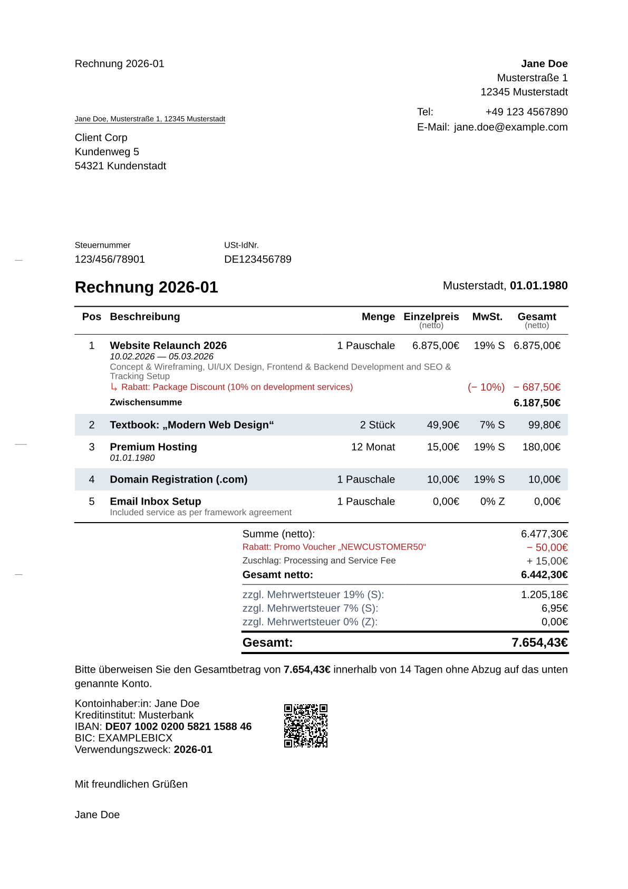

# invoice-pro

Modern Invoice Template for Typst

A professional, compliant, and automated invoice template for [Typst](https://typst.app) with integrated ZUGFeRD e-invoicing support. This package follows the German **DIN 5008** standard (Form A & B) and automates calculations, VAT handling, and payment details.



## Features

- **Internationalization (i18n) (New in v0.3.0):** Built-in support for English and German out of the box, plus a highly flexible `locale` API to inject custom translations for any language.
- **DIN 5008 Compliant:** Supports both Form A and Form B layouts natively via the flexible Theming API.
- **ZUGFeRD e-invoicing (New in v0.4.0):** (Experimental) Embed EN 16931-compliant Factur-X/ZUGFeRD XML metadata into your generated PDF/A-3B invoices for automated digital processing.
- **Block-based API:** Clean, scoped, and declarative data structure using `#line-items`, `#item`, and `#bundle`—inspired by CeTZ, keeping your document clutter-free.
- **Automatic Calculations:** Effortlessly handles line items, nested bundles, sub-totals, and calculates taxes automatically.
- **EPC QR-Code (GiroCode):** Automatically generates a scannable banking QR code for quick and easy payments using banking apps.
- **Advanced Modifiers:** Apply specific discounts, surcharges, and custom tax rates at the item, bundle, or global level.
- **Highly Customizable:** Easy configuration of sender, recipient, payment goals, bank details, and visual themes to match your corporate identity.

## Documentation

For comprehensive guides, API references, theming instructions, and advanced examples, please visit our official documentation:

👉 **[Read the Full Documentation Here](https://leonieziechmann.github.io/invoice-pro/)**

## Getting Started

### Installation

Import the package at the top of your Typst file:

```typst
#import "@preview/invoice-pro:0.4.0": *
```

### Basic Usage

Here is an example of how to create an invoice using the new v0.3.0 API:

```typst
#import "@preview/invoice-pro:0.4.0": *

#show: invoice.with(
  theme: themes.DIN-5008(form: "A"), // or form: "B"
  locale: locale.en-de,
  sender: (
    name: "Your Company / Name",
    address: "1 Example Street",
    city: "12345 Example City",
    tax-nr: "123/456/789",
  ),
  recipient: (
    name: "Customer Name",
    address: "5 Customer Street",
    city: "98765 Customer City",
  ),
  invoice-nr: "2026-01",
)

// Add Invoice Items inside a scoped block
#line-items[
  #item(
    [Consulting & Concept],
    price: 85.00,
    quantity: 5,
    unit: "hrs"
  )

  #item(
    [Web Design Layout (Flat Rate)],
    price: 1200.00,
  )

  #item(
    [Stock Licenses (Images)],
    price: 25.00,
    quantity: 4,
  )

  #discount([Project Discount (Regular Customer)], amount: 10%)
]

// Payment Terms
#payment-goal(days: 14)

// Bank Details with QR Code
#bank-details(
  bank: "Example Bank",
  iban: "DE07100202005821158846",
  bic: "EXAMPLEBICX",
)

#signature()
```

## API Stability

With the major refactoring introduced in version 0.2.0, the package structure is solidifying. Here is the current stability status of the various API components:

- **Invoice Header (`invoice` arguments):** **Mostly Stable**. The core invoice configuration is established. Future updates to the header will be non-breaking and will primarily consist of adding new optional fields.
- **Data Model (`#line-items`, `#bundle`, `#item`):** **Stable**. The new block-based data model is considered almost finished and safe to use.
  - _Note:_ The `unit` argument in `#item` and `#bundle` supports dictionary inputs (e.g., `(display: "Std.", code: "HUR")`) to comply with the standardized unit formats and codes required for ZUGFeRD e-invoicing.
- **Theming (`theme`):** **Under Construction**. The theming engine is still evolving and will most likely experience breaking changes in the next updates as we refine customization capabilities.
- **Localization (`locale`):** **Under Construction**. The localization and internationalization systems are actively being worked on and are subject to change.

## 🛠️ Development

This project uses **Nix** to provide a reproducible, sandboxed development environment. You do not need to install Typst, linters, or formatters globally—the flake provides everything.

### Try it out (No Install)

You can instantly compile a `.typ` file using the latest unreleased version of this template directly from GitHub, without entering a development shell:

```bash
nix run github:leonieziechmann/invoice-pro -- my-invoice.typ
# Or locally from the repository root:
nix run .#default -- my-invoice.typ
```

### Quick Start

1. **Enter the environment:**

```bash
nix develop
# or if you use direnv:
direnv allow
```

This activates a shell containing `typst`, `typstyle`, `markdownlint`, and `prettier`.

2. **Automatic Package Linking:**
   The environment automatically links the current directory to a sandboxed local package registry (inside `.typst-data`). You can import the package in your test files immediately without manual installation:

```typst
#import "@preview/invoice-pro:0.4.0": *
```

3. **Quality Control:**
   To run the full suite of Pull Request checks (linter, tests, and documentation build) locally before submitting a PR, you can use the built-in test runner:

```bash
check-pr
```

## 🗺️ Roadmap

I am actively working on improving this template. Here is what's planned for future releases:

- [x] (v0.2.0) **Refactored API:** Moving away from global states to a more robust, scoped API (inspired by CeTZ) for better stability and flexibility.
- [x] (v0.3.0) **Internationalization (i18n):** Built-in support for English and other languages (currently creates German invoices by default).
- [x] (v0.4.0) **ZUGFeRD Support:** (Experimental) Embedding XML data for fully compliant e-invoicing.
- [ ] (WIP) **Theming Engine:** Allow easy customization of accent colors and fonts to match corporate identities.
- [ ] **Data Loading:** Helper functions to load invoice items directly from JSON, CSV, or YAML files.

Have an idea? Feel free to open an issue or pull request!

## Dependencies

This template relies on these amazing packages:

- `letter-pro` for the DIN layout.
- `sepay` for EPC-QR-Code generation.
- `ibanator` for IBAN formatting.
- `loom` for reactive document rendering.

**Acknowledgements:**

- Special thanks to [classy-german-invoice](https://github.com/erictapen/typst-invoice) by Kerstin Humm, which served as inspiration and provided the logic for the EPC-QR-Code implementation.
- The ZUGFeRD e-invoicing implementation was contributed by [Michael Fuchs (theexiile1305)](https://github.com/theexiile1305).

## License

MIT
