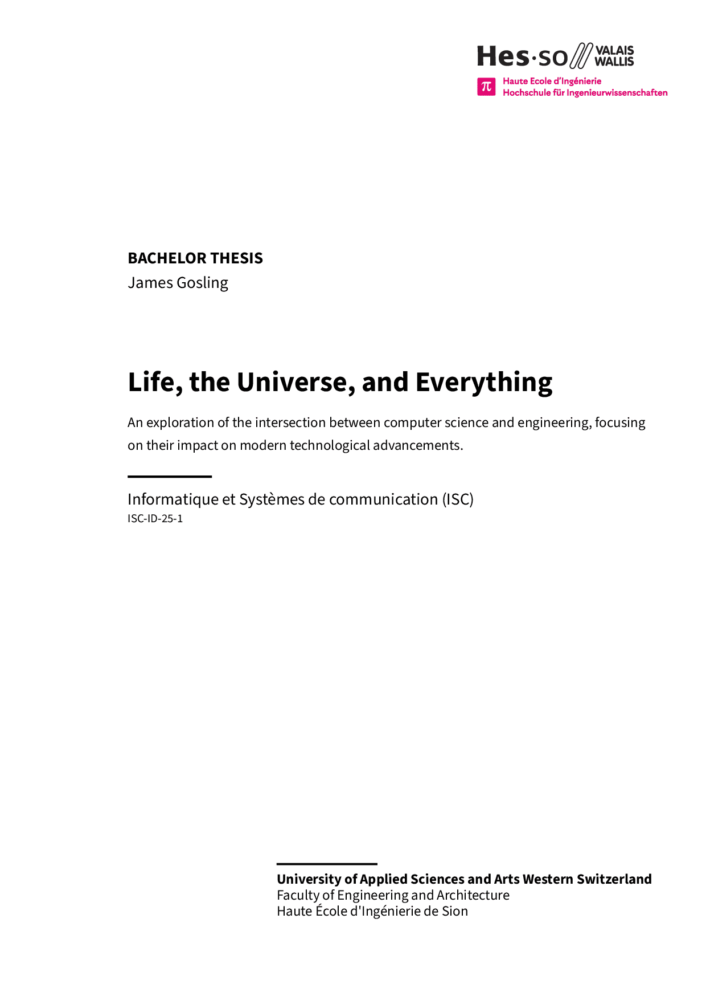

<p align="right">
    
</p>


# Bachelor Thesis Template for ISC Students

This is the official template for bachelor theses for the [ISC degree programme](https://isc.hevs.ch/) at the School of Engineering in Sion. It is part of the official templates repository, which also include templates for reports (`isc-hei-report`) and executive summaries (`isc-hei-exec-summary`).

<p align="center">
   <a href="https://github.com/ISC-HEI/isc-hei-student-templates/blob/ad7ebe178126b2910e3a0e2ba1b1929cf24e47f3/examples/bachelor_thesis.pdf?raw=true"></a>  
</p>

## Using the Template on the Web

In the `Typst` web application, start a new project with the `isc-hei-bthesis` template and voilà!

## Using the Template in Your Shell

First, install `Typst` on your machine by following the [official instructions](https://github.com/typst/typst).

### Installing Fonts Locally

If you are running `typst` locally, you might be missing some required fonts. For your convenience, a font download script is included in the repository. All fonts are released under the [SIL Open Font License](https://openfontlicense.org/), so there are no file inclusion issues.

To install the fonts locally on a Linux environment, simply type:

```bash
source install_fonts.sh
```

from within the `fonts` directory.

### Project Initialization and Compilation

You can initialize the project with the command:

```bash
typst init @preview/isc-hei-bthesis
```

If you need a specific template version, use:

```bash
typst init @preview/isc-hei-bthesis:0.5.0
```

## Including PDF Images

Unfortunately, `typst` does not support PDF file inclusion at the time of writing this documentation. As a temporary workaround, PDF files can be converted to SVG using `pdf2svg`.

# Usage

When used locally, creating a PDF is straightforward with the command:

```bash
typst compile bachelor_thesis.typ
```

Even better, the following command compiles the report every time the file is modified:

```bash
typst watch bachelor_thesis.typ
```

You can also use `VSCode` or `VSCodium` with the `Typst LSP` plugin, which enables direct compilation.

# Questions and Help

If you need any help installing or running these tools, do not hesitate to contact the maintainer [pmudry](https://github.com/pmudry).

You can also propose changes using pull requests or raise issues if something is unclear. Have fun writing your reports!
