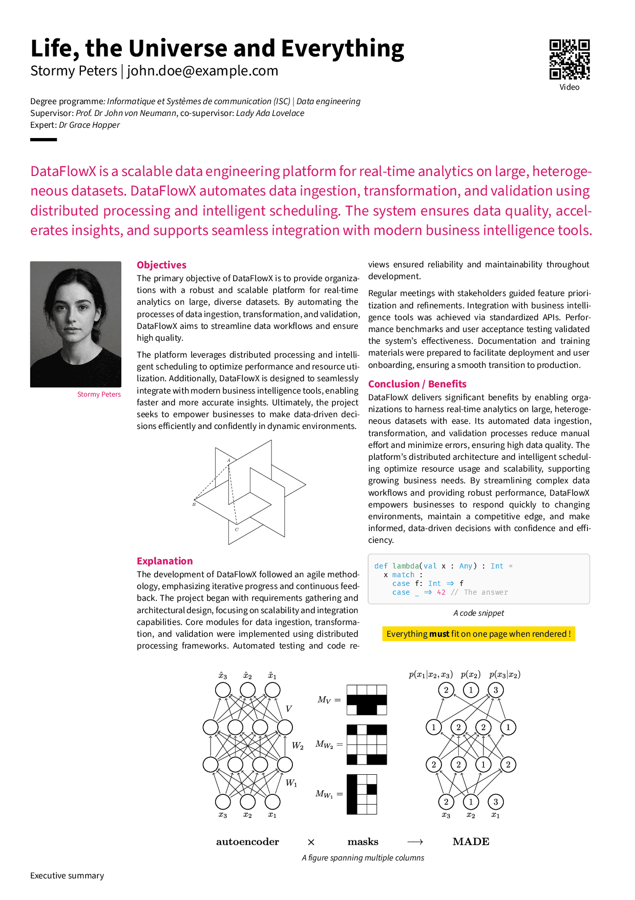

<p align="right">
  
</p>


# Document templates for ISC students :scroll:

This is the official templates for reports, bachelors thesis and project executive summary for the [ISC degree programme](https://isc.hevs.ch/) at the School of engineering in Sion. It is made to help the students focus on content, using `Tyst` as the typesetting software.


<p align="center">
  <a href="examples/bachelor_thesis.pdf?raw=true">
  <a href="examples/exec_summary.pdf?raw=true">
  <a href="examples/report.pdf?raw=true">
</p>

## Using the template, on the Web

In the `Typst` web application, start with the `isc-hei-report` and voilà ! 

## Using one of templates in your shell
First start by installing `Typst` on your machine. You can then initialize the project with the command :

```bash
typst init @preview/isc-hei-report
```

This template will initialize an sample report with sensible default values.

For the latest template for a bachelor thesis, use: 

```bash
typst init @preview/isc-hei-bthesis
```

or if you need a specific version, use:

```bash
typst init @preview/isc-hei-bthesis:0.5.0
```

For the latest template of the executive summary, use: 

```bash
typst init @preview/isc-hei-exec-summary
```

## Installing fonts locally

If you are running `typst` locally, you might miss some of the required fonts. For your convenience, a font download script is included in this repos. As all the fonts are released under the [SIL Open Font License](https://openfontlicense.org/), there are no file inclusion issues here.

To the install the fonts locally in a Linux environment, simply type

```bash
source install_fonts.sh
```

from within the `fonts` directory.

## PDF images inclusion

Unfortunately, `typst` does not support PDF file types inclusion at the time of writing this documentation. As a temporary workaround, PDF files can be converted to SVG via `pdf2svg`.

# Usage

When used locally, creating a PDF is straightforward with the command

```bash
typst compile report.typ
```

Even nicer, the following command compiles the report every time the file is modified.

```bash
typst watch report.typ
```

Another nice possibility is of course to use VScod(e | ium) via the `Typst LSP` plugin which enables direct compilation.

# Questions and help

If you need any help for installing or running those tools, do not hesitate to get in touch with its maintainer [pmudry](https://github.com/pmudry).

You can of course also propose changes using PR or raise issues if something is not clear. Have fun writing reports!
