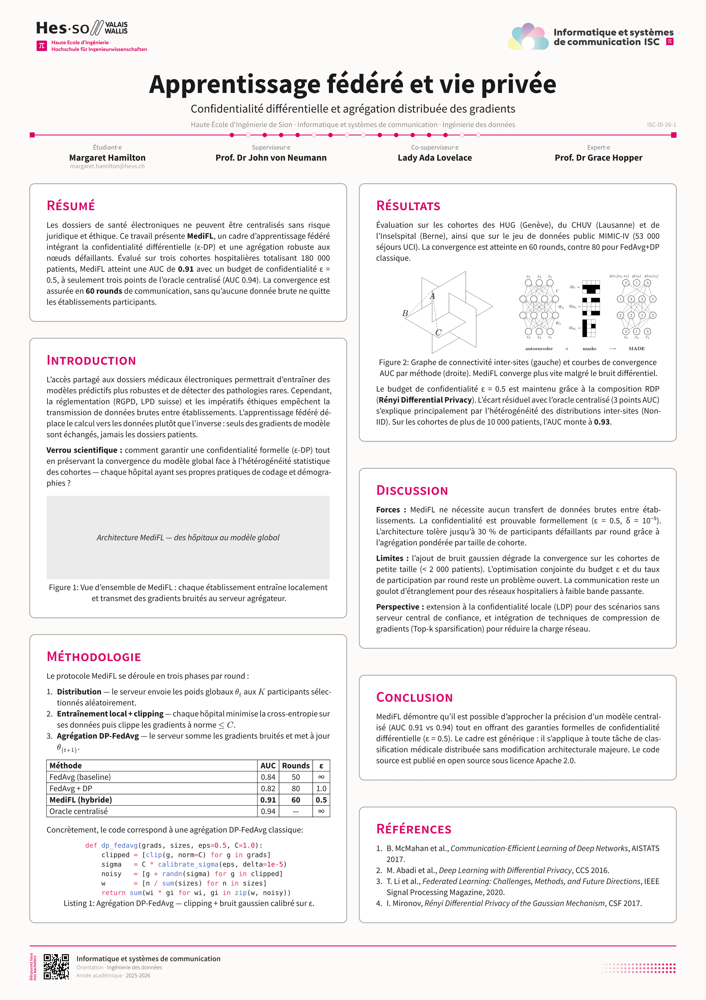

<p align="right">
    
</p>


# Poster Template for ISC Students

This is the official A1 poster template for the [ISC degree programme](https://isc.hevs.ch/) at the School of Engineering in Sion. It is part of the official templates repository, which also includes templates for the bachelor thesis (`isc-hei-bthesis`), reports (`isc-hei-report`) and executive summaries (`isc-hei-exec-summary`).

<p align="center">
  <a href="https://github.com/ISC-HEI/isc-hei-typst-templates/blob/0.8.1/examples/poster.pdf?raw=true"></a>
</p>

## Using the Template on the Web

In the `Typst` web application, start a new project with the `isc-hei-poster` template and voilà!

## Using the Template in Your Shell

First, install `Typst` on your machine by following the [official instructions](https://github.com/typst/typst).

### Installing Fonts Locally

If you are running `typst` locally, you might be missing some required fonts. For your convenience, a font download script is included in the repository. All fonts are released under the [SIL Open Font License](https://openfontlicense.org/), so there are no file inclusion issues.

To install the fonts locally on a Linux environment, simply type:

```bash
source install_fonts.sh
```

from within the `fonts` directory.

### Project Initialization and Compilation

You can initialize the project with the command:

```bash
typst init @preview/isc-hei-poster
```

If you need a specific template version, use:

```bash
typst init @preview/isc-hei-poster:0.7.2
```

## Layout Options

The poster is configured through the `isc-poster` show rule. The most commonly adjusted parameters are:

- `orientation` — `"portrait"` (default) or `"landscape"` for the A1 sheet.
- `num-columns` — number of card columns (`2` by default, `3` is also supported).
- `distribute-columns` — when `true` (default), cards are spaced vertically to fill each column top-to-bottom.
- `language` — `"fr"`, `"en"` or `"de"`; controls all label strings.
- `subtitle`, `co-supervisor`, `expert` — optional; omit (or pass `none`) to hide them.

Content is placed with `#isc-card(title: "...")[...]` blocks, and `#isc-colbreak()` starts a new column.

**Tip:** A poster lives on a single A1 page. Portrait comfortably holds nine or more cards; landscape is much tighter (around six cards) because the sheet is shorter. If your content spills onto a second page, reduce the amount of text per card or the number of cards.

## Including PDF Images

Unfortunately, `typst` does not support PDF file inclusion at the time of writing this documentation. As a temporary workaround, PDF files can be converted to SVG using `pdf2svg`.

# Usage

When used locally, creating a PDF is straightforward with the command:

```bash
typst compile poster.typ
```

Even better, the following command compiles the poster every time the file is modified:

```bash
typst watch poster.typ
```

You can also use `VSCode` or `VSCodium` with the `Typst LSP` plugin, which enables direct compilation.

# Questions and Help

If you need any help installing or running these tools, do not hesitate to contact the maintainer [pmudry](https://github.com/pmudry).

You can also propose changes using pull requests or raise issues if something is unclear. Have fun making your poster!
