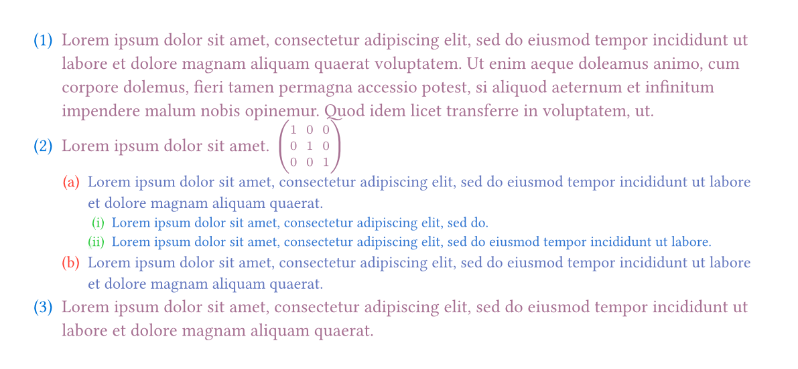

# Usage

The `itemize` package allows users to easily customize and format enumerations and lists, while also fixing some display format issues in `typst` (0.13.1) for `enum` and `list` (e.g., [issue#1204](https://github.com/typst/typst/issues/1204)).

> If the `typst` team fixes and enhances `enum` and `list`, this package will be deprecated.

To use this package, include the following at the beginning of your document:

```typst
#import "@preview/itemize:0.1.2" as el
```

## Basic Usage

Enhancements for `enum` and `list` can be applied by adding the following at the beginning of your document:

```typst
#show: el.default-enum-list
```

Now you can use `enum` and `list` as usual. Below is a comparison of the effects.


<details>
<summary>The source code is as follows:</summary>

```typst
#let item-test = [
  + one $vec(1, 1, 1)$
    $
      x^2 + y^2 = z^2
    $
  + two #box(baseline: .5em, rect(height: 2em, width: 2em))
  + + test
  + - test
    - test 
  - - test
]
#table(
  columns: (1fr, 1fr),
  [origin], [itemize],
  [
    #item-test
  ],
  [
    #show: el.default-enum-list
    #item-test
  ],
)
```

</details>

## Referencing `enum` Numbers

To correctly reference `enum` numbers, first use:

```typst
#show ref: el.ref-enum // add this
#show: el.default-enum-list
```

Now you can reference as usual.
For example:

```typst
#show ref: el.ref-enum
#show: el.default-enum-list
#set enum(numbering: "(1).(a).(i)", full: true)
+ #lorem(50) <item:1>
+ #lorem(5) $mat(1, 0, 0; 0, 1, 0; 0, 0, 1)$
  + #lorem(20)
    + #lorem(10)
    + #lorem(10) <item:2>
  + #lorem(20)
+ #lorem(20)

#show ref: set text(fill: orange)

The @item:1[item] is referenced; you can see the conclusion@item:2 also holds.

#set enum(numbering: "(1).(a).(i)", full: false)
+ #lorem(50)
+ #lorem(5) $mat(1, 0, 0; 0, 1, 0; 0, 0, 1)$ <eq0> #el.elabel("eq")
  + #lorem(20)
    + #lorem(10)
    + #lorem(10) <item:4>
  + #lorem(20)
+ #lorem(20)

The @eq[item] is referenced, you can see some thing@item:4. Note that `@eq0` will not work (since `@eq0` is labelled to the equation).
```

The effect is:


> Note: If referencing via `@some-label` does not work correctly, you need to use `#el.elabel(<some-label>)` or `#el.elabel("some-label")` to mark the `enum` item, such as `#el.elabel("eq")` here.

### Parameters for `ref-enum`

- `full`: Default is `auto`, using the `full` value from `enum`. `true` displays the full number (including parent levels); `false` displays only the current item's number.
- `numbering`: Numbering pattern or formatter. You can customize the style of the referenced item number.
- `supplement`: Supplemental content for the reference.

## Parameters for `default-enum-list`

```typst
#let default-enum-list(
  doc: any,
  ..args: arguments,
  body-indent: array | auto | function | length = auto,
  enum-margin: array | auto | length = auto,
  enum-spacing: array | auto | dictionary | length = auto,
  hanging-indent: array | auto | function | length = auto,
  indent: array | auto | function | length = auto,
  is-full-width: bool = true,
  item-spacing: array | auto | dictionary | length = auto,
  label-indent: array | auto | function | length = auto,
  line-indent: array | auto | function | length = auto,
) = any;
```

This method allows you to freely customize the `label` style (i.e., `enum`'s `numbering` and `list`'s `marker`), control paragraph indentation (`line-indent`, `hanging-indent`), horizontal spacing (`indent`, `body-indent`, `enum-margin`, `is-full-width`, `label-indent`), and vertical spacing (`enum-spacing`, `item-spacing`) for nested enumerations and lists.

These parameters can specify styles for specific levels of nested enumerations and lists.

- `..args`: Allows passing any named arguments for `text` to format the `label`, which can be an `array` (each element controls the `label` for the corresponding level). Unless `auto` is used, the `label` format cannot be changed via `#set text`, which addresses [issue#619](https://github.com/typst/typst/issues/619).
- `line-indent`, `hanging-indent`: Control the **first-line indentation** and **hanging indentation** for paragraphs in each level of the enumerations and lists. Unless `auto` is used, paragraph indentation cannot be changed via `#set par`.
- `indent`, `body-indent`: Control the **enumerations and lists indentation** and spacing between the `label` and `body` for each level. Unless `auto` is used, these spacings cannot be changed via `#set enum` or `#set list`.
- `label-indent`: Controls the spacing between the enumerations and lists and `label` for each level.
- `is-full-width`: Default is `true`, setting the `item` width to `100%`. This may temporarily fix the bug where block-level equations in the item are not center-aligned in some cases (not an ideal solution).
- `enum-margin`: Controls the left (right) margin for each level of the enumerations and lists. For this parameter to take effect, set `is-full-width` to `false`. If `auto`, the item width for the current level is `auto` (native `enum` and `list` behavior).
- `enum-spacing`: Controls the **spacing above and below** the enumerations and lists. Can be a `length` (same spacing above and below) or a `dictionary` (e.g., `(above: length1, below: length2)`).
- `item-spacing`: Controls the **spacing between items** for each level.

The model for `itemize` is as follows:


### Passing `array` Parameters

If a parameter accepts an `array`, each element controls the style for the corresponding level of the list. The last element's value applies to subsequent levels.

For example:

```typst
#show: el.default-enum-list.with(
  fill: (red, blue, green, yellow, auto),
  weight: "bold",
  size: (15pt, 12pt)
)
```

The `label` will be formatted as:

- Levels 1-4: `red`, `blue`, `green`, `yellow`, then the current text color (due to `auto`).
- All levels: Bold weight.
- Level 1: `15pt` font size; subsequent levels: `12pt`.

```typst
#show: el.default-enum-list.with(
  fill: (red, blue, green, yellow, auto),
  weight: "bold",
  size: (15pt, 12pt)
)
+ one
+ two
  + A
    - Good
      - #lorem(10)
        - #lorem(10)
        - #lorem(10)
    - Bad
  + B
    + #lorem(10)
      + #lorem(10)
      + #lorem(10)
+ three
```

Effect:


### Passing `function` Parameters

For horizontal spacing parameters (`indent`, `body-indent`, `hanging-indent`, `line-indent`, `label-indent`), you can pass a `function` with the following format:

```typst
(level, label-width, level-type) => length | auto
```

- `level`: The item's level.
- `label-width`: Captures the label width for levels 1 to the current level (i.e., `[1, level]`).
  - Use `(label-width.get)(some-level)` to get the label width at `some-level`.
  - Or `label-width.current` for the current level (equivalent to `(label-width.get)(level)`).
- `level-type`: Captures the construction (`enum` or `list`) for levels 1 to the current level. Use `(level-type.get)(some-level)` or `level-type.current`.

> Tip: If you don't need `label-width` or `level-type`, declare the function as:

```typst
(level, ..args) => length | auto
// or
(level, _, _) => length | auto
// or
(level, label-width, _) => length | auto
// etc.
```

Here's an example using a `function` to align all `label`s to the left:


<details>
<summary>Code</summary>

```typst
#let ex1 = [
    + #lorem(16)
    + #lorem(16)
      + #lorem(16)
      + #lorem(16)
        + #lorem(16)
          + #lorem(16)
        + #lorem(16)
    + #lorem(16)
    - #lorem(16)
      - #lorem(16)
      - #lorem(16)
        - #lorem(16)
        - #lorem(16)
  ]
  #table(
    columns: (1fr, 1fr),
    [
      original
      ```typ
      #set enum(numbering: "(A).(I).(i)", full: true, number-align: left)
      ```
    ],
    [
      using indent
      ```typ
      #set enum(numbering: "(A).(I).(i)", full: true, number-align: left)
      #let indent-f = (level, label-width, level-type) => {
        if level >= 2 {
          -(label-width.get)(level - 1) - (level-type.get)(level - 1).body-indent
        }
      }
      #show: el.default-enum-list.with(indent: indent-f)
      ```
    ],

    [
      #set enum(numbering: "(A).(I).(i)", full: true, number-align: left)
      #ex1
    ],
    [
      #set enum(numbering: "(A).(I).(i)", full: true, number-align: left)
      #let indent-f = (level, label-width, level-type) => {
        if level >= 2 {
          -(label-width.get)(level - 1) - (level-type.get)(level - 1).body-indent
        }
      }
      #show: el.default-enum-list.with(indent: indent-f)
      #ex1
    ],
  )
```

</details>

### `default-enum` and `default-list` Methods

These methods work the same as `default-enum-list`, but note that levels are counted independently. For example:

```typst
#show enum: el.default-enum.with(
  fill: (red, blue, green),
  weight: "bold",
)
#show list: el.default-list.with(fill: (yellow, orange))
+ #lorem(5)
  + $vec(1, 1, 1, 1)$ #lorem(5) // for enum, this is the second level (colored blue)
  + #lorem(5)
  - #lorem(5) // for list, this is the first level (colored yellow)
  - #lorem(5)
```

<details>
<summary>Output</summary>


</details>

## Using Counters

- `level`: Gets the current item's level in `enum`.
- `level-count`: Gets the current item's counter in `enum`.
- `list-level`: Gets the current item's level in `list`.

Here are some practical examples.

### Formatting enumeration and list `body`

```typst
#show: el.default-enum-list.with(fill: (blue, red, green))
#show enum: it => context {
  text(
    size: 15pt * calc.pow(0.9, el.level()),
    fill: color.mix((red, 90% * calc.pow(0.6, el.level())), (blue, 20% * calc.pow(2.5, el.level()))),
    it,
  )
}
#set enum(numbering: "(1).(a).(i)")
+ #lorem(50)
+ #lorem(5) $mat(1, 0, 0; 0, 1, 0; 0, 0, 1)$
  + #lorem(20)
    + #lorem(10)
    + #lorem(15)
  + #lorem(20)
+ #lorem(20)
```

Effect:



### Formatting `enum.numbering`

Since `enum`'s `numbering` allows a `function`, you can use `level` to control the formatting of `label`s at different levels. For example:

```typst
#show: el.default-enum-list
#let ff = (..num) => {
  if el.level() == 1 {
    let first = box(stroke: 1pt + blue, inset: 5pt, text(size: 20pt, fill: blue, weight: "bold", numbering(
      "A",
      ..num,
    )))
    let (height,) = measure(first)
    move(dy: height / 3, first)
  } else if el.level() == 2 {
    numbering("(A).(a)", ..num)
  } else {
    text(fill: red, numbering("(A).(a).(1)", ..num))
  }
}

#set enum(numbering: ff, full: false)

+ #lorem(50)
+ #lorem(5) $mat(1, 0, 0; 0, 1, 0; 0, 0, 1)$
  + #lorem(20)
    + #lorem(10)
    + #lorem(10)
  + #lorem(20)
+ #lorem(20)
```

Effect:


<details>
<summary>For fun</summary>

```typst
#import emoji: *
#show: el.default-enum-list

#let emoji = (alien, book.orange, butterfly, cloud.storm)
#let ff = (..num) => context {
  set text(fill: red)
  let count = el.level-count()
  let n = count.last()
  let level = count.len()
  if level == 1 {
    if n in range(3) {
      numbering("1.", ..num)
    } else {
      numbering("A.", n - 2)
    }
  } else if level == 2 {
    emoji.at(calc.rem(n, emoji.len()) - 1)
  } else {
    numbering("a)", ..num)
  }
}
#set enum(numbering: ff)
+ 123
+ 234
+ ddd
+ fff
+ gggg
  + 111
  + 123
    + ddd
    + 111
  + aaa
  + fff
  + dddd
+ dddd
  + 123
  + aaa
```

Effect:


</details>

### Formatting `list.marker`

Native `list`'s `marker` does not accept a `function`. But why not? As suggested in this issue:

- [It would be great if I could do this through the `#list()` function's `marker` field using a function instead.](https://github.com/typst/typst/issues/619#issuecomment-2291338210)

Now you can pass a `function` with the following format:

```typst
level => n => content
```

or

```typst
level => array
```

Here:

- `level`: The relative nesting level of the `list`, cyclically used.
- `n => content` or `array`: The `label` for each `item` in the same level.

For example:

```typst
#import emoji: *
#show: el.default-enum-list

#let marker = level => {
  if level == 1 {
    ([#sym.suit.club.filled], [#sym.suit.spade.filled], [#sym.suit.heart.filled])
  } else if level == 2 {
    n => rotate(24deg * n, box(rect(stroke: 1pt + blue, height: 1em, width: 1em)))
  } else {
    [#sym.ballot.check.heavy]
  }
}
#set list(marker: marker)
- 123
- 234
  - 111
  - 123
    - ddd
    - 111
  - aaa
  - fff
  - dddd
- dddd
  - 123
- aaa
```

Effect:


## Other Styles for `enum` and `list`

The `paragraph-enum-list` method (and `paragraph-enum`, `paragraph-list`) allows aligning `label`s with paragraphs. These methods have the same parameters as `default-enum-list`.
For example:


<details>
<summary>Code</summary>

```typst
#set page(width: 350mm, height: auto, margin: 25pt)
#let ex1 = [
  + #lorem(16)
  + #lorem(16)

    #lorem(16)
    + #lorem(16)
    + #lorem(16)

      #lorem(16)
      + #lorem(16)

        #lorem(16)
      #lorem(16)
      + #lorem(16)
    + #lorem(16)
  + #lorem(16)
  - #lorem(16)
    - #lorem(16)
    - #lorem(16)
      - #lorem(16)
      - #lorem(16)
  + #lorem(16)
    - #lorem(16)

      #lorem(16)
    - #lorem(16)
  + #lorem(16)
  + + - - + #lorem(16)
]
#table(
  columns: (1fr, 1fr),
  [
    default-style
    ```typ
    #set enum(numbering: "(A).(I).(i)", full: true)
    #set par(first-line-indent: 2em)
    #show: el.default-enum-list
    ```
  ],
  [
    paragraph-style
    ```typ
    #set enum(numbering: "(A).(I).(i)", full: true)
    #set par(first-line-indent: 2em)
    #show: el.paragraph-enum-list
    ```
  ],

  [
    #set enum(numbering: "(A).(I).(i)", full: true)
    #set par(first-line-indent: 2em)
    #show: el.default-enum-list
    #ex1
  ],
  [
    #set enum(numbering: "(A).(I).(i)", full: true)
    #set par(first-line-indent: 2em)
    #show: el.paragraph-enum-list
    #ex1
  ],
)
```

</details>

## Using `set rule`

In the current version of `typst` (0.13.1), we cannot use custom functions with `set rule`, which prevents us from retaining previously set property values when using `default-item-list`, `paragraph-item-list`, etc. Now, with the `elembic` package, we can achieve this functionality. To this end, we have repackaged `default-item-list` and `paragraph-item-list` into `set-default` and `set-paragraph` methods, which work the same as the original functions but retain previously set property values.

Here's how to use them:

Include the following at the beginning of your document:

```typst
#show: el.set-default() // need ()!!!
```

> Note: The key difference is that `set-default` requires **parentheses**!

```typst
#let item = [
  + #lorem(10)
  + #lorem(10)
    + #lorem(10)
    + + #lorem(10)
      + #lorem(10)
    + - #lorem(10)
      - #lorem(10)
  + #lorem(10)
]

#show: el.set-default()
#set enum(numbering: "(1).(a).(i)")
#item

// change the label color
#show: el.set-default(fill: (red, blue, green, auto))
#item

// change the label size
#show: el.set-default(size: (20pt, 16pt, 14pt, auto))
#item

// change the body-indent and indent
#show: el.set-default(body-indent: (auto, 0.5em), indent: (auto, 0em, 1em, auto))
#item

// use the default style
#show: el.set-default()
#item
```

<details>
<summary>Output</summary>


</details>

> Note: Property values set via `#set enum` and `#set list` cannot be restored using `#show: el.set-default()`.

# Acknowledge

- [@pacaunt](https://github.com/typst/typst/issues/1204#issuecomment-2909417340)
- [@Andrew](https://forum.typst.app/t/can-i-use-show-rule-only-in-content-of-enum-but-not-numbering/4590/2)

# License

This project is licensed under the MIT License.

