# Overview

---

The `itemize` package allows users to easily customize and format enums and lists. To use this package, include the following at the beginning of your document:

```typst
#import "@preview/itemize:0.2.0" as el
```

Use the method `default-enum-list` to override the native behavior of `enum` and `list` by adding the following at the beginning of your document:

```typst
#show: el.default-enum-list
```

Now you can use `enum` and `list` as usual. Below is a comparison.

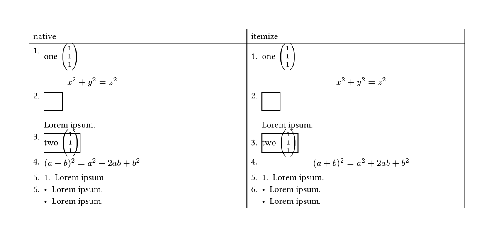

<details>
<summary>Code:</summary>

```typst
#let item-test = [
  + one $vec(1, 1, 1)$
    $
      x^2 + y^2 = z^2
    $
  + #rect(height: 2em, width: 2em) #lorem(2)
  + #block(stroke: 1pt)[two $vec(1, 1, 1,)$]
  + $ (a + b)^2 = a^2 + 2a b + b^2 $
  + + #lorem(2)
  + - #lorem(2)
    - #lorem(2)
]
#table(
  columns: (1fr, 1fr),
  [native], [itemize],
  [
    #item-test
  ],
  [
    #show: el.default-enum-list
    #item-test
  ],
)
```

</details>

See [manual.pdf](https://github.com/tianyi-smile/itemize/blob/main/doc/manual.pdf) and also the source code [manual.typ](https://github.com/tianyi-smile/itemize/tree/main/doc) for more details.

## Examples

<table>
<!----->
<tr>
  <td>All labels aligned</td>
  <td>Label with min-width</td>
  <td>Resuming enum</td>
</tr>
</tr>
  <td>  
      <a href="https://github.com/tianyi-smile/itemize/blob/main/examples/align-label.typ">
      
      </a>
  </td>
  <td>
      <a href="https://github.com/tianyi-smile/itemize/blob/main/examples/el-word.typ">
      
      </a>
  </td>
  <td>
      <a href="https://github.com/tianyi-smile/itemize/blob/main/examples/resuming-enum.typ">
      
      </a>
  </td>
</tr>
<!----->
<tr>
  <td>Circled label1</td>
  <td>Circled label2</td>
  <td>Square label1</td>
</tr>
</tr>
  <td>
      <a href="https://github.com/tianyi-smile/itemize/blob/main/examples/circled-enum.typ">
      
      </a>
  </td>
  <td>
        <a href="https://github.com/tianyi-smile/itemize/blob/main/examples/circle-line-enum.typ">
      
      </a>
  </td>
  <td>
      <a href="https://github.com/tianyi-smile/itemize/blob/main/examples/square-enum.typ">
      
  </td>
</tr>
<!----->
<tr>
  <td>Square label2</td>
  <td>With left border</td>
  <td>With background1</td>
</tr>
</tr>
  <td>    
    <a href="https://github.com/tianyi-smile/itemize/blob/main/examples/gradient-enum.typ">
      
    </a>
  </td>
  <td>
      <a href="https://github.com/tianyi-smile/itemize/blob/main/examples/v-line-el.typ">
      
      </a>
  </td>
  <td>
      <a href="https://github.com/tianyi-smile/itemize/blob/main/examples/background-list.typ">
      
      </a>
  </td>
</tr>
<!----->
<tr>
  <td>With background2</td>
  <td>Grid-like list</td>
  <td>Grid-like list2</td>
</tr>
</tr>
  <td>    
      <a href="https://github.com/tianyi-smile/itemize/blob/main/examples/orange-enum.typ">
      
      </a>
  </td>
  <td>
      <a href="https://github.com/tianyi-smile/itemize/blob/main/examples/grid-list.typ">
      
  </td>
  <td>    
      <a href="https://github.com/tianyi-smile/itemize/blob/main/examples/todo-list.typ">
      
    </a>
  </td>
</tr>
<!----->
<tr>
  <td>Leader board</td>
  <td>Tree list</td>
  <td>Checklist</td>
</tr>
</tr>
  <td>    
      <a href="https://github.com/tianyi-smile/itemize/blob/main/examples/leaderboard.typ">
      
    </a>
  </td>
  <td>
      <a href="https://github.com/tianyi-smile/itemize/blob/main/examples/tree-list.typ">
      
  </td>
  <td>    
      <a href="https://github.com/tianyi-smile/itemize/blob/main/examples/checklist.typ">
      
      </a>
  </td>
</tr>
</table>


*Click on the example image to jump to the code.*

## Features

The `itemize` package currently offers the following features:

+ Compatibility with native `enum` and `list` behaviors in most cases, along with fixes for certain native bugs (or providing alternative choices), such as [`typst/issue#1204`](https://github.com/typst/typst/issues/1204) and [`typst/issue#529`](https://github.com/typst/typst/issues/529).
+ Provide two styles of enum-list: `default` and `Paragraph`
+ Customization of `enum` and `list` *labels* and *bodies* by **level** and **item**:
  - Horizontal spacing settings: `indent`, `body-indent`, `label-indent`, `enum-margin` (`is-full-width`).
  - Vertical spacing settings: `item-spacing`, `enum-spacing`.
  - Label formatting settings: `..args(text-style)`, `label-align`, `label-baseline`, `label-width`.
    - Customize labels in any way: `label-format`.
  - Alignment styles for labels between items at each level: `auto-label-width`.
  - Body formatting settings: `hanging-indent`, `line-indent`.
    - Set text and border styles for the body: `body-format`.
+ Enhanced `enum` features:
  - Reference functionality for `enum` numbering.
  - Resume functionality for `enum` numbering.
+ Enhanced `list` features:
  - Terms-like functionality: Temporarily change the marker of the current item using the `item` method.
  - Checklist functionality (similar to the [`cheq`](https://typst.app/universe/package/cheq) package).

# Main Methods

---

The package `itemize` primarily provides the following methods:

## Two Styles of enum-list

- `default`-style (Typst's native style):  `default-enum-list`, `default-enum`, `default-list`
- `paragraph`-style: `paragraph-enum-list`, `paragraph-enum`, `paragraph-list`

By default, the `default-*` methods indent paragraphs after the `label`, while the `paragraph-*` methods align paragraphs with the `label`. See the example below:

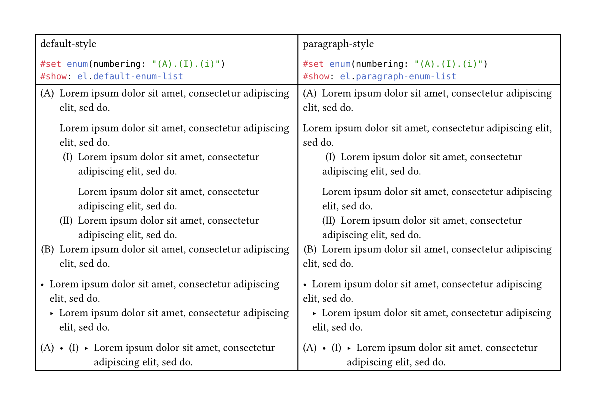

<details>
<summary>Code:</summary>

```typst
#let test = [
  + #lorem(10)

    #lorem(10)
    + #lorem(10)

      #lorem(10)
    + #lorem(10)
  + #lorem(10)
  - #lorem(10)
    - #lorem(10)
  + - + - #lorem(10)
]
#table(
  columns: (1fr, 1fr),
  [
    default-style
    ```typ
    #set enum(numbering: "(A).(I).(i)")
    #show: el.default-enum-list
    ```
  ],
  [
    paragraph-style
    ```typ
    #set enum(numbering: "(A).(I).(i)")
    #show: el.paragraph-enum-list
    ```
  ],

  [
    #set enum(numbering: "(A).(I).(i)")
    #show: el.default-enum-list.with(auto-base-level: true)
    #test
  ],
  [
    #set enum(numbering: "(A).(I).(i)")
    #show: el.paragraph-enum-list.with(auto-base-level: true)
    #test
  ],
)
```

</details>

The differences between `*-enum-list`, `*-enum`, and `*-list` are:

- `*-enum-list` can uniformly configure both `enum` and `list`, while allowing separate configuration through parameters:
  - `enum-config` for `enum`
  - `list-config` for `list`
- `*-enum` only configures `enum`, leaving nested `list` styles unchanged
- `*-list` only configures `list`, leaving nested `enum` styles unchanged

## Enum Numbering References

To enable this feature, add the following at the beginning of your document:

```typst
#show: el.config.ref
```

> The `ref-enum` method from ver0.1.x will be deprecated in the future. Please use `config.ref` for this configuration.

In the `enum` items you want to reference, label them with `<some-label>`, and then use `@some-label` to reference the enum number of that item.

Example (taken from: https://github.com/typst/typst/issues/779#issuecomment-2702268234)

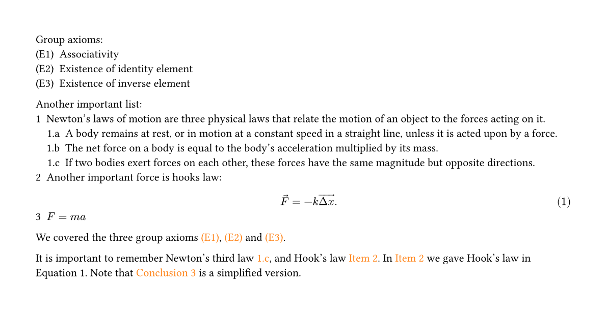

<details>
<summary>Code:</summary>

```typst
#show: el.config.ref.with(supplement: "Item")
#show link: set text(fill: orange)
#set enum(numbering: "(E1)", full: true)
#show: el.default-enum-list

Group axioms:
+ Associativity <ax:ass>
+ Existence of identity element <ax:id>
+ Existence of inverse element <ax:inv>

#set enum(numbering: "1.a", full: true)
#set math.equation(numbering: "(1.1)")
Another important list:
+ Newton's laws of motion are three physical laws that relate the motion of an object to the forces acting on it.
  + A body remains at rest, or in motion at a constant speed in a straight line, unless it is acted upon by a force.
  + The net force on a body is equal to the body's acceleration multiplied by its mass.
  + If two bodies exert forces on each other, these forces have the same magnitude but opposite directions. <newton-third>
+ Another important force is hooks law: <hook1>
  $ arrow(F) = -k arrow(Delta x). $ <eq:hook> #el.elabel[hook2]
+ $F = m a$ <eq:c> #el.elabel("eq:ma")

We covered the three group axioms @ax:ass[], @ax:id[] and @ax:inv[].

It is important to remember Newton's third law @newton-third[], and Hook's law @hook1. In @hook2 we gave Hook's law in @eq:hook. Note that @eq:ma[Conclusion] is a simplified version.
```

> For the label `<hook2>`, you cannot directly write `<hook2>`, as this would label `<hook2>` to the equation. Use the method `elabel` to label it. The same applies to `eq:c`.

> The method `elabel(<some-label>)` is equivalent to `elabel("some-label")`, and can sometimes be written as `elabel[some-label]` (provided the latter can be parsed as a string).

</details>

## Resuming Enum Numbering

- To enable this feature, set the `auto-resuming` parameter to `auto` in `*-enum-list` (or `*-enum`).
- Use the `resume()` method to continue numbering from the previous ones.

  ```typst
  #show: el.default-enum-list.with(auto-resuming: auto)
  + #lorem(5)
    + #lorem(5)
    + #lorem(5)
    #lorem(5)
  + #lorem(5)
    #el.resume() // -> 3
    + #lorem(5)
    + #lorem(5)
  + #lorem(5)
    + + #lorem(5)
  ```

  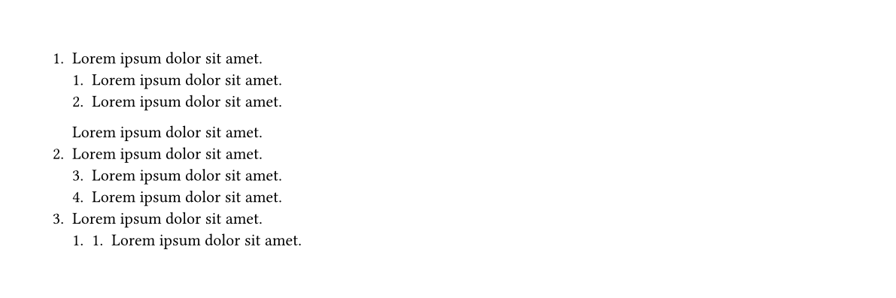
- Alternatively, use `resume-label(<some-label>)` to label the enum to resume, then use `resume-list(<some-label>)` in the desired enum to continue numbering.

  - If the following is added to the document:

    ```typst
    #show: el.config.ref-resume
    ```

    You can use `@some-label` instead of `resume-list(<some-label>)`.

  ```typst
  #show: el.config.ref-resume
  #let auto-resume = el.default-enum-list.with(auto-resuming: auto)
  #auto-resume[
    + #lorem(5)
      + #lorem(5)
      + #lorem(5)
      - #lorem(5)
      #el.resume() // continue
      + #lorem(5) #el.resume-label(<resume:demo>)
    #lorem(5)
    @resume:demo // resume the enum labelled with `resume:demo`
    + #lorem(5)
  ]
  ```

  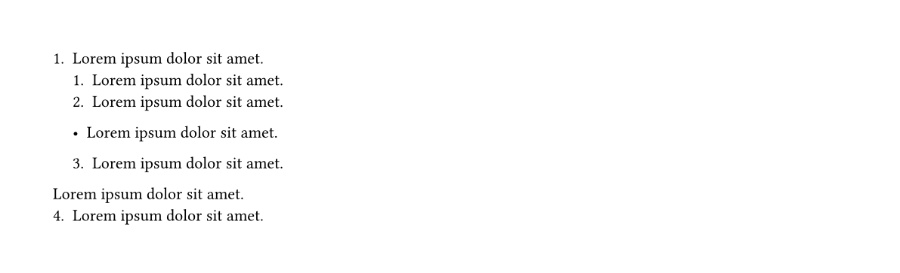
- Alternatively, use `auto-resume-enum(auto-resuming: true)[...]` to ensure all `enum` items within `[...]` continue numbering from the previous items. For example:

  ```typst
  #let resume-enum(doc) = el.default-enum-list(auto-resuming: auto)[
    #el.auto-resume-enum(auto-resuming: true, doc)
  ]
  #resume-enum[
    + #lorem(5)
        + #lorem(5)
        + #lorem(5)
          + #lorem(5)
        - #lorem(5)
        + #lorem(5)
          + #lorem(5)
    #lorem(5)
    + #lorem(5)
  ]
  ```

  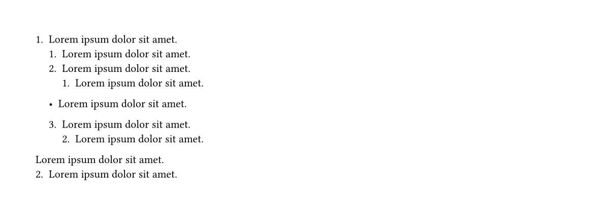

## Terms-like Functionality

Now, you can use the `item` method within a `list` to temporarily change the marker of the current item. For example:

```typst
#show: el.default-enum-list
- #el.item[#sym.ast.square] #lorem(2)
- #el.item[①] #lorem(2)
```

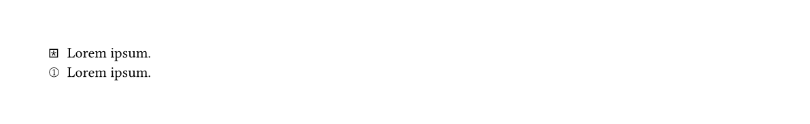

## Checklist

- To enable this feature, set the `checklist` parameter to `true` in `*-enum-list` (or `*-list`), for example:

  ```typst
  #show: el.default-enum-list.with(checklist: true)
  ```

  Now you can use:

  ```typst
  #show: el.default-enum-list.with(checklist: true)
  - [x] checked #lorem(2)
  - [ ] unchecked #lorem(2)
  - [/] incomplete #lorem(2)
  - [-] canceled #lorem(2)
  ```

  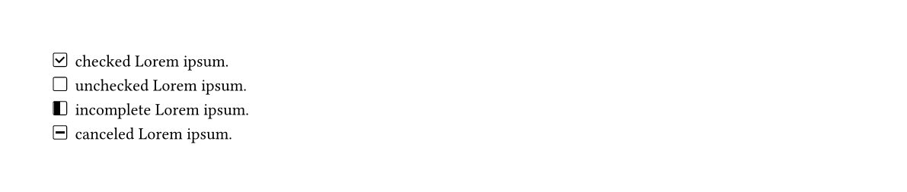
- Alternatively, you can enable and configure checklist-related features using the `config.checklist` method:

  ```typst
  #show: el.config.checklist
  ```

  Example:

  ```typst
   #show: el.config.checklist
   #show: el.default-enum-list
   - [x] checked #lorem(2)
   - [ ] unchecked #lorem(2)
   - [/] incomplete #lorem(2)
   - [-] canceled #lorem(2)
  ```

# Model <model>

---

The diagram below illustrates the model for `enum` and `list` in `itemize`.

- `enum` and `list` consist of multiple items.
- Each item is composed of a `label` and a `body`:
  - `label`: The enum number or list marker.
  - `body`: The content following the label.
- Level (`level`): Starts from 1, and increments if an item contains nested items.
- Item index (`n`): Starts from 1. The position of items in the same level.

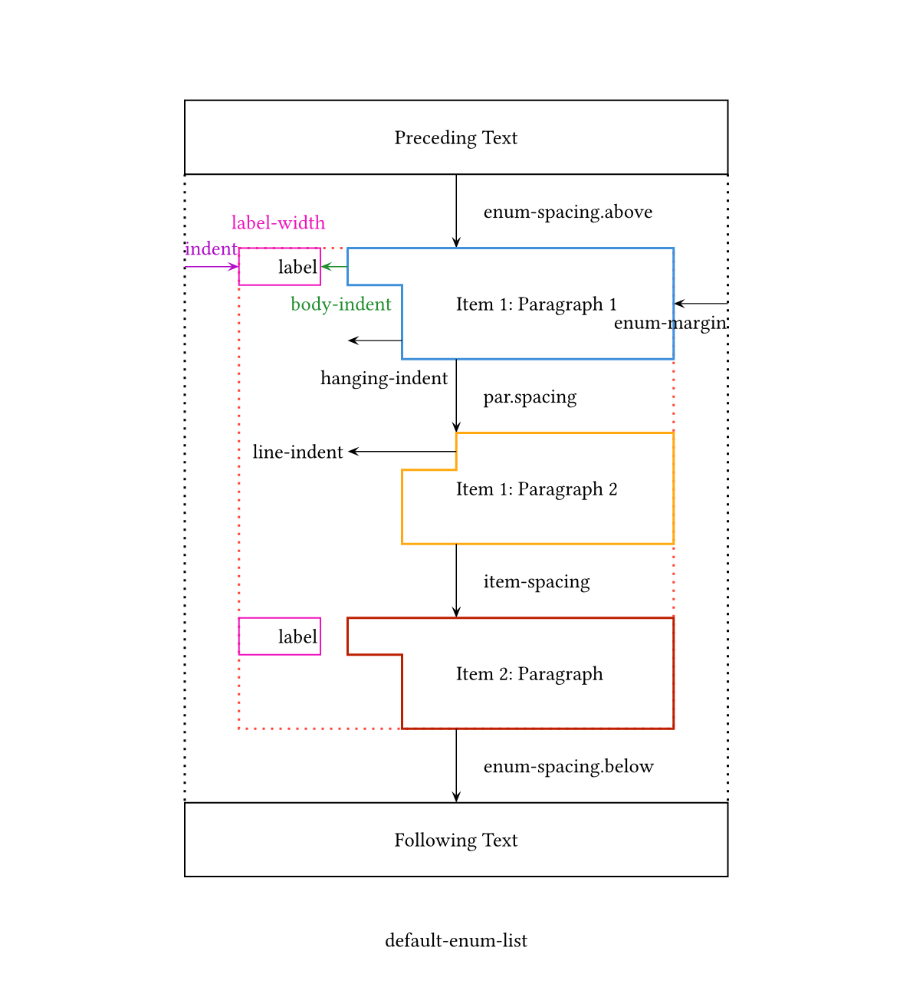

<details>
<summary>The `label-indent` of default-enum-list:</summary>

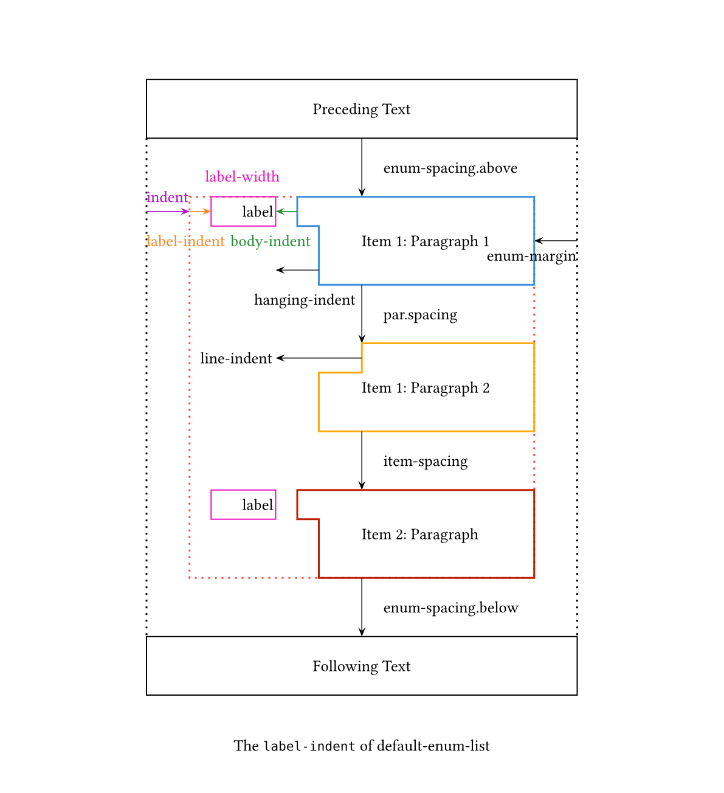

</details>

Code Example:

```typst
#set align(center)
#set par(justify: true)
#block(width: 80%, stroke: 1pt + red, inset: 5pt)[
  #set align(left)
  #show: el.default-enum-list.with(
    indent: 1em,
    label-align: right,
    label-width: 3em,
    body-indent: 1em,
    hanging-indent: 2em,
    line-indent: 4em,
    is-full-width: false,
    enum-margin: 4em,
    enum-spacing: 3em,
    item-spacing: 2.5em,
  )
  Preceding Text. #lorem(30)

  1. Item 1: Paragraph 1. #lorem(30)

    Paragraph 2. #lorem(30)

  100. Item 2. #lorem(30)

  Following Text. #lorem(30)
]
```

Output:

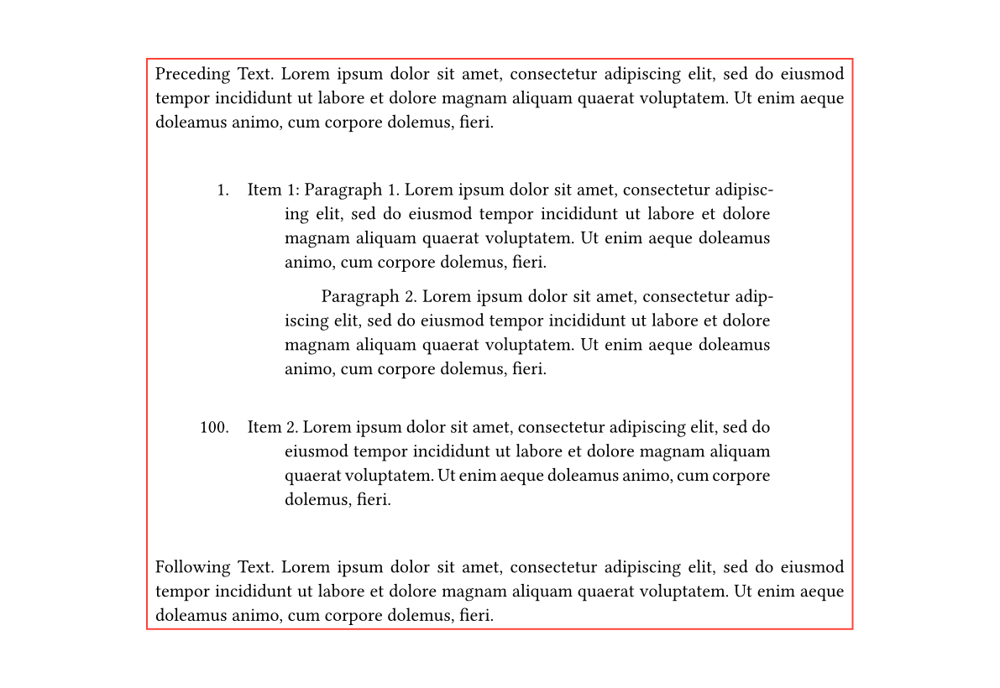

## `*-enum-list` Methods

The parameters for `default-enum-list` and `paragraph-enum-list` are similar.

- Horizontal spacing
  - `indent: array | auto | function | length = auto`: The indent of enum or list.
    - If `indent` is `auto`, the item will be indented by the value of `indent` of `enum` or `list`.
    - If `indent` is an `array`, whose elements are `length` or `auto` or `array`, each level of the item will be indented by the corresponding value of the array at position `level - 1`. The last value of the array will be used for residual levels.
      - If the last element of the array is `LOOP`, the values in the array will be used cyclically.
      - The elements in the array can also be an array, where each element applies to the corresponding item.
    - If `indent` is a `function`, the return value will be used for each level and each item. The function should be declared as:
    
      `it => length | auto | array`

      - `it` is a dictionary that contains the following keys:
        - `level`: The level of the item.
        - `n`: The index of the item.
        - `n-last`: The index of the last item.
        -  `label-width`: The label max-width of the item. `label-width` captures the label width of items from level 1 to the current level (i.e., [1, `level`]). Use `(label-width.get)(some-level)` to get the label width at level `some-level` or `label-width.current` for the current level (equivalent to `(label-width.get)(level)`).
        - `e`: captures the construction (`enum` or `list`) of items from level 1 to the current level. Use `(level-type.get)(some-level)` or `level-type.current`.
        - If the return value is an `array`, it will be used for each item.
  - `body-indent: array | auto | function | length = auto`: Body indentation value (default: auto), i.e., the space between the label and the body of each item.
    - If `auto`, it uses the value of `body-indent` of `enum` or `list`.
    - Similar to the `indent` parameter.
  - `label-indent: array | auto | function | length = auto`: The indentation value for the first line of an item. (default: `0em` if `auto`). Similar to the `indent` parameter.
  - `is-full-width: bool = true`: Whether to use full width (default: true). This may temporarily fix the bug where block-level equations in the item are not center-aligned in some cases (not an ideal solution).
  - `enum-margin: array | auto | function | length = auto`: Margin of items for enums and lists (default: auto).
    - To make `enum-margin` effective, set `is-full-width` to `false`.
    - If `auto`, the item width is `auto`.
    - Similar to `item-spacing`.

- Vertical spacing
  - `enum-spacing: array | auto | dictionary | length = auto`: Spacing between enums and lists (default: auto). If `auto`, it uses the current paragraph spacing or leading (`par.spacing` or `par.leading`), depending on the `tight` parameter of `enum` or `list`. Similar to `item-spacing`.
  - `item-spacing: array | auto | function | length = auto`: Spacing between items (default: auto). If `auto`, it uses the value of `spacing` of `enum` or `list`. See `indent` for details.
- Body style
  - `hanging-indent: array | auto | function | length = auto`:  The indent for all but the first line of a paragraph (default: auto).
    - If `auto`, it uses the hanging indent of the current paragraph (`par.hanging-indent`).
    - Similar to `indent`.
  - `line-indent: array | auto | function | length = auto`: The indent for the first line of a paragraph excluding the first paragraph (default: auto).
    - If `auto`, it uses the first line indent of current paragraph  (`par.first-line-indent.amount`).
    - Similar to `indent`.
  - `body-format: dictionary | none = none`: Sets the *text style* and *border style* of the body (default: none). It is a dictionary containing the following keys:
    - `none`: Does not take effect.
    - `style`: A dictionary that can include any named arguments of `text` to format the text style of `body`.
    - `whole`, `outer`, `inner`: Dictionaries used to set the borders of the item.
      - `whole`: Wraps the entire `enum` or `list`
      - `outer`: Wraps the item (including the label)
      - `inner`: Wraps the item (excluding the label)
    - If `whole`, `outer`, or `inner` is omitted, the default is to set the border for `outer`.
    - Supported border properties (consistent with `block` borders): `stroke`, `radius`, `outset`, `fill`, `inset`, `clip`.
      - ⚠️ In ver0.2.x, `inset` with `relative` length is temporarily _not supported_!!!
      - Each value in `style`, `whole`, `outer`, `inner` is also supported `array` and `function` types.
- Label style
  - `..args: arguments`:  Used to format the text of the numbering. Accepts all named parameters of the `text` function (e.g., `fill: red`, `size: 4em`, `weight: "bold"`). Values can be `array`, `auto` or `function`
    - If `auto`, it uses the current `text` value
    - If `array`, each level uses the corresponding value of the array at position `level - 1`.
      - If the last element of the array is `LOOP`, the values in the array will be used cyclically, else,
      - The last value is used for residual levels.
    - if `function`, the return value will be used for each level and each item. The function should be declared as:
      
      `it => some-value | auto | array`

      - `it` is a dictionary that contains the following keys:
        - `level`: The level of the item.
        - `n`: The index of the item.
        - `n-last`: The index of the last item.
  - `label-align: array | alignment | auto | function = auto`: The `alignment` that enum numbers and list markers should have.
    - Unless `auto` is used, it cannot be be changed via `#set enum(number-align: ...)`.
    - For native `list`, it has no such property.
  - `label-baseline: auto | dictionary | function | length | "center" | "top" | "bottom" = auto`: An amount to shift the label baseline by. 
    - It can be taken: 
      - `length`, `auto` or `"center"`, `"top"`, `"bottom"`,
      - or a `dictionary` with the keys:
        - `amount`: `length`, `auto` or `"center"`, `"top"`, `"bottom"`
        - `same-line-style` : `"center"`, `"top"`, `"bottom"`
        - `alone`: `bool`
      - The first case is interpreted as `(amount: len, same-line-style: "bottom", alone: false)`
      - When the label has a paragraph relationship with the first line of text in the current item, the label baseline will shift based on the value of `amount`.
      - For `"center"`, `"top"`, and `"bottom"`, the label will be aligned to the center, top, or bottom respectively.
      - If labels from different levels appear on the same line, their alignment is determined by `same-line-style`.
      - If `alone` is `true`, it will not participate in the alignment of labels on the same line.
  - `label-width: array | auto | dictionary | function | length = auto`: The width of the label.
    1. `auto`: Uses the native behavior.
    2. `length`: The width of the label.
    3. `dictionary`, with keys:
       -  `amount`: `length`, `auto`, or `"max"`.
       -  `style`: `"default"`, `"constant"`, `"auto"`, or `"native"`.
    - The first case is equivalent to `(amount: len, style: "default")`, where `len` is the specified width value; The second case is equivalent to `(amount: max-width, style: "native")`, where `max-width` is the maximum width of labels at the current level.
    -  Here, `amount` also represents the hanging indent of the item's body (i.e., for the default style, the hanging indent length = `amount` + `body-indent`; for the paragraph style, the hanging indent length = `amount`).
    -  When `amount` is `"max"`, the value of `amount` is the maximum actual width of labels at the current level.
  - `label-format: array | function | none = none`: Customize labels in any way. It takes
     - `none`: Does not take effect
     - `function`
       - The form is: `it => ...`, Access
         - `it.body` to get the label content,
         -  `it.level` for the current label's level
         -  `it.n` for the current label's index, and
         -  `it.n-last` for the index of the last label in the current level
     -  `array`
        -  The (`level-1`)-th element of the array applies to the label at the `level`-th level.
        -  Each element in the array can be:
           1.  A `function` with the form `body => ...`, which applies the label's content to this function.
           2.  A `content`, which outputs this content directly.
           3.  `auto` or `none`, which means no processing will be done.
           4.  An `array`:
              -  Its elements follow the meanings of 1, 2, and 3 above.
              -  The (`n-1`)-th element of the array applies to the `n`-th item's label at the current level.
    - This method can not only control the style of labels, but also control the content displayed by the current label. In the current version `0.2.x`, we recommend using `enum.numbering` (along with the `numbly` package) to control the output content of labels in `enum`, and `list.marker` to control the output content of labels in `list`.
- Other features:
  - `auto-base-level: bool = false`: To maintain compatibility with native behavior, the display of `numbering` and `marker` still uses absolute levels. This means even if you reconfigure `enum.numbering` and `list.marker` in sublists, the display of `numbering` and `marker` in sublists follows the absolute level rules. Default: `false`. 
    - If `auto-base-level` is set to `true`, then it treats the current level as 1.
    - ⚠️ *Breaking change*: When configuring enums and lists using `*-enum-list`, `*-enum`, or `*-list`, the current level is treated as 1.
  - `checklist: array | bool = false`: Enables checklist. 
  - `auto-resuming: auto | bool | none = none`: Relate to the feature `Resuming Enum`. Alternatively, You can also enable and configure checklist-related features using the method `config.checklist`.
    -  `none`: Disables this feature.
    - `auto`: Enables this feature. In this case, the following methods can be used.
      - Use the method `resume()` to continue using the enum numbers from the previous enum at the same level.
      - Use `resume[...]` to explicitly continue using the enum numbers from the previous level (especially in ambiguous cases) and treat the `[...]` as a new `enum`.
      - Use the method `resume-label(<some-label>)` to label the enum you want to resume, and then use `resume-list(<some-label>)` in the desired enum to continue using the labelled enum numbers.
      -  Or use the method `auto-resume-enum(auto-resuming: true)[...]`, where all enum numbers within `[...]` will continue from the previous ones.
      -  The method `isolated-resume-enum[...]` allows the `[...]` to be treated as a new enum with independent numbering, without affecting other enums.
      - `bool` | `array`: If `auto-resuming` is set to `true`, all enum numbers will continue from the previous ones. It can also be set as an array, e.g., `(false, true)` means the first level does not enable the resuming feature, while subsequent levels do.
  - `auto-label-width: array | bool | "all" | "each" | "list" | "enum" | auto | none | = none`: To ensure consistent first-line indentation of the body across different enums and lists, you can now set `auto-label-width` to `auto` and use the method `auto-label-item` to align the sublists within.
    - `none`: Disables this feature.
    - `auto`: Enables this feature and uses the method `auto-label-item` to align the sublists within.
    - "all", "each", "list", "enum" or an array: The values and meanings of `auto-label-width` are the same as those of the `form` parameter in the `auto-label-item` method.
- Separate setting of `enum` and `list`
  - `enum-config: dictionary = (:)`: Configure `enum`, currently allowed properties (keys) are:
      - `indent`,
      - `body-indent`,
      - `label-indent`,
      - `is-full-width`,
      - `item-spacing`,
      - `enum-spacing`,
      - `enum-margin`,
      - `hanging-indent`,
      - `line-indent`,
      - `label-width`,
      - `label-align`,
      - `label-baseline`,
      - `label-format`,
      - `body-format`,
      - any named arguments of the function `text`
  - `list-config: dictionary = (:)`: Configure `list`. Similar to `enum-config`

This method allows customizing the *labels* and *bodies* of enums and lists by **level** and **item**.

See [manual.pdf](https://github.com/tianyi-smile/itemize/blob/main/doc/manual.pdf) and also the source code [manual.typ](https://github.com/tianyi-smile/itemize/tree/main/doc) for more details.

# Changelog and All Features

---

Breaking Change: ⚠️

New Feature: 🆕 for ver0.2.x

If you were using ver0.1.x, please read this section carefully when upgrading to ver0.2.x, as we have made some changes to the configuration methods.

- Two styles of enum-list: Default (native typst) and Paragraph
- Customize labels and bodies for enums and lists by level and item

  - 🆕 Allow per-item configuration
  - 🆕 Enable loop usage of array element values: `LOOP`
  - 🆕 If a property can be set at both the level and item, it allows passing a function

    - The function format is now standardized as `it => ...`, where you can control it by accessing its properties, typically `it.level` and `it.n`
      - More properties may be added in the future
      - ⚠️ *Breaking change*: Properties related to horizontal spacing now follow this format, and additional properties like `it.label-width` (stores the actual maximum width of the label) and `it.e` (represents the current level's construction object: enum or list) are provided
      - ⚠️ *Breaking change*: Deprecated `level`, `level-count`, and `list-level`
        - Using these methods to configure enum and list properties may sometimes cause "layout did not converge within 5 attempts"
        - In ver0.1.x, per-level and per-item settings for `enum.numbering` can now be combined with the `numbly` package and the `label-format` method
  - 🆕 When using the `*-enum-list` method, you can separately configure enums and lists: `enum-config`, `list-config`
  - Horizontal spacing settings: `indent`, `body-indent`, `label-indent`, `enum-margin` (`is-full-width`)
  - Vertical spacing settings: `item-spacing`, `enum-spacing`
  - Label customization

    - `text-style` (..args)
    - 🆕 `label-align`
    - 🆕 `label-baseline`
    - 🆕 `label-format`
    - 🆕 `label-width`
  - 🆕 Label alignment between items at different levels: `auto-label-width`
  - `auto-base-level`

    - ⚠️  *Breaking change*: When configuring enums and lists using `*-enum-list`, `*-enum`, or `*-list`, the current level is treated as 1
      - Version 0.1.x used absolute levels
    - To maintain compatibility with native behavior, the display of numbering and markers still follows absolute levels. Even if you reconfigure `enum.numbering` and `list.marker` in sublists, their display adheres to absolute level rules
      - In this case, `auto-base-level` is set to `true`, treating the current level as 1
  - Body formatting: `hanging-indent`, `line-indent`

    - 🆕 `body-format`:
      - `text-style`: `style`
      - Border settings: `outer`, `inner`, `whole`: (`stroke`, `radius`, `outset`, `fill`, `inset`)
    - Experimental: `item-format`
- Enum numbering references: `elabel` and `config.ref`

  - ⚠️ The `ref-enum` method from ver0.1.x will be deprecated in the future. Please use `config.ref` for configuration
- Resume enum [`issue#1`](https://github.com/tianyi-smile/itemize/issues/1)

  - 🆕 `auto-resuming`
    - `none`: Disable resume functionality
    - `auto`: Using the following methods:
      - `resume`
      - `resume-label`, `resume-list`
      - `auto-resume-enum`
      - `isolated-resume-enum` (independent sublists)
    - Globally use `true` or `(true, false)` etc. to enable functionality; `false` means the functionality does not apply to this level
- List enhancements

  - Enhanced `list.marker`: Allows passing a `function` parameter in the form of `level => n => content` or `level => array`
  - 🆕 Terms-like functionality: `item`
  - 🆕 Checklist (from the `cheq` package, with minor enhancements and fixes for compatibility with `itemize`)
    - Configure using `config.checklist`
- Add manual
- Fixes

  - Alignment of labels and bodies
  - 🆕 Block-level elements displayed on the same line ([`issue#4`](https://github.com/tianyi-smile/itemize/issues/4))

    - Now better handles blank content in typst, ensuring correct alignment
    - Due to limitations in typst, content within `context` cannot be retrieved in pure typst, making it impossible to correctly process cases like:

      ```typst
      #show: el.default-enum-list
      + #context {block[#text.fill]}
      ```

      - Temporary solution: Use `layout(_ => {...})` instead of `context {...}`, e.g.,
        ```typst
        #show: el.default-enum-list
        + #layout(_ => {block[#text.fill]})
        ```
    - Similarly, output content in `ref(...)` cannot be processed
    - For block-level elements, our handling is more refined compared to native behavior:

      - If a block-level element behaves like a paragraph (`par`, `pad`, `block`, `repeat`, `layout`), it is treated as paragraph behavior, ensuring alignment of labels and bodies within the same paragraph
      - If it is not a paragraph (`block-equation`, `block-raw` `rect`, `table`, `grid`, `stack`, `heading`, `figure`, etc.), it follows native behavior
      - [?] `align` here is paragraph behavior but cannot be correctly implemented (currently follows native behavior)
  - Resolved some cases where "layout did not converge within 5 attempts" occurred

    - However, this may lead to "maximum show rule depth exceeded" when nesting levels increase
    - Mainly occurs with complex configurations of `label-format` and `body-format`
  - Other fixes:

    - Support for `enum.start`
    - ⚠️ *Breaking change*: For compatibility with the native `list.marker` behavior, unlike the methods provided by `itemize`, the level here starts from 0 (see [`issue#3`](https://github.com/tianyi-smile/itemize/issues/3)).

    - Fixed: Incorrect label display when mixing enums and lists with `*-enum` and `*-list` configurations
      - Now, we rewrite both behaviors of `enum` and `list`, but `*-enum`does not configure list formatting, and similarly for`*-list`
    - Compatibility with typst 0.14 behavior (`[#6609]` and `[#6242]`)

# Acknowledge

- [@pacaunt](https://github.com/typst/typst/issues/1204#issuecomment-2909417340)
- [@Andrew](https://forum.typst.app/t/can-i-use-show-rule-only-in-content-of-enum-but-not-numbering/4590/2)
- [cheq](https://typst.app/universe/package/cheq)

# License

This project is licensed under the MIT License.
