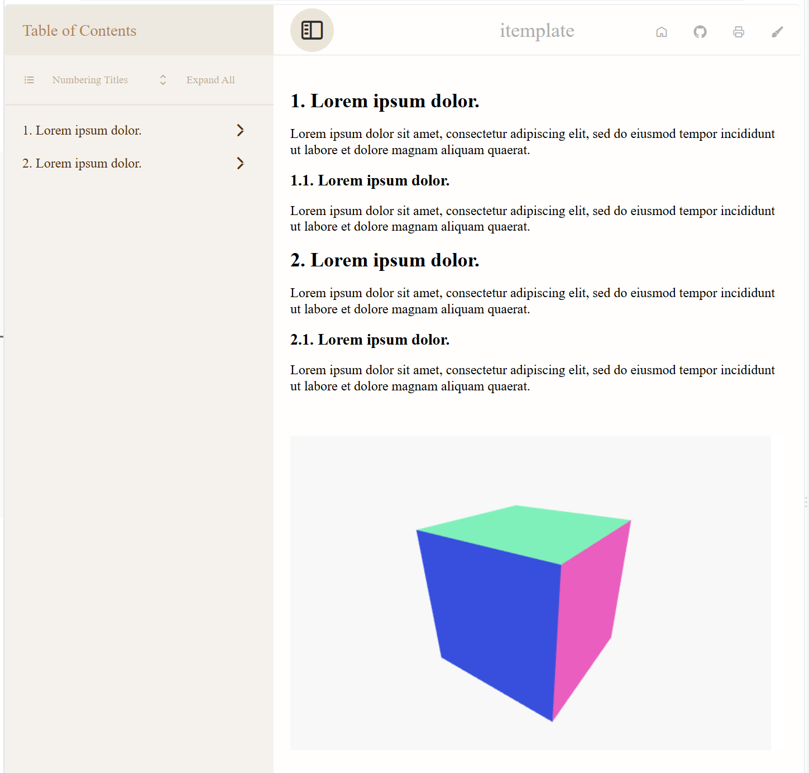

# itemplate

This package restructures the default exported HTML file to provide a more complex structure for subsequent CSS styling and JS manipulation. The exported HTML uses online CSS and JS resources from an npm package named `@hexiongwu1995/itemplate`. An importMap for Three.js has also been added to provide potential 3D visualization features.

# Usage

```typst
// document.typ
#import "@preview/itemplate: 0.1.0": *
#show: contents => itemplate(title: "itemplate", contents)

= #lorem(3)

#lorem(20)

== #lorem(3)

#lorem(20)

= #lorem(3)

#lorem(20)

== #lorem(3)

#lorem(20)

#html.elem("div", attrs: (
  style: "background: white; margin-top: 50px; width: 100%; height: 30vh",
  id: "three-orbital-cube",
))[]

#html.script(
  type: "module",
  src: "https://unpkg.com/@hexiongwu1995/itemplate/examples/itemplate/three-orbital-cube.js",
)

// #html.script(
//   type: "module",
//   src: "./assets/three-js/three-orbital-cube.js",
// )
```

# Compilation

- use tinymist to convert the document to HTML in VS Code.

- or compile the document.typ to HTML in the command line:

```powershell
cd path/to/your/document.typ
typst compile document.typ --format html
```
- or watch document.typ and auto-compile it to HTML in the command line:

```powershell
cd path/to/your/document.typ
typst watch document.typ --format html
```





# source file

All source files associated with this project, except for the iconfont files, are placed in the `assets` directory to ensure this package always maintains a consistent appearance and functionality.