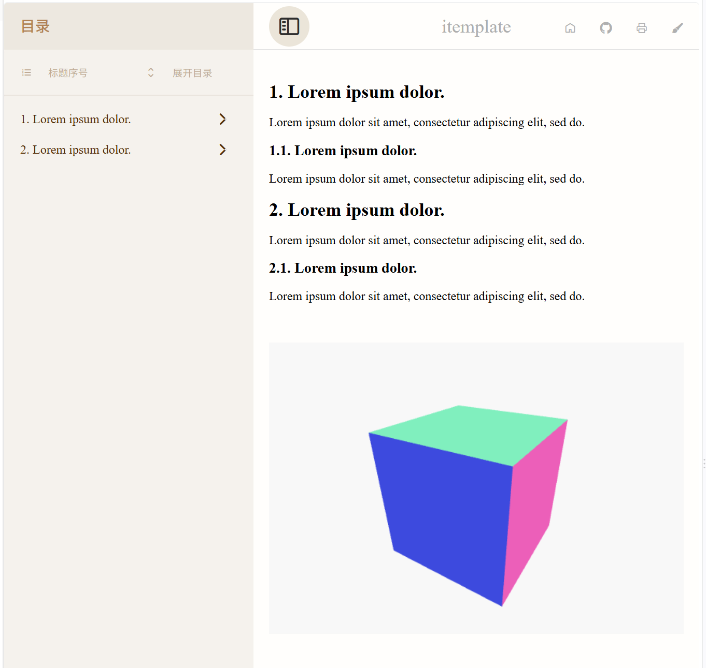

# itemplate

This package automatically adds an HTML template when exporting Typst documents to HTML. The exported HTML uses CSS and JS resources from a package of the same name on npm, with support for Three.js.

# Usage

```typst
// document.typ
#import "@preview/itemplate: 0.3.2": *
#show: contents => itemplate(title: "itemplate", contents)

= #lorem(3)

#lorem(10)

== #lorem(3)

#lorem(10)

= #lorem(3)

#lorem(10)

== #lorem(3)

#lorem(10)

#html.elem("div", attrs: (
  style: "background: white; margin-top: 50px; width: 100%; height: 30vh",
  id: "three-orbital-cube",
))[]
#html.script(
  type: "module",
  src: "https://unpkg.com/@hexiongwu1995/itemplate/examples/itemplate/three-orbital-cube.js",
)

```
# Compilation

- use tinymist to convert the document to HTML in VS Code.

- or compile the document.typ to HTML in the command line:

```powershell
cd path/to/your/document.typ
typst compile document.typ --format html
```
- or watch document.typ and auto-compile it to HTML in the command line:

```powershell
cd path/to/your/document.typ
typst watch document.typ --format html
```


