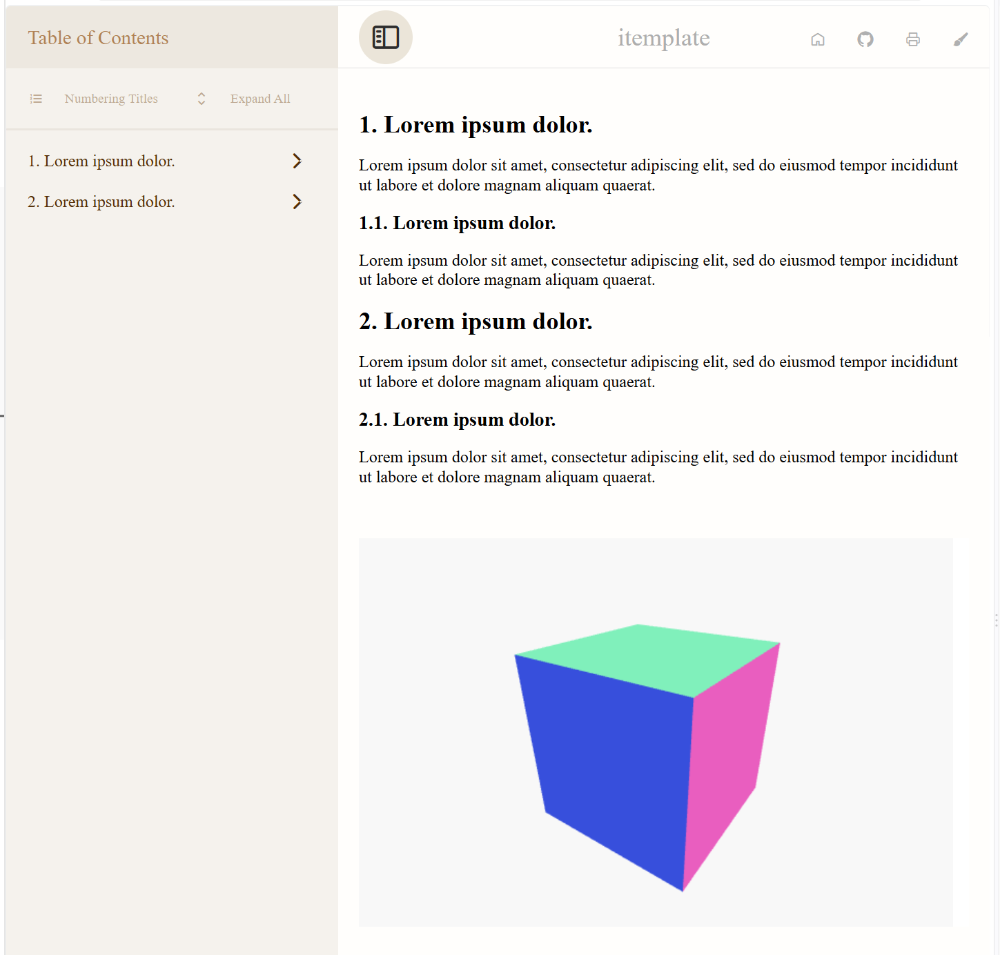

# itemplate

`itemplate` is a Typst template for generating interactive HTML documents. It compiles Typst markup into a self-contained HTML file with a responsive layout, featuring a sidebar table of contents, a header with navigation actions, and a main article area.

The template comes with built-in support for:

- **Interactive UI** such as title numbering, expand/collapse of sections, and home / GitHub / print / paintbrush shortcuts.
- **Three.js** for embedding 3D scenes (e.g. the orbital cube demo).

> This is an amateur project, please use with caution.

# Usage

```typst
// example.typ
#import "@preview/itemplate:0.5.0": *
#show: itemplate.with(doc-title: "example")

= #lorem(3)

#lorem(20)

== #lorem(3)

#lorem(20)

= #lorem(3)

#lorem(20)

== #lorem(3)

#lorem(20)

#html.elem("div", attrs: (
  style: "background: white; margin-top: 50px; width: 100%; height: 30vh",
  id: "three-orbital-cube",
))[]

#html.script(
  type: "module",
  src: "https://unpkg.com/@hexiongwu1995/itemplate/examples/itemplate/three-orbital-cube.js",
)
```

# Compile to HTML

## use Tinymist Typst plugin in VS Code

- install Tinymist Typst plugin in VS Code
- append the following settings to your `.vscode/settings.json` file:

```
"tinymist.typstExtraArgs": ["--features=html", "--features=bundle"],
```
- The exported HTML file will be saved in the same directory as the example.typ file

## use typst cli

- install typst cli on your computer
- compile the example.typ to html in the command line:

```powershell
cd path/to/your/example.typ
typst compile example.typ --features html --format html
```

- or watch example.typ and auto-compile it to HTML in the command line:

```powershell
cd path/to/your/example.typ
typst watch example.typ --features html --format html
```

- The exported HTML file will be saved in the same directory as the example.typ file


