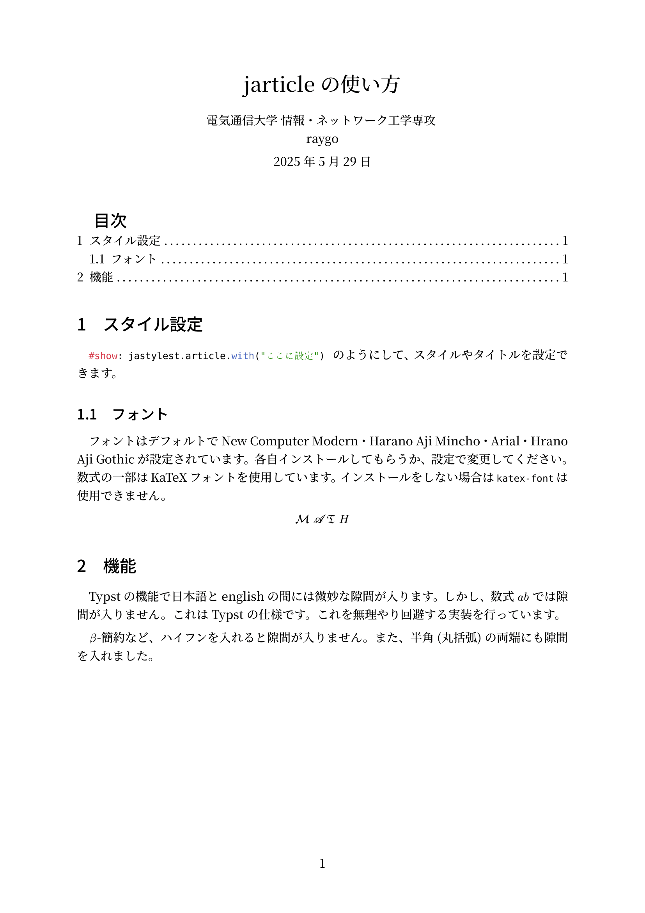
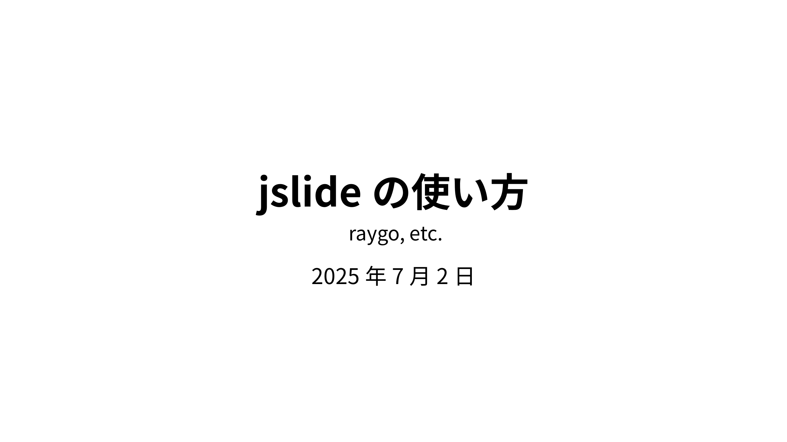
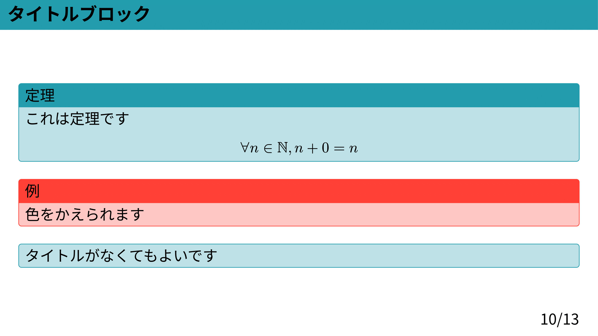

# Typstの日本語テンプレート

Typstの日本語ドキュメント・スライドのテンプレートを作成しました．修正点があればissueにあげるか，pull
requestを送ってください．

# 必要なフォント

このテンプレートを使用する場合は次のフォントをインストールしてもらうか，別のフォントを指定する必要があります．再起動が必要かもしれません．

- [原ノ味フォント](https://github.com/trueroad/HaranoAjiFonts)
- [katex-fonts](https://github.com/KaTeX/katex-fonts/tree/master)
- [adobe-blank](https://github.com/adobe-fonts/adobe-blank)

具体的な使い方は[公式ドキュメント](https://typst.app/docs/)か解説ブログをご覧ください．

# 参考サイト

- [Typstで和文と数式の間の空きをどうにかしたい話](https://qiita.com/zr_tex8r/items/a9d82669881d8442b574)

# サンプル

## ドキュメント

ドキュメントを作成したい場合は，[document.typ](./template/document.typ)を参考にしてください．

## スライド

スライドを作成したい場合は，[slide.typ](./template/slide.typ)を参考にしてください．

# 更新履歴

v0.1.1 (2025-07-02)

- subtitleの追加
- slide titleの色を黒にした(自分で設定できます)
- title-blockのtitleがない場合のスタイルを追加

v0.1.2 (2025-10-24)

- 数式前後に空白を自動で入れる処理を修正
