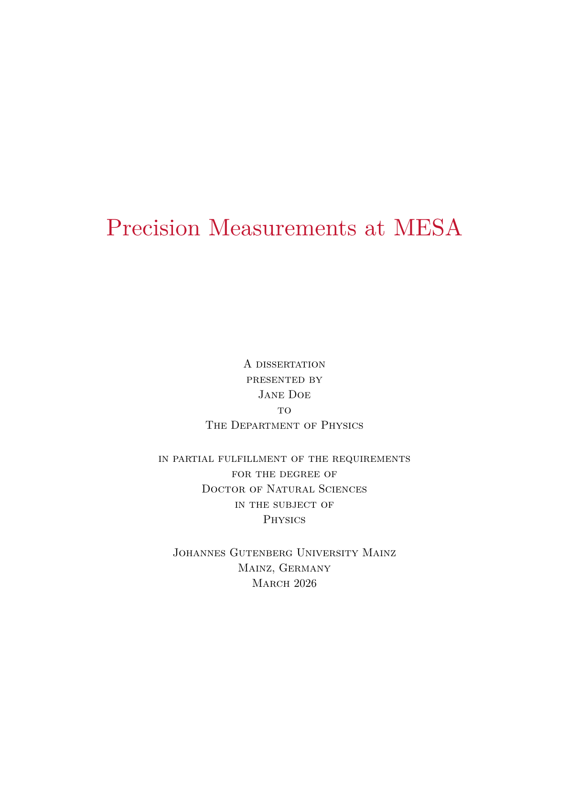
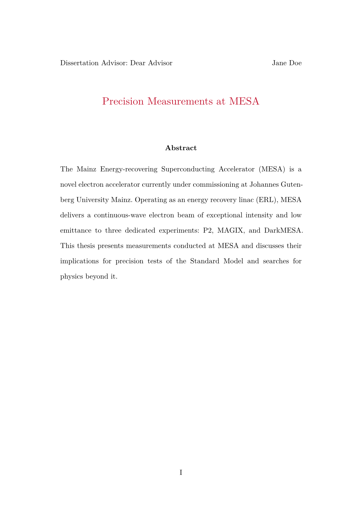
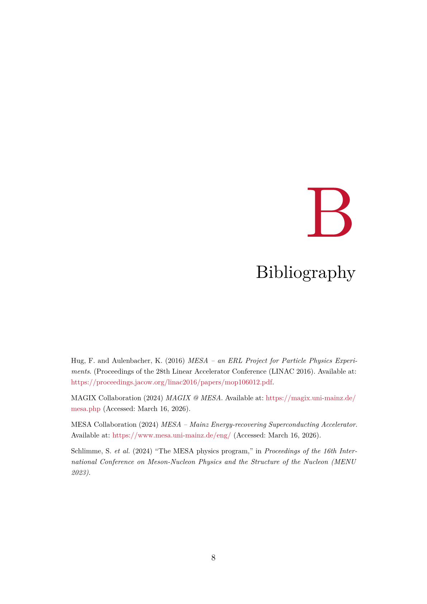

# A Typst Thesis Template for the JGU Mainz
This is an **unofficial** MINT-focused thesis template for the Johannes Gutenberg University Mainz, adopted from [Jerry Ling's Harvard GSAS template](https://github.com/Moelf/harvard-gsas-thesis-oat).

<div align="center" style="display:flex; gap:1rem; justify-content:center;">
  
  
</div>
<div align="center" style="display:flex; gap:1rem; justify-content:center; margin-top:1rem;">
  
  
</div>


# Installation

Download the [latest release](https://github.com/inverted-tree/jgu-thesis/releases/latest), or clone the repository and run:

```sh
just install
```

This copies the package into the Typst local packages directory for your OS. You can then import it in any Typst project using the @local namespace:

```typst
#import "@local/jgu-mint-thesis:0.2.2": *
```

# Usage

Apply `frontmatter` as a show rule at the top of your document. This allows you to set the following options:

```typst
#show: frontmatter.with(
  title: "...",
  author: "...",
  examiners: ("...",),             // add more entries for multiple examiners
  abstract: [...],
  thesis-type: "dissertation",    // "dissertation", "master", or "bachelor"
  doctor-of: "Natural Sciences",
  major: "Physics",
  department: "Department of Physics",
  completion-date: "May 2026",    // defaults to today
  creative-commons: true,         // CC BY 4.0 on copyright page
  dedication: [_For my family._],
  acknowledgements: [...],
  list-of-figures: false,
  list-of-tables: false,
  abbreviations: (
    "ERL": "Energy Recovery Linac",
    "MESA": "Mainz Energy-recovering Superconducting Accelerator",
  ),
  statutory-declaration: image("declaration.pdf", width: 100%, height: 100%, fit: "contain"),
  logo: image("logo.svg", width: 6cm),  // defaults to JGU logo
  language: "en",           // "en" or "de"
)
```

The `logo` parameter accepts any Typst content and defaults to the JGU Mainz logo bundled with the package — pass your own `image(...)` to override it. The dedication is rendered centered on an unnumbered page after the copyright page. Acknowledgements appear as the last frontmatter section before the chapters and are listed in the TOC. The list of figures and tables are populated automatically by Typst when enabled. Abbreviations are sorted alphabetically and rendered as a two-column list. If `statutory-declaration` is set, it is appended as the final page without margins — intended for a scanned signed declaration of originality, passed as `image("declaration.pdf", width: 100%, height: 100%, fit: "contain")`. Setting `language: "de"` switches all template strings to German (section titles, examiner labels, title page phrasing) and also needs to be passed to `#show: appendix.with(language: "de")`.

The package also exports `accent-color` (JGU red), which can be used in custom figures or highlighted content, or overwritten with a different color.

Place `#bibliography(...)` right before the appendix. Below that, switch heading and figure numbering to `A.1` format like so:

```typst
#bibliography("refs.yml")

#show: appendix.with()

= Appendix Title
```

# Changelog

## 0.2.2
- Remove per-chapter reset of raw figure counters
- Update package description to follow Typst Universe guidelines

## 0.2.1
- Fix completion date showing English month names when `language: "de"`

## 0.2.0
- Add german language support

## 0.1.8
- Added optional statutory declaration page (appended as final page)
- Added support for multiple examiners
- Added optional dedication and acknowledgements pages
- Fixed list of figures, tables, and abbreviations not appearing in TOC
- Bibliography/References heading letter is now derived from the section title

## 0.1.7
- Added optional list of figures, list of tables, and abbreviations sections
- Switched paper size to A4

## 0.1.6
- Adapted template to JGU Mainz with minor stylistic changes

## 0.1.5
- `Chapter` and `Section` are used for supplement correctly

## 0.1.4
- Added `appendix()` function for appendix, which resets numbering to start with `A.`
- fix equation numbering style to include `()`

## 0.1.3
- Improved figure caption alignment, size, and separation

## 0.1.2
- Fixed title style
- Added Numbering for equations and figures
- Improved margin

## 0.1.1
- Added `creative_commons` option for front matter
- Fixed title printing just before Abstract
- Fixed inconsistent small caps
- Fixed fill for entries in the ToC
- added color for reference and URL to be the school color
