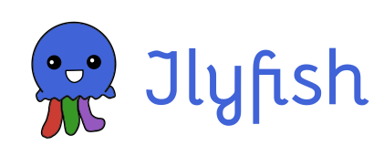
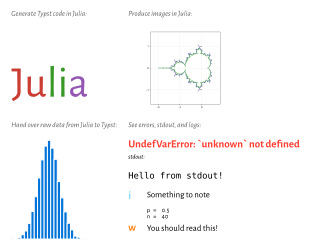

Jlyfish is a package for Julia and Typst that allows you to integrate Julia
computations in your Typst document.

[](https://github.com/andreasKroepelin/TypstJlyfish.jl/wiki)


[](https://github.com/andreasKroepelin/TypstJlyfish.jl)

You should use Jlyfish if you want to write a Typst document and have some of
the content automatically produced by Julia code but want the source code for
that within your document source.
It fills a similar role as [PythonTeX](https://github.com/gpoore/pythontex)
does for Python and LaTeX.
Note that this is different from tools like [Quarto](https://quarto.org/) where
you write documents in Markdown, also integrate some Julia code, but then might
use Typst only as a backend to produce the final document.

See below for a quick introduction or read the
[wiki](https://github.com/andreasKroepelin/TypstJlyfish.jl/wiki) for an in depth
explanation.

# Getting started

Since Jlyfish builds a bridge between Julia and Typst, we also have to get two
things running.
First, install the Julia package `TypstJlyfish` from the general registry by
executing
```julia-repl
julia> ]

(@v1.10) pkg> add TypstJlyfish
```
You only have to do this once.
(It is like installing and using the Pluto notebook system, if you are familiar
with that.)

When you want to use Jlyfish in a Typst document (say, `your-document.typ`),
add the following line at the top:
```typ
#import "@preview/jlyfish:0.1.0": *
```
Then, open a Julia REPL and run
```julia-repl
julia> import TypstJlyfish

julia> TypstJlyfish.watch("your-document.typ")
```

Jlyfish facilitates the communication between Julia and Typst via a JSON file.
By default, Jlyfish uses the name of your document and adds a `-jlyfish.json`,
so `your-document.typ` would become `your-document-jlyfish.json`.
This can be configured, of course.

To let Typst know of the computed data in the JSON file, add the following line
to your document:
```typ
#read-julia-output(json("your-document-jlyfish.json"))
```

You can then place some Julia code in your Typst source using the `#jl`
function:
```typ
What is the sum of the whole numbers from one to a hundred? #jl(`sum(1:100)`)
```

Head over to the [wiki](https://github.com/andreasKroepelin/TypstJlyfish.jl/wiki)
to learn more!

# Showcase

Just to show what is possible with Jlyfish:



````typ
#import "@preview/jlyfish:0.1.0": *

#set page(width: auto, height: auto, margin: 1em)
#set text(font: "Alegreya Sans")
#let note = text.with(size: .7em, fill: luma(100), style: "italic")

#read-julia-output(json("demo-jlyfish.json"))
#jl-pkg("Colors", "Typstry", "Makie", "CairoMakie")

#grid(
  columns: 2,
  gutter: 1em,
  align: top,
  [
    #note[Generate Typst code in Julia:]

    #set text(size: 4em)
    #jl(```julia
      using Typstry, Colors

      parts = map([:red, :green, :purple], ["Ju", "li", "a"]) do name, text
        color = hex(Colors.JULIA_LOGO_COLORS[name])
        "#text(fill: rgb(\"$color\"))[$text]"
      end
      TypstText(join(parts))
    ```)
  ],
  [
    #note[Produce images in Julia:]

    #set image(width: 10em)
    #jl(recompute: false, ```
      using Makie, CairoMakie

      as = -2.2:.01:.7
      bs = -1.5:.01:1.5
      C = [a + b * im for a in as, b in bs]
      function mandelbrot(c)
        z = c
        i = 1
        while i < 100 && abs2(z) < 4
          z = z^2 + c
          i += 1
        end
        i
      end

      contour(as, bs, mandelbrot.(C), axis = (;aspect = DataAspect()))
    ```)
  ],
  [
    #note[Hand over raw data from Julia to Typst:]
    #let barchart(counts) = {
      set align(bottom)
      let bars = counts.map(count => rect(
        width: .3em,
        height: count * 9em,
        stroke: white,
        fill: blue,
      ))
      stack(dir: ltr, ..bars)
    }

    #jl-raw(fn: it => barchart(it.result.data), ```julia
      p = .5
      n = 40
      counts = zeros(n + 1)
      for _ in 1:10_000
        count = 0
        for _ in 1:n
          if rand() < p
            count += 1
          end
        end
        counts[count + 1] += 1
      end

      counts ./= maximum(counts)
      lo, hi = findfirst(>(1e-3), counts), findlast(>(1e-3), counts)
      counts[lo:hi]
    ```)
  ],
  [
    #note[See errors, stdout, and logs:]

    #jl(```julia
      println("Hello from stdout!")
      @info "Something to note" n p
      @warn "You should read this!"
      this_does_not_exist
    ```)
  ]
)
````
