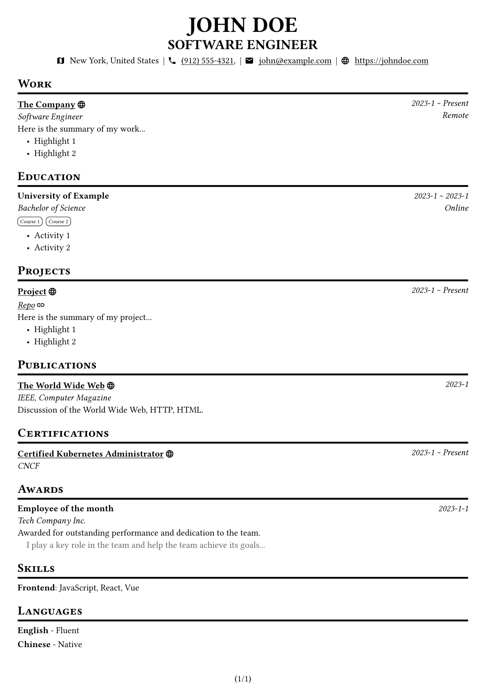

# Jsume (JSON Resume) Typst Template

An easy to use resume template. Just provide your [jsume](https://github.com/jsume/jsume/tree/main/packages/schemas) JSON file and generate a beautiful resume PDF.

## Sample Resume



## Quick Start

First, create your own jsume JSON file (e.g. `en-US.jsume.json`) by using the [jsume CLI](https://github.com/jsume/jsume/blob/main/packages/cli/README.md). And make sure validate your JSON file with [jsume CLI](https://github.com/jsume/jsume/blob/main/packages/cli/README.md) `jsume validate jsume-en.json` after editing.

Then, create a Typst file (e.g. `resume.typ`) and add the following code:

```typst
#import "@preview/jsume:0.1.0": *

#show: jsume.with(
  lang: "en-US",
  jsume-data: json("en-US.jsume.json"),
)
```

There are some options with default values you can customize:

```typst
#let jsume(
  paper: "a4",
  numbering: "(1/1)",
  top-margin: 0.3in,
  bottom-margin: 0.3in,
  left-margin: 0.3in,
  right-margin: 0.3in,
  font: "Libertinus Serif",
  nerd-font: "Symbols Nerd Font",
  font-size: 11pt,
  lang: "en-US",
  jsume-data: (),
  doc,
) = { /*...*/ }
```

## I18n

This template supports:

- [x] English (`en-US`)
- [x] 简体中文 (`zh-CN`)
- [x] 繁體中文 (`zh-HK`)
- [x] 繁體中文 (`zh-TW`)
- [x] 日本語 (`ja-JP`)
- [x] Español (`es-ES`)
- [x] Français (`fr-FR`)
- [x] Deutsch (`de-DE`)
- [x] Русский (`ru-RU`)
- [x] 한국어 (`ko-KR`)

> [!NOTE]
> Translations are done by AI, please open an issue or PR for any mistakes or new languages.
