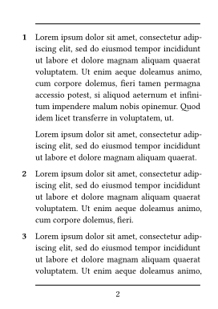
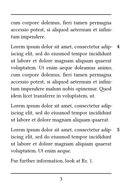

# jurz – *Randziffern* in Typst

[*Randziffern*](https://de.wikipedia.org/w/index.php?title=Randnummer&oldid=231943223) (also called *Randnummern*) are a way to reference text passages in a document, independent of the page number or the section number. They are used in many German legal texts, for example. This package provides a way to create *Randziffern* in Typst.

## Demo

<table>
 <tr>
  <td>
   
  </td>
  <td>
   
  </td>
 </tr>
</table>

<details>
 <summary>View source</summary>

```typst
#show: init-jurz.with(
  gap: 1em,
  two-sided: true
)

#rz #lorem(50)

#lorem(20)

#rz<abc> #lorem(30)

#rz #lorem(40)

#rz #lorem(50)

#lorem(20)

#rz #lorem(24)

Fur further information, look at @abc.
```

</details>

## Reference

### `init-jurz`

A show rule that initializes the *Randziffern* for the document. This rule should be placed at the beginning of the document. It also allows customizing the behavior of the *Randziffern*.

#### Usage

```typst
#show: init-jurz.with(
 // parameters
 // two-sided: true,
 // gap: 1em,
 // supplement: "Rz.",
 // reset-level: 0,
)
```

#### Parameters

- `two-sided` (optional): If `true`, the *Randziffern* are placed on the outer margin of the page. If `false`, they are placed on the left margin. Default is `true`.
- `gap` (optional): The distance between the *Randziffer* and the text. Default is `1em`.
- `supplement` (optional): The text that is placed before the *Randziffer* when referencing it. Default is `"Rz."`.
- `reset-level` (optional): The heading level at which the *Randziffern* are reset. If set to `3`, for example, the numbering of the *Randziffern* restarts after every heading of levels `1`, `2`, or `3`. Default is `0`.

### `rz`

Adds a *Randziffer* to the text. The *Randziffer* is a unique identifier that can be referenced in the text.

You can add references the same way you can with headings. In fact, the *Randziffer* is treated as a heading of level `99` under the hood.

#### Usage

```typst
#rz #lorem(100)
#rz<abc> #lorem(100)

See also @abc.
```

## License

This package is licensed under the MIT License.