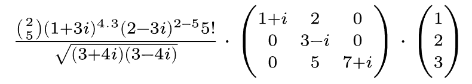
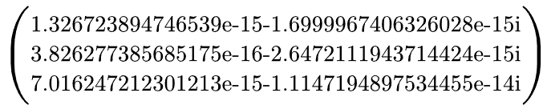
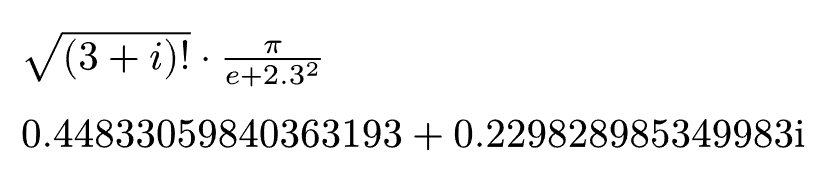
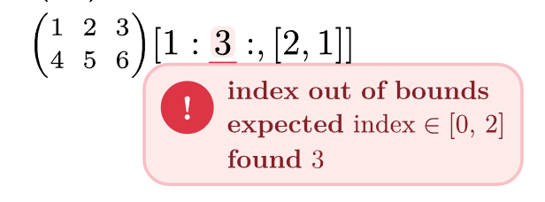

# Kalt

Kalt evaluates arbitrary nested Typst equations and removes the need to
transcribe your equations into Typst's `calc` system. You will no longer run
into unsupported operations, and it all works for scalars and matrices. Since
everything runs on normal Typst content, you can store and adjust the results as
needed.

Complex equation?



```typst
$comp(frac(binom(2, 5) (1 + 3 i)^4.3 (2 - 3 i)^(2-5) 5!, sqrt((3+4i)(3-4i))) dot mat(
    1+i, 2, 0;
    0, 3-i, 0;
    0, 5, 7+i;
) dot vec(1, 2, 3))$
```



No problem :D

## Import and start evaluating

```typst
#import "@preview/kalt:0.1.0": comp;
```

## Math Operators

- `+`, `-`, `/`, `*`|`dot`
- `^` exponents
- `!` factorial
- `root`, `sqrt`
- `binom`

```typst
#let N = 2
$comp(sqrt((3+i)!)) dot pi/(e + 2.3^(#N))$
```



## Number Formats

```typst
$comp("2.1e3"+1)$ // => 2101.0
$comp("0b010"*2)$ // => 4.0
$comp("0XFF"i/2)$ // => 127.5i
```

## Built-in Functions

- `ln`, `log_a`

```typst
$comp(ln(2^4))$ // => 4.0
```

## Complex Numbers

Full support for complex numbers at any position in an equation.

```typst
$comp(e^(i pi))$ // => -1
```

## Matrices and Vectors

```typst
$comp(mat(1/i+2, 0)^T dot mat(1, 2))$ // => mat(2-i, 4-2i; 0, 0)
```

### Indexing

Subslice your matrices the way you are used to from NumPy `ndarray`s.

```typst
$comp(mat(1,2;4,5)[::, 1])$ // => mat(2; 5)
$comp(mat(1,2,3;4,5,6)[1:2:, [2,1]])$ // => mat(6, 5)
```

### Element-wise Operations and Mapping

Element-wise multiplication is supported by default:

```typst
#let m = $mat(1,2,3;4,5,6)$
$comp(#m compose #m)$ // => mat(1, 4, 9; 16, 25, 36)
```

You can also apply custom **mapping** functions to each element **in Typst**

```typst
#import "@preview/kalt:0.1.0": comp, map;

$map(mat(2, 2; 2, 6), #{ a => $#a + 3$ })$ // mat(5, 5; 5, 9)
```

Or **merge** multiple matrices together:

```typst
#import "@preview/kalt:0.1.0": comp, merge;

$merge(#{ (a, b) => $log_#a (#b)$ }, mat(2, 2; 2, 2), mat(2, 2; 2, 8))$ // => mat(1, 1; 1, 3)
```

## Error Handling

It returns inlined error messages for mistakes.


# Development

You do not need to move everything into Kalt. Kalt uses `sertyp` to run the
heavy computation in Rust using Wasm. The backend libraries for both `sertyp`
and `kalt` are available as standalone libraries and are ready for your project
:D Basic math should stay in `kalt`, though. For more on what still needs work,
take a look at the contributions section.

# Contributions

There is still a lot to do. Many basic functions like `abs`, `floor`, and `ceil`
are not yet supported. Quality-of-life features like improved floating point
formatting would brighten everyone's day. If you find something that is missing,
feel free to contribute :D
