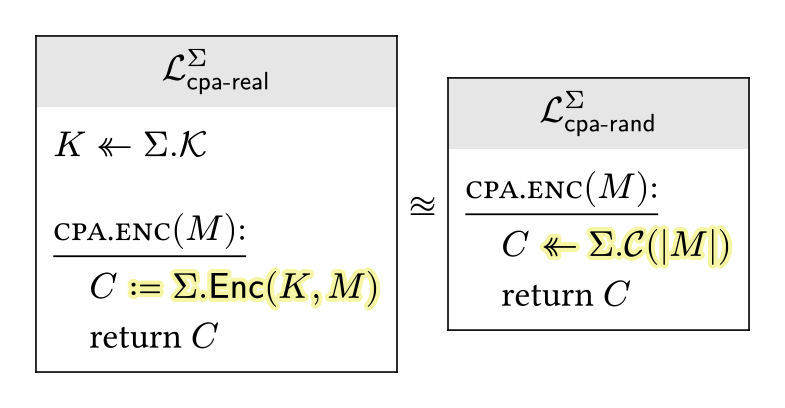

# Kangaroo

Kangaroo is a [Typst][] package for typesetting cryptography.

The notation and style for game-hopping proofs follow that of [The Joy of Cryptography][].

## Usage

The [showcase][] documents all the available functions.

<p align="center">
    
</p>

```typst
#import "@preview/kangaroo:0.1.0": *

#let cpa-real = library(title: lib(subject: $Sigma$)[cpa-real])[
  - $K <<- Sigma\.cal(K)$

  - #proc(subr[cpa.enc], args: $M$)
    - $C #hl[$:= Sigma\.algo("Enc")(K, M)$]$
    - return $C$
]

#let cpa-rand = library(title: lib(subject: $Sigma$)[cpa-rand])[
  - #proc(subr[cpa.enc], args: $M$)
    - $C #hl[$<<- Sigma\.cal(C)(|M|)$]$
    - return $C$
]

#chain(cpa-real, indist.is, cpa-rand)
```

[Typst]: https://typst.app
[The Joy of Cryptography]: https://joyofcryptography.com
[showcase]: https://github.com/interrato/kangaroo/releases/download/v0.1.0/kangaroo-showcase-v0.1.0.pdf
