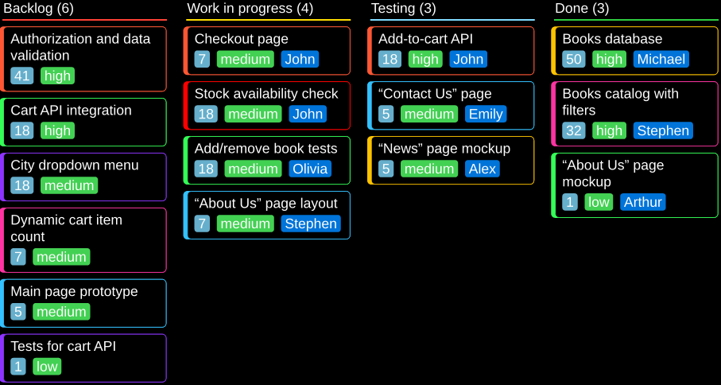
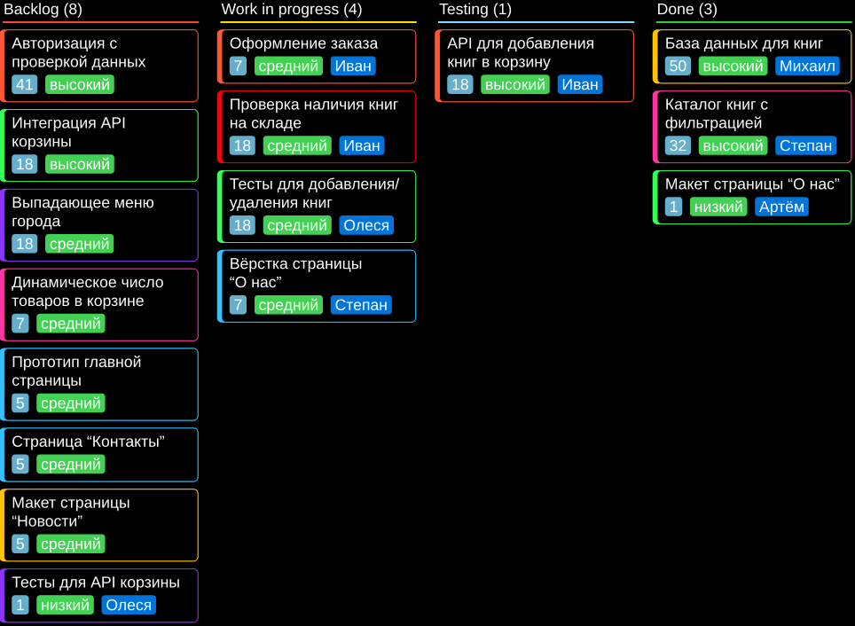

# [Kantan][kantan] (Typst package)

[Kantan][kantan] (<ruby>簡単<rt>かんたん</rt></ruby>) is a package to _easily_
create a kanban board (<ruby>看板<rt>かんばん</rt></ruby>) of any scale.

A bonus, is that the source code is so small, you can quickly modify any aspect
of it, to make the board look the way you want. Because of composability, you
can mix package functions with locally edited ones.

## Usage

### [Example 1]

```typ
#import "@preview/kantan:0.1.0": *
// #set page(width: 16cm, height: auto, margin: 2pt)

// Dark theme
#set page(fill: black)
#set text(fill: white)
#let kanban-item = kanban-item.with(fill: black)

#kanban(
  font-size: 0.80em,
  font: "Liberation Sans",
  kanban-column("Backlog", color: red,
    kanban-item(stroke: rgb("#FF5733"))[41][high][Authorization and data validation],
    kanban-item(stroke: rgb("#33FF57"))[18][high][Cart API integration],
    kanban-item(stroke: rgb("#8D33FF"))[18][medium][City dropdown menu],
    kanban-item(stroke: rgb("#FF33A1"))[7][medium][Dynamic cart item count],
    kanban-item(stroke: rgb("#33C1FF"))[5][medium][Main page prototype],
    kanban-item(stroke: rgb("#8D33FF"))[1][low][Tests for cart API],
  ),
  kanban-column("Work in progress", color: yellow,
    kanban-item(stroke: rgb("#FF5733"))[7][medium][John][Checkout page],
    kanban-item(stroke: rgb("#FF0000"))[18][medium][John][Stock availability check],
    kanban-item(stroke: rgb("#33FF57"))[18][medium][Olivia][Add/remove book tests],
    kanban-item(stroke: rgb("#33C1FF"))[7][medium][Stephen]["About Us" page layout],
  ),
  kanban-column("Testing", color: aqua,
    kanban-item(stroke: rgb("#FF5733"))[18][high][John][Add-to-cart API],
    kanban-item(stroke: rgb("#33C1FF"))[5][medium][Emily]["Contact Us" page],
    kanban-item(stroke: rgb("#FFC300"))[5][medium][Alex]["News" page mockup],
  ),
  kanban-column("Done", color: green,
    kanban-item(stroke: rgb("#FFC300"))[50][high][Michael][Books database],
    kanban-item(stroke: rgb("#FF33A1"))[32][high][Stephen][Books catalog with filters],
    kanban-item(stroke: rgb("#33FF57"))[1][low][Arthur]["About Us" page mockup],
  ),
)
```

<picture>
  <source
    media="(prefers-color-scheme: light)"
    srcset="./tests/example-en/ref/1.png">
  
</picture>

---

### [Example 2]

```typ
#import "@preview/kantan:0.1.0": *
// #set page(width: 17cm, height: auto, margin: 2pt)

// Dark theme
#set page(fill: black)
#set text(fill: white)
#let kanban-item = kanban-item.with(fill: black)

#kanban(
  font-size: 0.80em,
  font: "Liberation Sans",
  kanban-column("Backlog", color: red,
    kanban-item(stroke: rgb("#FF5733"))[41][высокий][Авторизация с проверкой данных],
    kanban-item(stroke: rgb("#33FF57"))[18][высокий][Интеграция API корзины],
    kanban-item(stroke: rgb("#8D33FF"))[18][средний][Выпадающее меню города],
    kanban-item(stroke: rgb("#FF33A1"))[7][средний][Динамическое число товаров в корзине],
    kanban-item(stroke: rgb("#33C1FF"))[5][средний][Прототип главной страницы],
    kanban-item(stroke: rgb("#33C1FF"))[5][средний][Страница "Контакты"],
    kanban-item(stroke: rgb("#FFC300"))[5][средний][Макет страницы "Новости"],
    kanban-item(stroke: rgb("#8D33FF"))[1][низкий][Олеся][Тесты для API корзины],
  ),
  kanban-column("Work in progress", color: yellow,
    kanban-item(stroke: rgb("#FF5733"))[7][средний][Иван][Оформление заказа],
    kanban-item(stroke: rgb("#FF0000"))[18][средний][Иван][Проверка наличия книг на складе],
    kanban-item(stroke: rgb("#33FF57"))[18][средний][Олеся][Тесты для добавления/удаления книг],
    kanban-item(stroke: rgb("#33C1FF"))[7][средний][Степан][Вёрстка страницы "О~нас"],
  ),
  kanban-column("Testing", color: aqua,
    kanban-item(stroke: rgb("#FF5733"))[18][высокий][Иван][API для добавления книг в корзину],
  ),
  kanban-column("Done", color: green,
    kanban-item(stroke: rgb("#FFC300"))[50][высокий][Михаил][База данных для книг],
    kanban-item(stroke: rgb("#FF33A1"))[32][высокий][Степан][Каталог книг с фильтрацией],
    kanban-item(stroke: rgb("#33FF57"))[1][низкий][Артём][Макет страницы "О~нас"],
  ),
)
```

<picture>
  <source
    media="(prefers-color-scheme: light)"
    srcset="./tests/example-ru/ref/1.png">
  
</picture>

## API

### `kanban-item`

```typ
/// Create a single kanban board item that can be placed in `kanban-column`.
///
/// - hardness-level (any): How hard the task is, its cost (usually a number).
/// - priority-level (any): For example, can be "low", "medium", "high".
/// - inset (relative, dictionary): Inset for: hardness, priority, assignee.
/// - stroke (color, gradient, tiling, length, stroke): Stroke for item box.
/// - height (auto, relative): Item height.
/// - args (arguments): 1 positional argument is item name, 2 positional
///    arguments is assignee and item name.
#let kanban-item(
  hardness-level,
  priority-level,
  inset: 0.27em,
  stroke: 0.05em,
  height: auto,
  ..args,
)
```

---

### `kanban-column`

```typ
/// Create a single kanban board column that can be placed in `kanban`.
///
/// - name (str, content): Column name.
/// - color (color, gradient, tiling): Column color.
/// - items (arguments): Column items created with `kanban-item`.
#let kanban-column(name, color: auto, ..items)
```

---

### `kanban`

```typ
/// Create a single kanban board item that can be placed in `kanban-column`.
///
/// - width (auto, relative): Kanban board width. Default is `100%`.
/// - item-spacing (relative): Spacing between items in a column.
/// - leading (length): Paragraph leading to use inside the board.
/// - font-size (length): Font size to use inside the board.
/// - font (str, array, dictionary): Font to use inside the board.
/// - args (arguments): Columns created with `kanban-column`.
#let kanban(
  width: 100%,
  item-spacing: 0.5em,
  leading: 0.5em,
  font-size: 1em,
  font: (),
  ..args,
)
```

## License

This Typst package is licensed under AGPL-3.0-only license. You can view the
license in the [`LICENSE`] file in the root of the project or at
<https://www.gnu.org/licenses/agpl-3.0.txt>.

[kantan]: https://codeberg.org/Andrew15-5/kantan
[Example 1]: ./tests/example-en/test.typ
[Example 2]: ./tests/example-ru/test.typ
[`LICENSE`]: ./LICENSE
