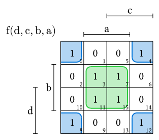
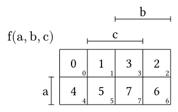
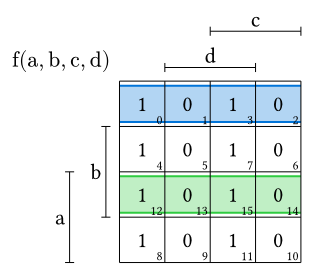
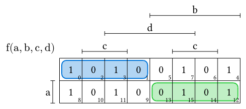
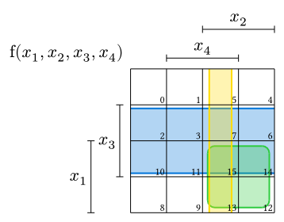
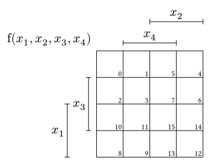

# Karnaugh

`karnaugh-express` is a [Typst](https://github.com/typst/typst) package for creating highly customizable Karnaugh maps.

## Overview

The `karnaugh` function takes two necessary arguments: `variables` and `values`. The parameter `terms` is optional and lets you select cells in the Karnaugh map without the hassle of specifying coordinates:

```typ
#import "@preview/karnaugh-express:0.1.1": karnaugh

#karnaugh(
  ("d", "c", "b", "a"),
  (1, 0, 0, 1, 1, 0, 0, 1, 1, 0, 0, 1, 1, 0, 0, 1),
  terms: ("!b & !a", "a & b")
)
```
  
    
## Placement of the Values

Values are automatically placed so that you can read them directly from a truth table. Take the following table:

| a | b | c | position |
| - | - | - | -------- |
| 0 | 0 | 0 | 0        |
| 0 | 0 | 1 | 1        |
| 0 | 1 | 0 | 2        |
| 0 | 1 | 1 | 3        |
| 1 | 0 | 0 | 4        |
| 1 | 0 | 1 | 5        |
| 1 | 1 | 0 | 6        |
| 1 | 1 | 1 | 7        |

```typ
#import "@preview/karnaugh-express:0.1.1": karnaugh

#karnaugh(
  ("a", "b", "c"),
  (0, 1, 2, 3, 4, 5, 6, 7),
  arrangement-standard: 1
)
```


## Arranging Variables on the Axis

### 1. Standard Arrangement
There are different ways of arranging variables on a Karnaugh map. One is the standard layout shown in the first image. `karnaugh-express` supports two standard layouts that can be selected with the `arrangement-standard` argument. 

`arrangement-standard: 0` is used in the first image. `arrangement-standard: 1` looks like this:

```typ
#import "@preview/karnaugh-express:0.1.1": karnaugh

#karnaugh(
  ("a", "b", "c", "d"),
  (1, 0, 0, 1, 1, 0, 0, 1, 1, 0, 0, 1, 1, 0, 0, 1),
  arrangement-standard: 1,
  terms: ("!b & !a", "a & b")
)
```

    
### 2. Custom Arrangement
You can also specify a completely custom arrangement. Just provide an `arrangement` parameter as an array of two arrays. The first array contains the row axis variables, and the second array contains the column axis variables:

```typ
#import "@preview/karnaugh-express:0.1.1": karnaugh

#karnaugh(
  ("a", "b", "c", "d"),
  (1, 0, 0, 1, 1, 0, 0, 1, 1, 0, 0, 1, 1, 0, 0, 1),
  arrangement: (("a",), ("b", "d", "c")),
  terms: ("!b & !a", "a & b")
)
```


## Terms 

To select cells in the K-map, you need to pass the `terms` parameter, which is an array of strings. Each element of the array represents a separate term. In the string, you need to separate each literal with a ampersand (`&`). If the variable should be `0`, put an exclamation mark (`!`) before the variable.

Term highlighting supports automatic wraparound grouping across opposing edges of the Karnaugh map.

### Gaps
Use highlight-inset to control the gap between the grid and a highlight outline.

When multiple highlights overlap, readability can be improved by varying the inset for each term. The amount by which successive highlights are offset is determined by highlight-stroke. Use highlight-steps to specify how many different inset levels should be used before the pattern repeats.

```typ
#import "@preview/karnaugh-express:0.1.1": karnaugh

#karnaugh(
  ("a", "b", "c", "d"),
  (),
  var-disp: ($x_1$, $x_2$, $x_3$, $x_4$), 
  terms: ("c", "a & b", "b & d"),
  highlight-inset: 0.1, 
  highlight-steps: 3,
)
```


## Display Variables

Because the variables you pass into the `karnaugh` function fulfill a functional purpose (used to specify which cells should be highlighted), they cannot be passed in math mode. This is what the `var-disp` parameter is for. Just create a second array detailing how you want each variable to be displayed, in the exact same order as your functional variables:

```typ
#import "@preview/karnaugh-express:0.1.1": karnaugh

#karnaugh(
  ("a", "b", "c", "d"),
  (),
  var-disp: ($x_1$, $x_2$, $x_3$, $x_4$)
)
```

    
## Other Parameters

| Parameter | Default | Type | Explanation |
| --- | --- | --- | --- |
| `arrangement` | `auto` | `((string,), (string,))` | Explained above |
| `arrangement-standard` | `0` | `1` or `0` | Explained above |
| `terms` | `()` | `(string,)`| Explained above |
| `var-disp` | Same as `variables` | `(content,)` | Explained above |
| `stroke` | `0.5pt` | `length` | The width of the grid lines and the bars |
| `grid-size` | `0.8cm` | `length` | The size of the grid cells |
| `draw-subscripts` | `true` | `bool` | Turns the cell index subscripts on or off |
| `highlight-transparency` | `70%` | `ratio` | Determines the transparency of the cell highlight colors |
| `highlight-colors` | `(blue, green, yellow, purple, red)` | `(color,)` | The colors used for cell selection. The package loops through them. |
| `highlight-radius` | `0.2` | `float` | The radius of the rounded corners of the cell highlights |
| `highlight-inset` | `0.1` | `float` | Size of the gap between the grid and the boxes used for the cell highlights |
| `highlight-stroke` | `0.5pt` | `length` | Stroke thickness for term outlines |
| `highlight-steps` | `1` | `int` | How often the highlight-gap will increase in order to prevent overlap |
| `default-fill` | `none` | `content` | When some values aren't provided, cells will be filled with this placeholder |
| `value-size` | `1em` | `relative length` | Font size of the values |
| `subscript-size` | `0.6em` | `relative length` | Font size of the subscripts |
| `distance-subscript-corner` | `0.05` | `float` | Distance from the corner of the grid to the subscripts |
| `distance-bar-grid` | `0.3` | `float` | Distance from one bar to the grid |
| `distance-bar-bar` | `0.8` | `float` | Distance between adjacent bars |
| `distance-bar-letter` | `0.1` | `float` | Distance from the letters (variables) to the bars |
| `small-bar-len` | `0.1` | `float` | The length of the small lines (or half of it) |
| `function-name` | `"f"` | `content` | The function name used in the autogenerated "title" of the map |
| `label` | `auto` | `content` | The label shown in the upper-left corner of the map. |
| `label-position` | `(0.2, 0.2)` | `(float, float)` | The position of the label relative to the upper left corner of the grid |
