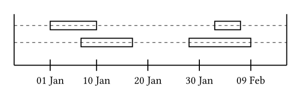
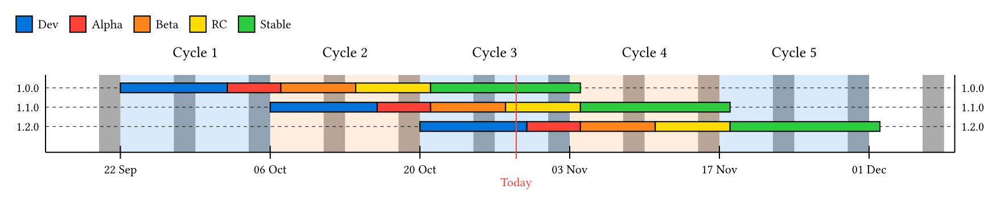

# Kebab Chart

Kebab chart is a typst package to display time range chart.

## Examples

Checkout the [repository](https://github.com/tguichaoua/kebab-chart/tree/main/examples) for the source code of the following examples:

### A simple chart



### Product development cycles



## Usage

Here a simple usage:

```typst
#import "@preview/kebab-chart:0.1.0": kebab-chart

#kebab-chart(
  ticks: 5,

  (
    (
      spans: (
        (start: datetime(year: 2025, month: 1, day: 1), end: datetime(year: 2025, month: 1, day: 10)),
        (start: datetime(year: 2025, month: 2, day: 2), end: datetime(year: 2025, month: 2, day: 7)),
      ),
    ),
    (
      spans: (
        (start: datetime(year: 2025, month: 1, day: 7), end: datetime(year: 2025, month: 1, day: 17)),
        (start: datetime(year: 2025, month: 1, day: 28), end: datetime(year: 2025, month: 2, day: 9)),
      ),
    ),
  ),
)
```
