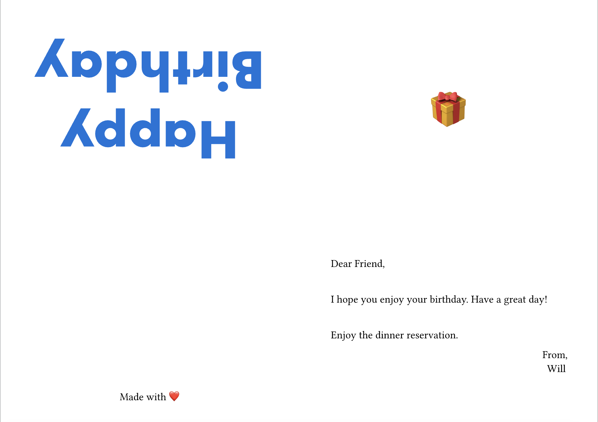

# keepsake

Create printable, folding greeting cards for various occasions like birthdays,
holidays, and thank-you notes. This package handles the complex layout and
rotation logic required for professional-looking physical stationery.

<div align="center">
  
</div>

<details><summary>Example Card Code</summary>

```typst
#import "@preview/keepsake:0.1.0": primary-content, quarter-fold-vertical

#let paper = "a4"

#let front = [
  #set text(size: 50pt, fill: blue, font: "Futura")
  = Happy Birthday
]
#let primary = {
  set text(size: 15pt)

  primary-content(
    greeting: "Dear Friend,",
    body: [
      #v(1.5em)

      I hope you enjoy your birthday. Have a great day!

      #v(1.5em)

      Enjoy the dinner reservation.
    ],
    sender: "Will",
  )
}
#let back = {
  box(height: 100%, width: 100%)[
    #set align(bottom + center)
    #set text(size: 15pt)
    #pad(bottom: 2em)[
      Made with ❤️
    ]
  ]
}
#let secondary = [
  #set align(center + horizon)
  #set text(size: 50pt)
  🎁
]

#show: quarter-fold-vertical.with(
  front: front,
  primary: primary,
  secondary: secondary,
  back: back,
  paper: paper,
)
```

</details>


## Usage
To use this package, import it into your Typst file:

```typst
#import "@preview/keepsake:0.1.0": (
  bifold, primary-content, quarter-fold-horizontal, quarter-fold-vertical,
)
```

### Bifold Card

Best for a standard large card. This layout uses two pages: one for the outside
(front and back) and one for the interior.

```typst
#show: bifold.with(
  front: [= Happy Birthday],
  primary: [Wishing you an incredible year ahead!],
  back: [
    #set align(center + bottom)
    #set text(8pt, gray)
    Made with ❤️ and Keepsake
  ],
)
```

### Quarter-fold Card (Vertical and Horizontal)

Perfect for a single-sheet, one-sided print. The paper is folded in half twice
(horizontally then vertically or vertically then horizontally). `keepsake`
automatically rotates the top panels 180° so they are upright when folded.

```typst
#show: quarter-fold-vertical.with(
  front: [= Thank You],
  primary: [Your gift was so thoughtful!],
)
```

```typst
#show: quarter-fold-horizontal.with(
  front: [= Thank You],
  primary: [Your gift was so thoughtful!],
)
```

### Content Template

```typst
#let primary = primary-content(
  greeting: "Dear Someone,",
  date: "Summer 2025",
  sender: "Your Friend",
  body: [
    I hope you enjoyed your summer
  ]
)
```

## Reference

### Card Types

`bifold`

A card folded once, creating four panels across two pages.

- `front`: Content for the front cover.
- `back`: Content for the back cover.
- `primary`: Content for the interior right panel.
- `secondary`: Content for the interior left panel.
- `paper`: The paper size (default: "us-letter"). Supports any standard Typst paper string.

`quarter-fold-vertical`

A card folded twice, with all panels printed on a single side of one sheet.

- `front`: Content for the front cover (automatically rotated).
- `primary`: Content for the bottom interior panel.
- `secondary`: Content for the top interior panel.
- `back`: Content for the back cover (automatically rotated).
- `paper`: The paper size (default: "us-letter").

`quarter-fold-horizontal`

A card folded twice, with all panels printed on a single side of one sheet.

- `front`: Content for the front cover (automatically rotated).
- `primary`: Content for the right interior panel.
- `secondary`: Content for the left interior panel.
- `back`: Content for the back cover (automatically rotated).
- `paper`: The paper size (default: "us-letter").

### Content Templates

`primary-content`

Helper to format content for primary section.

- `greeting`: Greeting on top left
- `date`: The date to display on top right
- `salutation`: Sign-off of the sender
- `sender`: Name of the sender
- `body`: Main body content
- `inset`: Inset for the section

## Tips

- While printing, it is recommended to use us-letter or a4 paper. Use scale =
100% in printer settings.
- Using a `box` for each panel can help with formatting

## License

This package is licensed under the MIT License.
