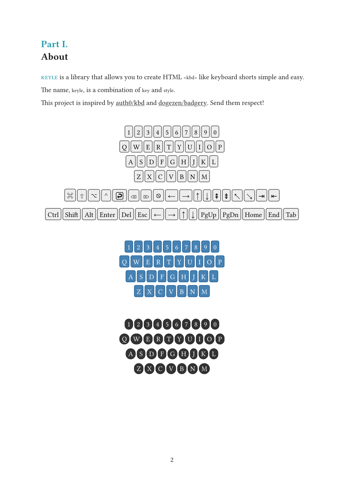

# keyle

This package provides a simple way to style keyboard shortcuts in your documentation.

It was inspired by [auth0/kbd](https://auth0.github.io/kbd/) and [dogezen/badgery](https://github.com/dogezen/badgery).

Send them respect and love.

## Usage

Please see the [keyle.pdf](doc/keyle.pdf) for more documentation.

`keyle` is imported using:

```typst
#import "@preview/keyle:0.1.0"
```

### Example



## License

MIT
