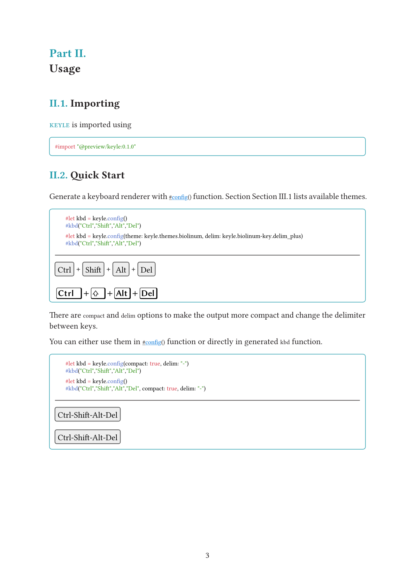

# keyle

<p align="center">
  <a href="https://github.com/magicwenli/keyle/blob/main/doc/keyle.pdf">
    
  </a>
  <a href="https://github.com/magicwenli/keyle/blob/main/LICENSE">
    
  </a>
</p>

A simple way to style keyboard shortcuts in your documentation.

This package was inspired by [auth0/kbd](https://auth0.github.io/kbd/) and [dogezen/badgery](https://github.com/dogezen/badgery). Send them respect and love.

## Usage

Please see the [keyle.pdf](https://github.com/magicwenli/keyle/blob/main/doc/keyle.pdf) for more documentation.

`keyle` is imported using:

```typst
#import "@preview/keyle:0.1.1"
```

### Example



## License

MIT
