# keyle

<p align="center">
  <a href="https://raw.githubusercontent.com/magicwenli/keyle/main/doc/keyle.pdf">
    
  </a>
  <a href="https://github.com/magicwenli/keyle/blob/main/LICENSE">
    
  </a>
</p>

A simple way to style keyboard shortcuts in your documentation.

This package was inspired by [auth0/kbd](https://auth0.github.io/kbd/) and [dogezen/badgery](https://github.com/dogezen/badgery). Also thanks to [tweh/menukeys](https://github.com/tweh/menukeys) -- A LaTeX package for menu keys generation.

Document generating using [jneug/typst-mantys](https://github.com/jneug/typst-mantys).

Send them respect and love.

## Usage

Please see the [keyle.pdf](https://github.com/magicwenli/keyle/blob/main/doc/keyle.pdf) for more documentation.

`keyle` is imported using:

```typst
#import "@preview/keyle:0.3.0"
```

### Example

#### Custom Delimiter

```tpy
#let kbd = keyle.config()
#kbd("Ctrl", "Shift", "K", delim: "-")
```
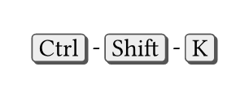

#### Compact Mode

```tpy
#let kbd = keyle.config()
#kbd("Ctrl", "Shift", "K", compact: true)
```
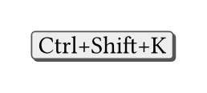

### Themes

A theme is just a renderer function `sym => content`. The built-in presets live
in `keyle.themes`. There are three backends: vector rectangles (`keycap`), a
generated SVG shell (`svg-keycap`), and a font-based one (`biolinum`).

#### Standard Theme

```tpy
#let kbd = keyle.config(theme: keyle.themes.standard)
#keyle.gen-examples(kbd)
```


#### Deep Blue Theme

```tpy
#let kbd = keyle.config(theme: keyle.themes.deep-blue)
#keyle.gen-examples(kbd)
```
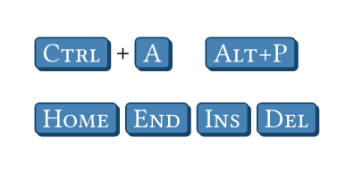

#### Type Writer Theme

```tpy
#let kbd = keyle.config(theme: keyle.themes.type-writer)
#keyle.gen-examples(kbd)
```
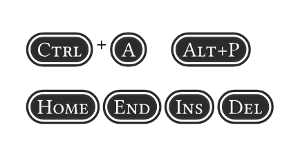

#### Biolinum Theme

```tpy
#let kbd = keyle.config(theme: keyle.themes.biolinum, delim: keyle.biolinum-key.delim_plus)
#keyle.gen-examples(kbd)
```
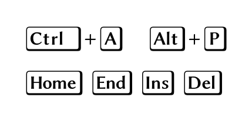

#### Custom Theme

```tpy
// https://www.radix-ui.com/themes/playground#kbd
#let radix_kdb(content) = box(
  rect(
    inset: (x: 0.5em),
    outset: (y:0.05em),
    stroke: rgb("#1c2024") + 0.3pt,
    radius: 0.35em,
    fill: rgb("#fcfcfd"),
    text(fill: black, font: (
      "Roboto",
      "Helvetica Neue",
    ), content),
  ),
)
#let kbd = keyle.config(theme: radix_kdb)
#keyle.gen-examples(kbd)
```
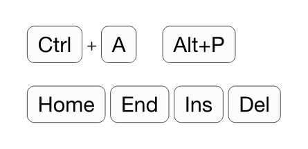

#### Minimal Theme

```tpy
#let kbd = keyle.config(theme: keyle.themes.minimal)
#keyle.gen-examples(kbd)
```
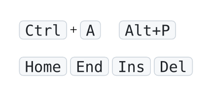

#### Radix Theme

```tpy
#let kbd = keyle.config(theme: keyle.themes.radix)
#keyle.gen-examples(kbd)
```
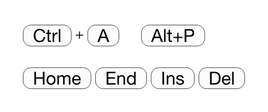

#### Flowbite Theme (SVG)

```tpy
#let kbd = keyle.config(theme: keyle.themes.flowbite)
#keyle.gen-examples(kbd)
```
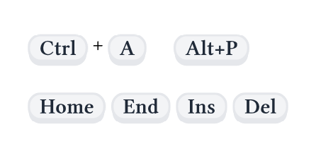

#### Flowbite Dark Theme (SVG)

```tpy
#let kbd = keyle.config(theme: keyle.themes.flowbite-dark)
#keyle.gen-examples(kbd)
```
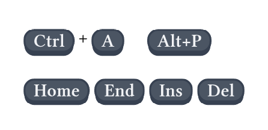

#### Daisy Theme (SVG)

```tpy
#let kbd = keyle.config(theme: keyle.themes.daisy)
#keyle.gen-examples(kbd)
```
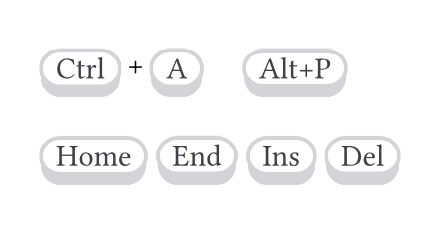

### Customize with `.with()`

Every preset is a function with its style pre-bound, so you extend any of them
with Typst's native `.with(...)` — no custom merge API to learn.

```tpy
#let rose = keyle.themes.flowbite.with(
  fill: rgb("#fee2e2"),
  stroke: rgb("#fca5a5"),
  text-args: (fill: rgb("#991b1b"), weight: "bold"),
)
#let kbd = keyle.config(theme: rose)
#keyle.gen-examples(kbd)
```
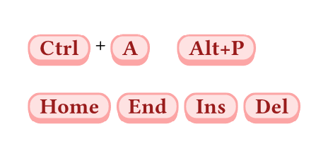

The text layer (`text-args`, `wrap`) and the cap layer (`fill`, `stroke`,
`radius`, `raise`, ...) are kept separate, so you can restyle one without
touching the other.

### SVG Key Glyphs

A key symbol is just content, so non-textual keys can be passed as inline SVG
glyphs from `keyle.svg-key` (`up`, `down`, `left`, `right`, `enter`,
`backspace`, `tab`, `win`).

```tpy
#let kbd = keyle.config(theme: keyle.themes.flowbite)
#kbd(keyle.svg-key.up) #kbd(keyle.svg-key.down)
#kbd(keyle.svg-key.left) #kbd(keyle.svg-key.right)
#kbd(keyle.svg-key.enter) #kbd(keyle.svg-key.backspace)
#kbd(keyle.svg-key.tab) #kbd(keyle.svg-key.win)
```
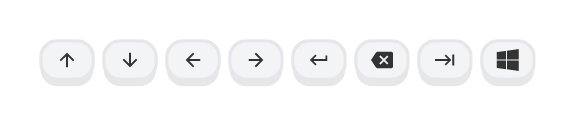

## License

MIT
