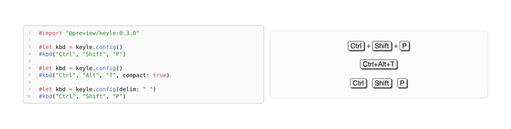
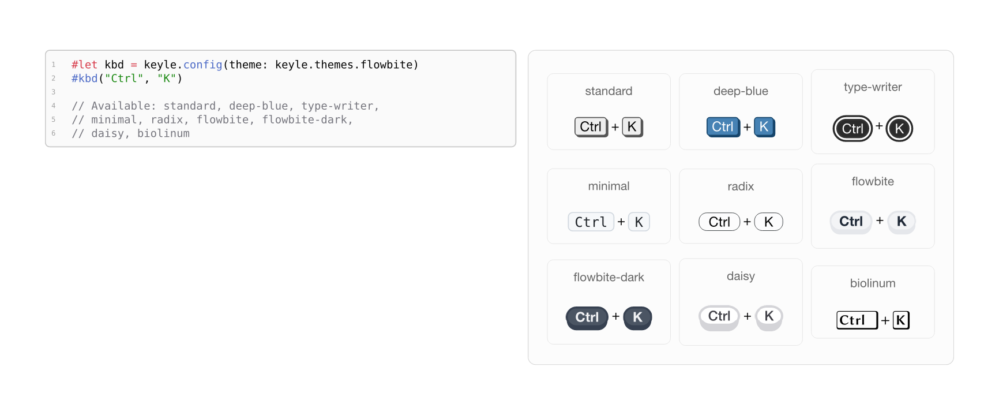
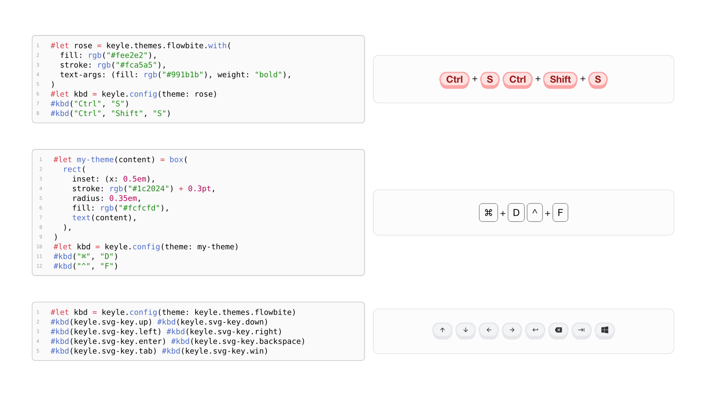

# keyle

<p align="center">
  <a href="doc/keyle.pdf">
    
  </a>
  <a href="LICENSE">
    
  </a>
</p>

A simple way to style keyboard shortcuts in your documentation.

This package was inspired by [auth0/kbd](https://auth0.github.io/kbd/) and [dogezen/badgery](https://github.com/dogezen/badgery). Also thanks to [tweh/menukeys](https://github.com/tweh/menukeys) -- A LaTeX package for menu keys generation.

Document generating using [jneug/typst-mantys](https://github.com/jneug/typst-mantys).

Send them respect and love.

## Usage

Please see the [keyle.pdf](doc/keyle.pdf) for more documentation.

`keyle` is imported using:

```typst
#import "@preview/keyle:0.3.0"
```







## License

MIT
