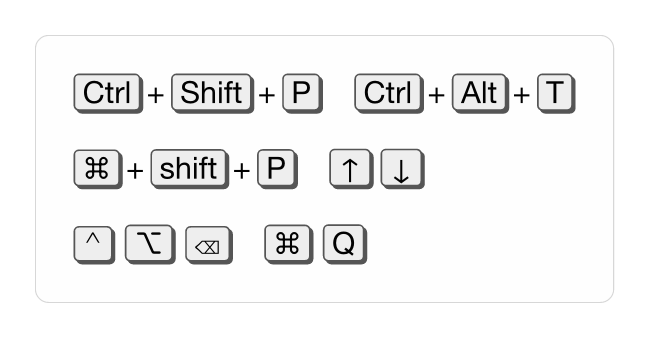
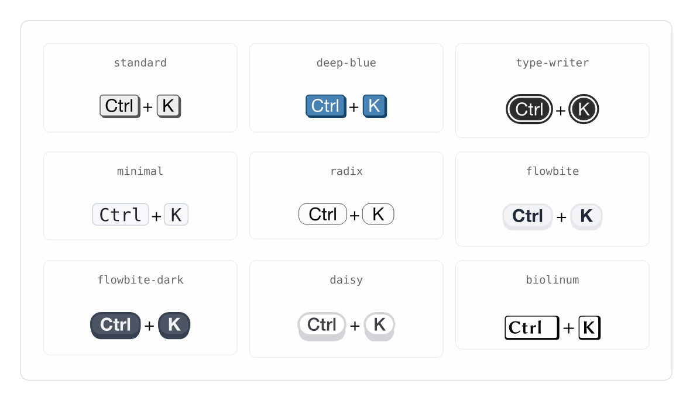
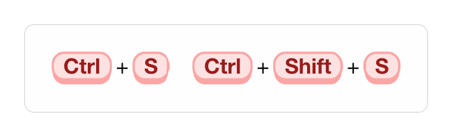
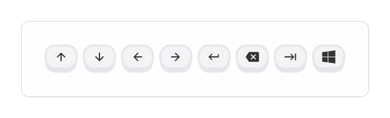

# keyle

<p align="center">
  <a href="doc/keyle.pdf">
    
  </a>
  <a href="LICENSE">
    
  </a>
</p>

A simple way to style keyboard shortcuts in your documentation.

This package was inspired by [auth0/kbd](https://auth0.github.io/kbd/) and [dogezen/badgery](https://github.com/dogezen/badgery). Also thanks to [tweh/menukeys](https://github.com/tweh/menukeys) -- A LaTeX package for menu keys generation.

Document generating using [typst-community/tidy](https://github.com/typst-community/tidy).

Send them respect and love.

## Usage

`keyle` works out of the box — import `kbd` and go. Keys can be passed as
separate arguments or as one shortcut string; common aliases map to glyphs,
and `layout: "mac"` switches every key name to its Apple symbol:

```typst
#import "@preview/keyle:0.4.0": kbd

#kbd("Ctrl", "Shift", "P") #kbd("Ctrl+Alt+T")

#kbd("cmd", "shift", "P") #kbd("up") #kbd("down")

#let mac = keyle.config(layout: "mac", delim: none)
#mac("Ctrl+Alt+Del") #mac("cmd+Q")
```



### Themes

Pick one of the nine built-in themes by name (or function) in `config`:

```typst
#let kbd = keyle.config(theme: "flowbite")
#kbd("Ctrl", "K")
```



### Customization

Every theme is an ordinary function — extend any preset with `.with(...)`:

```typst
#let rose = keyle.themes.flowbite.with(
  fill: rgb("#fee2e2"),
  stroke: rgb("#fca5a5"),
  text-args: (fill: rgb("#991b1b"), weight: "bold"),
)
#let kbd = keyle.config(theme: rose)
#kbd("Ctrl", "S") #kbd("Ctrl", "Shift", "S")
```



### SVG key glyphs

Non-textual keys are just another kind of symbol:

```typst
#let kbd = keyle.config(theme: "flowbite")
#kbd(keyle.svg-key.up) #kbd(keyle.svg-key.down)
#kbd(keyle.svg-key.left) #kbd(keyle.svg-key.right)
#kbd(keyle.svg-key.enter) #kbd(keyle.svg-key.backspace)
#kbd(keyle.svg-key.tab) #kbd(keyle.svg-key.win)
```



### HTML export

Under Typst's HTML export (`typst compile --features html`), keys are embedded
as inline SVG automatically, or emitted as semantic `<kbd>` elements with
`keyle.config(html: "kbd")`. PDF/PNG output is unaffected.

See [keyle.pdf](doc/keyle.pdf) for the full manual. Requires Typst 0.15+.

## License

MIT
