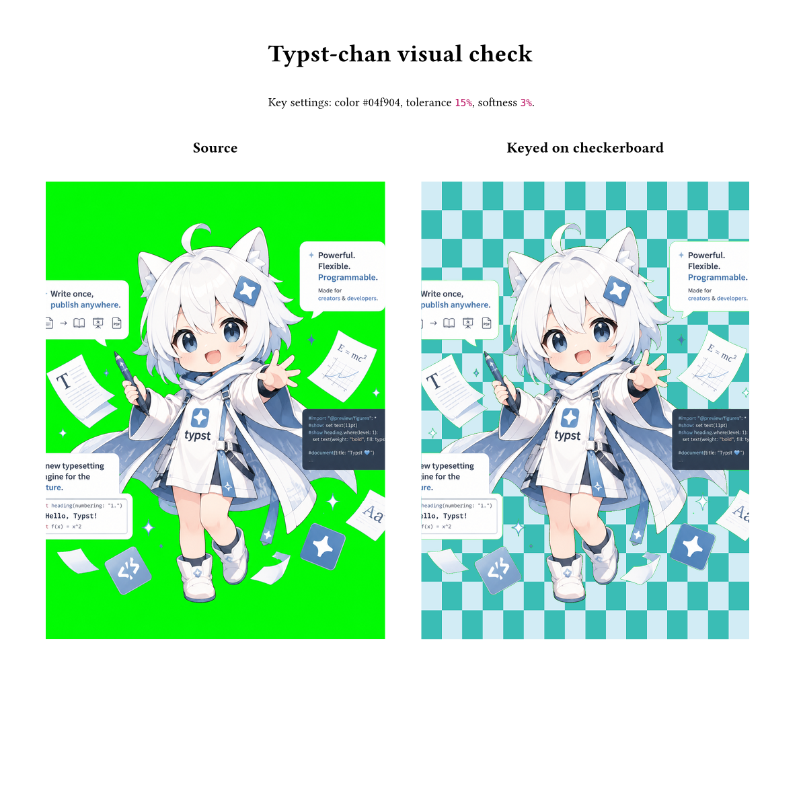

# Keyless

Keyless is a Typst package for keying colors out of raster images and converting them into transparent pixels.

It provides a simple interface for common tasks such as removing a white background, cutting out a green screen, or making a scanned image blend cleanly into the page. Keyless is designed for reproducible documents: every threshold, softness value, color space, and output option can be written directly in Typst source.



The demo image is rendered from `tests/visual-chan.typ`, using the same local package entrypoint and fixtures as the visual test suite.

## Usage

For the local Tyler install:

```typst
#import "@local/keyless:0.1.0": key-out, key-out-bytes
```

After publishing to Typst Universe:

```typst
#import "@preview/keyless:0.1.0": key-out, key-out-bytes
```

Remove a white background and place the result like a normal Typst image:

```typst
#import "@local/keyless:0.1.0": key-out

#let logo = read("logo.png", encoding: none)

#key-out(
  logo,
  color: white,
  tolerance: 10%,
  softness: 2%,
  width: 5cm,
  alt: "Logo with white background removed",
)
```

Use `key-out-bytes` when you want the transformed PNG bytes instead of image content:

```typst
#let keyed = key-out-bytes(
  logo,
  color: rgb("#ffffff"),
  tolerance: 12%,
  softness: 3%,
)

#image(keyed, width: 80%)
```

## Examples

Place a logo with a white background on a colored panel:

```typst
#import "@local/keyless:0.1.0": key-out

#set page(fill: rgb("#20242a"))

#let logo = read("logo.png", encoding: none)

#box(
  fill: rgb("#f5c542"),
  inset: 12pt,
  radius: 6pt,
  key-out(
    logo,
    color: white,
    tolerance: 8%,
    softness: 2%,
    width: 42mm,
    alt: "Logo with transparent background",
  ),
)
```

Cut out a green-screen image and keep a soft edge around the subject:

```typst
#import "@local/keyless:0.1.0": key-out

#let portrait = read("portrait.webp", encoding: none)

#key-out(
  portrait,
  color: rgb("#00ff00"),
  tolerance: 18%,
  softness: 5%,
  width: 70%,
  alt: "Portrait with green screen removed",
)
```

Make a scanned signature blend into the page while preserving dark ink:

```typst
#import "@local/keyless:0.1.0": key-out

#let signature = read("signature.jpg", encoding: none)

#align(right)[
  #key-out(
    signature,
    color: white,
    tolerance: 14%,
    softness: 4%,
    width: 35mm,
    alt: "Handwritten signature",
  )
]
```

Generate keyed PNG bytes for reuse in metadata, export pipelines, or later image placement:

```typst
#import "@local/keyless:0.1.0": key-out-bytes

#let source = read("badge.png", encoding: none)
#let keyed = key-out-bytes(
  source,
  color: rgb("#ffffff"),
  tolerance: 10%,
  softness: 2%,
)

#metadata(range(keyed.len()).map(i => keyed.at(i))) <keyed-badge>
#image(keyed, width: 30mm)
```

## API

```typst
#key-out(
  source,
  color: white,
  tolerance: 0%,
  softness: 0%,
  space: "srgb",
  premultiply: false,
  format: auto,
  ..args,
)
```

`source` is image bytes, usually from `read("image.png", encoding: none)`. Extra arguments are forwarded to Typst's built-in `image`, including `width`, `height`, `alt`, `fit`, and `scaling`.

`key-out-bytes` accepts the same image-processing parameters and returns PNG bytes.

## Behavior

Keyless currently computes normalized Euclidean distance in sRGB:

```text
distance <= tolerance
  alpha = 0

distance >= tolerance + softness
  alpha = original alpha

otherwise
  alpha fades smoothly between 0 and original alpha
```

The first release supports PNG, JPEG, GIF, and WebP input and always emits PNG output with an alpha channel.

## Compatibility

Keyless requires Typst 0.8.0 or newer. This is the first Typst release with Wasm plugin support.

## Building

```sh
rustup target add wasm32-unknown-unknown
cargo build --release --target wasm32-unknown-unknown
cp target/wasm32-unknown-unknown/release/keyless_plugin.wasm src/plugin.wasm
```

## Testing

Run the full compiler compatibility matrix with Nix:

```sh
nix run .#test-matrix
```

This builds the same checks and prints one line per compiler plus an `x/y passed` summary.

To quickly inspect the compiled results for the latest compiler version, build the latest artifact bundle:

```sh
nix build .#artifacts-latest
```

To manually inspect the compiled results for every compiler version, build the full artifact bundle:

```sh
nix build .#artifacts --max-jobs auto
```

The full bundle builds one derivation per compiler version. `--max-jobs auto` lets Nix build independent versions in parallel; without it, your Nix configuration may build them one at a time.

The `result` symlink contains one directory per Typst version:

```text
result/
  typst-0.8.0/
    compat.pdf
    visual-kun.pdf
    visual-chan.pdf
    keyed.png
    keyed.json
  typst-0.9.0/
    ...
  report.txt
```

Open each `visual-kun.pdf` and `visual-chan.pdf` to compare the real-world `typst-kun.png` and `typst-chan.png` examples. Each visual check shows the source image beside its keyed result on a high-contrast checkerboard so remaining background, halos, and accidentally removed foreground details are easier to spot. Open each `keyed.png` to inspect the tiny deterministic pixel fixture used by the analyzer.

The matrix compiles the rendering regression test with every Typst release from 0.8.0 through 0.14.2. Older releases are not included because 0.8.0 introduced WASM plugin support.

Each matrix check also queries the PNG bytes produced by `key-out-bytes` and analyzes the decoded pixels. The fixture contains one white pixel and one black pixel; the analyzer verifies that the white pixel becomes transparent RGBA `[255, 255, 255, 0]` and the black pixel stays opaque RGBA `[0, 0, 0, 255]`.

To test one compiler version while iterating, build its check directly:

```sh
nix build .#checks.x86_64-linux.0_12_0
```

Replace `0_12_0` with any check name shown by:

```sh
nix flake show
```

The compatibility test lives in `tests/compat.typ`. It imports the local package, verifies that `key-out-bytes` returns PNG bytes, exposes those bytes as queryable metadata for pixel analysis, and renders `key-out` so the bytes-to-image path is tested on each compiler version. The visual examples live in `tests/visual-kun.typ` and `tests/visual-chan.typ`, with image fixtures in `tests/fixtures/`, and the pixel analyzer lives in `tests/analyze-keyed-png.py`.

You can also run the test with your local Typst compiler after generating the fixture image:

```sh
base64 -d tests/fixtures/white-black.png.b64 > tests/fixtures/white-black.png
typst compile --root . tests/compat.typ /tmp/keyless-compat.pdf
```
