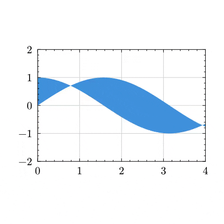

# Kino

[Kino](https://github.com/aualbert/kino) is an easy-to-use, proof of concept package for creating animations in pure Typst. Kino comes with a companion script [kino.py](https://github.com/aualbert/kino/blob/main/bin/kino.py) for exporting to videos, slideshows, or reveal.js presentations. See the [manual](docs/manual.pdf) and the [examples](https://github.com/aualbert/kino/blob/main/examples).

## Examples

<table>
<tr>
  <td>
    <a href="examples/graphs/arrays.typ">
      
    </a>
  </td>
  <td>
    <a href="examples/graphs/lilaq.typ">
      
    </a>
  </td>
  <td>
    <a href="examples/countdown.typ.typ">
      
    </a>
  </td>
</tr>
</table>

## Installation

To use the Kino package, simply add the following code to your document:
```typ
#import "@preview/kino:0.1.0": *
```
The companion python script [kino.py](https://github.com/aualbert/kino/blob/main/bin/kino.py) can be downloaded from the homepage. It requires python3, pypdf, ffmpeg and typst. A flake is also provided for nix users.
To use reveal.js exports, an installation of reveal.js is also required. 

## Quick start

Create a file `quick_start.typ` with the following content:

```typ
#import "@preview:kino:0.1.0": *
#set page(width: auto, height: auto)

// main show rule
#show: animation

// initialize an animation variable
#init(x: (3cm, 2.))

// animate x, for a duration of 1 second
#animate(x: (0cm, 3))

// then animate x using a sine transition
#then(transition: "sin", x: (1cm, 1))

// meanwhile animate y pointwise from the initial value t => 0, for a duration of 2 seconds.
#meanwhile(duration: 2, y: t => (2cm * t))

// context is mandatory to evaluates animation variables
#context {
  // evaluate x
  let (w, h) = a("x")

  // evaluate y
  rect(width: w, height: a("y")(h))
}

// mandatory
#finish()
```

By default, this Typst code compiles to a pdf containing frames of the animation, at 5 frames per seconds. To generate a 35 fps video, use the script [kino.py](https://github.com/aualbert/kino/blob/main/bin/kino.py) along with the following arguments:
```bash
python3 kino.py quick_start.typ video --fps 35
```

For an in-depth introduction, including
- more export formats
- documentation of animation primitives
- supported types
- advanced command-line options 
- debugging tools

please consult the [manual](docs/manual.pdf).

