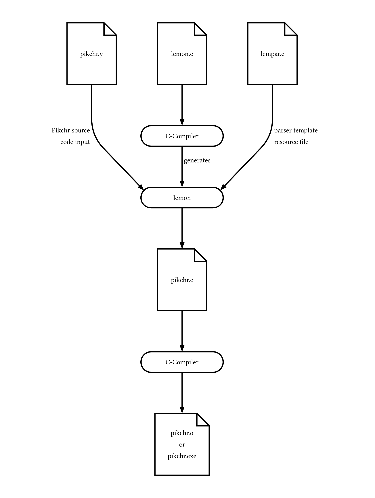
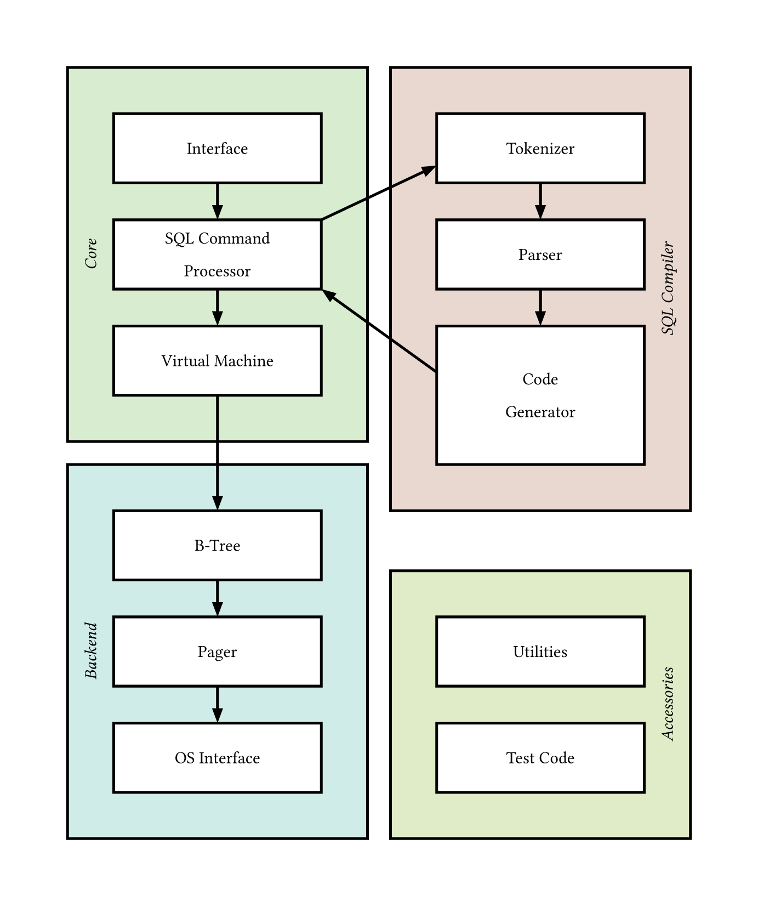
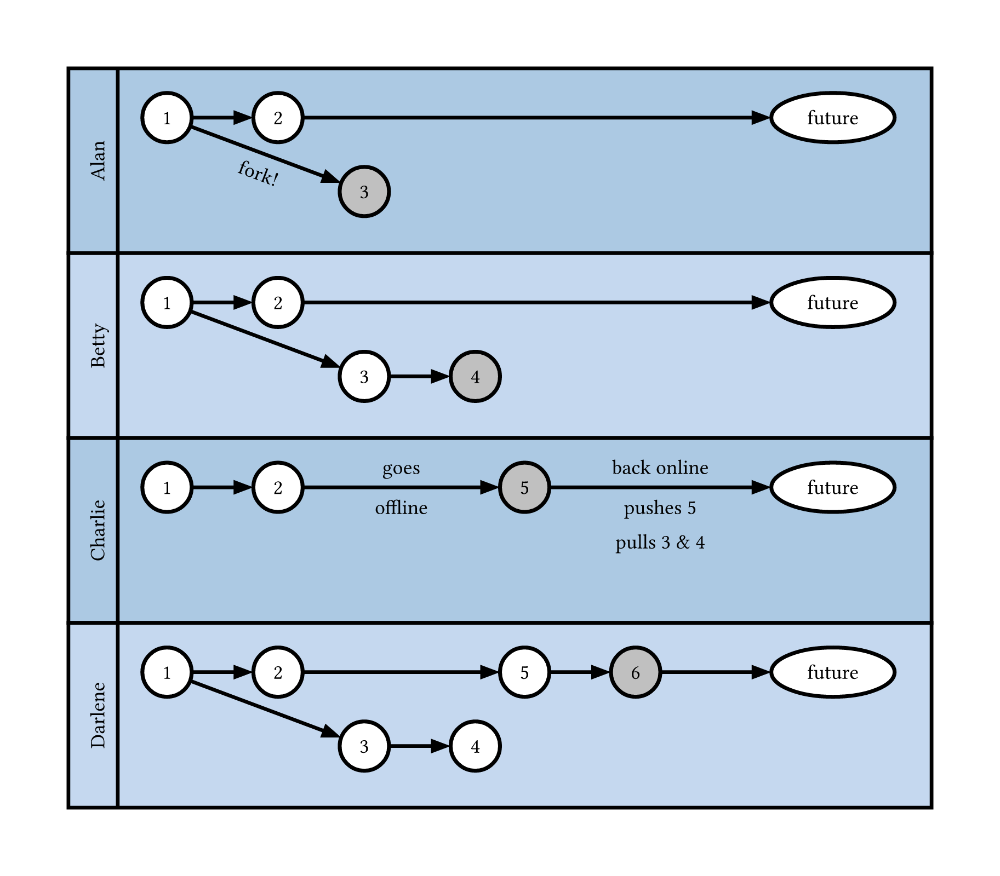
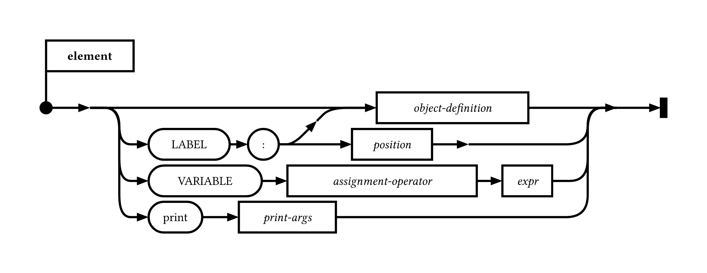
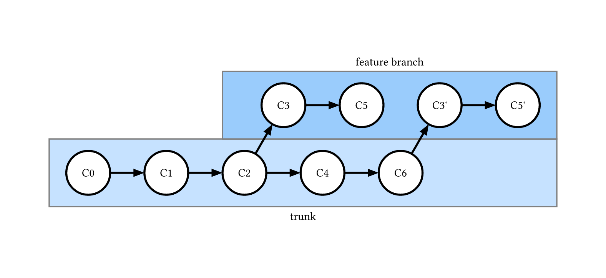
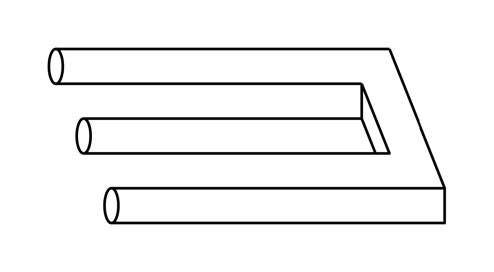

# Kip - Pikchr Plugin for Typst

A Typst package for rendering [Pikchr](https://pikchr.org) diagrams directly in your Typst documents.

Pikchr (pronounced like "picture") is a PIC-like markup language for diagrams in technical documentation. **Kip** brings Pikchr to Typst with a simple, elegant interface.

> **Why "Kip"?** It's "Pik" backwards - a playful nod to the Pikchr language! 📐

## Features

- ✅ Render Pikchr diagrams as SVG directly in Typst
- ✅ No external dependencies - uses WebAssembly plugin
- ✅ Fast and lightweight (~125KB WASM module)
- ✅ Works in Typst CLI (tested with Typst 0.12+)
- ✅ Simple, intuitive API

## Examples

<table>
<tr>
  <td>
    <a href="gallery/build-pikchr.typ">
      
    </a>
  </td>
  <td>
    <a href="gallery/sqlite-arch.typ">
      
    </a>
  </td>
  <td>
    <a href="gallery/swimlanes.typ">
      
    </a>
  </td>
</tr>
<tr>
  <td>Build Process Flowchart</td>
  <td>SQLite Architecture</td>
  <td>Swimlanes Timeline</td>
</tr>
<tr>
  <td>
    <a href="gallery/syntax-diagram.typ">
      
    </a>
  </td>
  <td>
    <a href="gallery/version-control.typ">
      
    </a>
  </td>
  <td>
    <a href="gallery/trident.typ">
      
    </a>
  </td>
</tr>
<tr>
  <td>Syntax Railroad Diagram</td>
  <td>Version Control Graph</td>
  <td>Impossible Trident</td>
</tr>
</table>

*Click on an example image to see the code. Examples from [pikchr.org](https://pikchr.org).*

## Installation

Import the package from the official Typst package registry:

```typst
#import "@preview/kip:0.1.0": kip
```

### Alternative: Local Installation

1. Download or clone this package
2. Place it in your Typst local packages directory:
   - **Windows**: `%APPDATA%\typst\packages\local\kip\0.1.0\`
   - **macOS**: `~/Library/Application Support/typst/packages/local/kip/0.1.0/`
   - **Linux**: `~/.local/share/typst/packages/local/kip/0.1.0/`

### Alternative: Direct Import

Place this directory next to your Typst document and import it directly:

```typst
#import "kip/lib.typ": kip
```

## Usage

### Basic Example

```typst
#import "@preview/kip:0.1.0": kip

#kip(```
box "Start"
arrow
circle "End" fit
```)
```

### With String Input

```typst
#kip("box \"Hello\" \n arrow \n circle \"World\" fit")
```

### With Sizing

```typ
#kip(
  "arrow right 200% \n box \"Process\" fit \n arrow right 200%",
  width: 400pt
)
```

## Examples

### Simple Flow

```typst
#kip(```
box "Start"
arrow
box "Process"
arrow
circle "End" fit
```)
```

### State Machine

```typst
#kip(```
circle "Idle" fit
arrow right 150% "start" above
circle "Active" fit
arrow right 150% "finish" above
circle "Done" fit
```)
```

### Arrow Diagram

```typst
#kip(```
arrow right 200% "Input"
box rad 10px "Processor" fit
arrow right 200% "Output"
```)
```

### Architecture Diagram

```typst
#kip(```
box "Frontend" width 3cm fit
arrow down 50%
box "API Layer" width 3cm fit
arrow down 50%
box "Database" width 3cm fill lightblue fit
```)
```

## API Reference

### `kip(code, width: auto, height: auto, fit: "contain")`

Renders a Pikchr diagram from the provided markup code.

**Parameters:**
- `code` (string or content): The Pikchr markup code (can be a string or raw block)
- `width` (length, auto): Optional width constraint
- `height` (length, auto): Optional height constraint
- `fit` (string): How to fit the image ("contain", "cover", "stretch")

**Returns:** An image element containing the rendered diagram

### Aliases

For backwards compatibility and convenience:
- `pikchr()` - alias for `kip()`
- `render()` - alias for `kip()`

All three functions work identically:
```typst
#import "@preview/kip:0.1.0": kip, pikchr, render

#kip("box \"A\"")      // Primary function
#pikchr("box \"B\"")   // Alias
#render("box \"C\"")   // Alias
```

## Pikchr Language Reference

For complete Pikchr syntax and examples, visit:
- [Pikchr Homepage](https://pikchr.org)
- [Pikchr Documentation](https://pikchr.org/home/doc/trunk/homepage.md)
- [Pikchr Examples](https://pikchr.org/home/doc/trunk/doc/examples.md)

## Building from Source

> **Note:** This section is only relevant for contributors who have cloned the repository. If you just want to use the package, see the [Installation](#installation) section above.

If you need to rebuild the WASM module (e.g., for updates or modifications), see the [build-scripts/BUILD.md](build-scripts/BUILD.md) file.

## Known Limitations

- The plugin is pure (stateless) - each diagram is rendered independently
- Some very complex Pikchr features might have rendering differences
- Currently only supports light mode rendering

## License

- Pikchr: BSD-style license (see [pikchr.org](https://pikchr.org))
- Kip plugin wrapper: MIT License

## Contributing

Contributions are welcome! Please feel free to submit issues or pull requests.

## Links

- [Pikchr Official Site](https://pikchr.org)
- [Typst Documentation](https://typst.app/docs)
- [Typst Plugin Documentation](https://typst.app/docs/reference/foundations/plugin/)

## Acknowledgments

- Pikchr created by D. Richard Hipp
- Inspired by [diagraph](https://github.com/Robotechnic/diagraph) Typst plugin
- Uses [wasm-minimal-protocol](https://github.com/astrale-sharp/wasm-minimal-protocol) for plugin interface

---

Made with ❤️ for the Typst community
