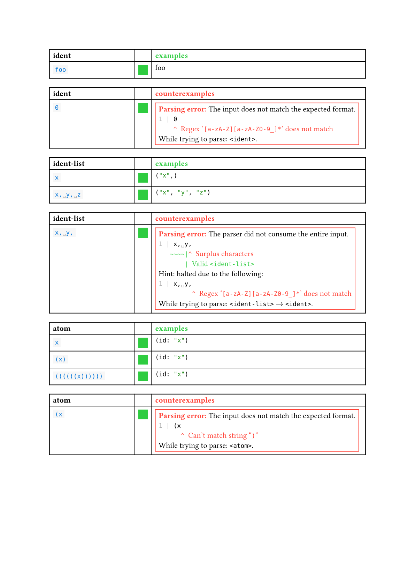
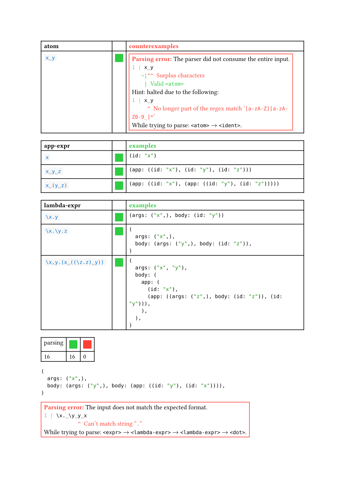

# Kleene

A parser combinator in pure Typst.

----

<!-- @scrybe(not version; panic Please specify a version number) -->
<!-- @scrybe(if publish; grep https; grep {{version}}) -->
[Full documentation here.](https://github.com/Vanille-N/kleene/releases/download/v0.1.0/docs.pdf)

The skeleton of a Kleene invocation is as follows:
<!-- @scrybe(not publish; jump import; grep local; grep {{version}}) -->
<!-- @scrybe(if publish; jump import; grep preview; grep {{version}}) -->
```typ
#import "@preview/kleene:0.1.0"

#let grammar = {
  // kleene.prelude contains all the operators, which we usually
  // don't want to have polluting the global namespace.
  import kleene.prelude: *

  kleene.grammar(
    main: {
      // definition of <main> goes here
    },
    // more rules can be specified
  )
}

// If the grammar includes any unit tests, this will evaluate them.
#kleene.test(grammar)

// This is how to invoke the parser with <main> as the entry point.
// The result is a tuple where the first boolean indicates if the parsing
// was successful, and the second value is either the parsed output
// or an error message.
#let (ok, ans) = kleene.parse(grammar, <main>, "..")
```

In more detail,

<!-- @scrybe(not publish; jump import; grep local; grep {{version}}) -->
<!-- @scrybe(if publish; jump import; grep preview; grep {{version}}) -->
<!-- @scrybe(jump import; until ```; diff tests/demo/test.typ) -->
```typ
#import "@preview/kleene:0.1.0"

// This grammar parses lambda-terms.
// See: https://en.wikipedia.org/wiki/Lambda_calculus
#let grammar = {
  import kleene.prelude: *
  kleene.grammar(
    // Declares a new rule <ident>
    ident: {
      // <ident> has a single pattern, specified by a regex.
      // By default, a successful match returns a `string`.
      pat(`[a-zA-Z][a-zA-Z0-9_]*`)
      // Here is a positive unit test (must parse)
      yy(`foo`)
      // Here is a negative unit test (must fail)
      nn(`0`)
    },
    whitespace: {
      // `iter` matches 1 or more repetitions of a pattern.
      // `fork` introduces a backtracking point where
      // we try the patterns sequentially until one of them works.
      pat(iter(fork(" ", "\n", "\t")))
      // `rewrite`, abbreviated `rw`, allows one to transform
      // the match post-parsing. Passing `none` will drop
      // the entire match and make it return no data.
      // This is typically used for markers and whitespace.
      rw(none)
    },
    blank: {
      // `maybe` matches 0 or 1 repetitions of a pattern.
      // A label will cause the parser to recursively call
      // another defined rule.
      // `drop` is the inline equivalent to `rw(none)`.
      pat(drop(maybe(<whitespace>)))
    },
    // You can easily define functions to help you
    // specify repetitive rules.
    ..{
      let optional-spaces(symbol) = {
        // A sequence of patterns will match if every
        // pattern is matched one after the other
        pat(<blank>, symbol, <blank>)
        rw(none)
      }
      (
        lambda: optional-spaces("\\"),
        dot: optional-spaces("."),
        comma: optional-spaces(","),
      )
    },
    ident-list: {
      // `star` matches 0 or more repetitions of a pattern.
      // It is strongly recommended when possible to use
      // repetition operators (`star`, `iter`, `maybe`) rather
      // than recursive rules.
      pat(<ident>, star(<comma>, <ident>))
      rw(ids => ids.flatten())
      yy(`x`)
      yy(`x, y, z`)
      nn(`x, y,`)
    },
    atom: {
      // A single rule may consist of multiple separate `pat`.
      // They will be treated as if there was a `fork`,
      // but with more freedom on which `rw` applies to each.
      pat(<ident>)
      rw(id => (id: id)) // This `rw` applies only to the `pat` above.
      // `$$` introduces a commit point: if we go that far
      // then backtracking is disabled. This can improve performance
      // and the quality of error messages.
      pat(drop("("), $$, <blank>, <expr>, <blank>, drop(")"))
      yy(`x`, `(x)`)
      yy(`((((((x))))))`)
      nn(`(x`)
      nn(`x y`)
    },
    app-expr: {
      // `try` is the inverse of `$$` and re-enables backtracking.
      pat(try(<atom>), iter(<whitespace>, <atom>))
      rw(atoms => (app: atoms.flatten()))
      pat(<atom>)
      yy(`x`, `x y z`, `x (y z)`)
    },
    lambda-expr: {
      // Rules are allowed to be self-recursive,
      // but make sure that they always consume at least one token
      // before looping.
      pat(<lambda>, $$, <ident-list>, <dot>, <lambda-expr>)
      rw(((ids, body),) => (args: ids, body: body))
      pat(<app-expr>)
      yy(`\x.y`, `\x.\y.z`, `\x,y.(x ((\z.z) y))`)
    },
    expr: {
      pat(<lambda-expr>)
    }
  )
}

// This runs all the unit tests (`yy` and `nn`) defined above
// and displays a global tally.
#kleene.test(grammar)

// Create a parser for a specific rule by attaching the grammar
// and the entry point to `kleene.parse`.
#let parse-lambda = kleene.parse.with(grammar, <expr>)

// Now you can parse arbitrary expressions!
// A success will return a pair (true, result)
#let (ok, ans) = parse-lambda("\x. \y. y x")
#assert(ok)
#ans

// A failure will return a pair (false, error)
// in which you can print the error message to get more details.
#let (ok, ans) = parse-lambda("\x. \y y x")
#assert(not ok)
#ans
```





