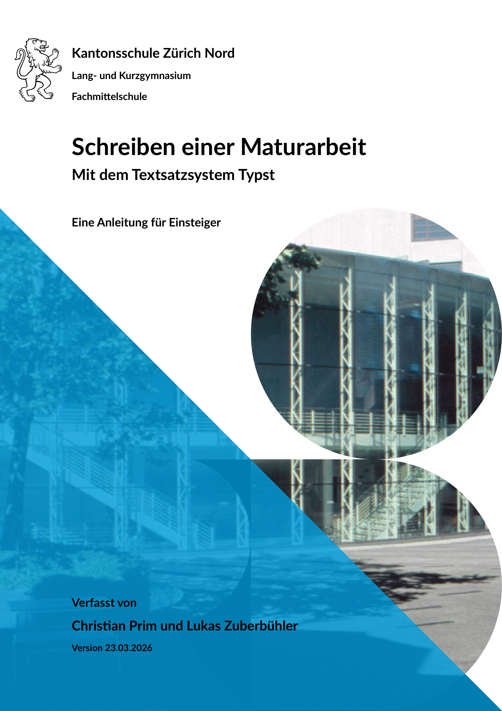

# kzn-ma


[](LICENSE)
[](https://github.com/itkzn/ma-template/blob/0bad4afc9fa804fac7c43fd7f5b7b08a0e559e13/docs/manual.pdf)

`kzn-ma` is a comprehensive Typst template for academic theses and dissertations. Provides functions for title pages, headers, footers, table of contents, list of figures/tables, figure and table formatting with subfigures, and full document layout management. Supports multilingual documents (DE/EN/FR) with customizable fonts, spacing, and numbering schemes.



## Basic usage

This section provides the minimal amount of information to get started with the template. For more detailed information, see the [manual](https://github.com/itkzn/ma-template/blob/0bad4afc9fa804fac7c43fd7f5b7b08a0e559e13/docs/manual.pdf).

To use the `kzn-ma` template, you need to include the following line at the beginning of your `typ` file:

```typ
#import "@preview/kzn-ma:0.1.0": *
```


## License
MIT licensed

Copyright (C) 2026 IT KZN (itkzn)
