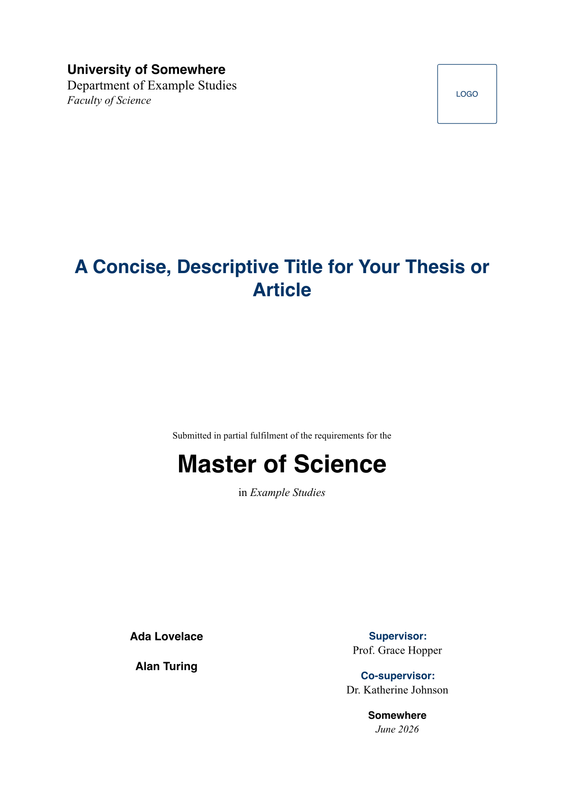

# lambda

A clean, two-column scientific **thesis and article** template for
[Typst](https://typst.app), with an optional cover page, a compact title block
(abstract, affiliations, supervisors, DOI/dates, license), an automatic table of
contents, and themeable colours and fonts.



## Quick start

```sh
typst init @preview/lambda
cd lambda
typst compile main.typ
```

This copies the example [`template/main.typ`](template/main.typ) and
[`template/refs.bib`](template/refs.bib) into a new project. Edit the single
`#show: thesis.with(..)` call at the top, then write your content below it.

## Configuration

Everything is configured through one function call — there is no separate config
file to keep in sync. Delete any field you don't need; optional fields are hidden
when omitted.

```typ
#import "@preview/lambda:0.1.0": thesis, note-block

#show: thesis.with(
  title: "Your Title",
  authors: ((name: "Ada Lovelace", affils: (1,)),),
  affiliations: ((id: 1, text: "University of Somewhere"),),
  degree: "Master of Science",
  supervisor: "Prof. Grace Hopper",
  abstract: [ ... ],
  keywords: "a, b, c",
)

= Introduction
...
```

### Parameters

| Group | Parameters |
|------|------------|
| **Metadata** | `title`, `authors`, `affiliations`, `date` |
| **Cover** | `degree`, `major`, `department`, `faculty`, `university`, `location`, `submission-text`, `supervisor`, `co-supervisor`, `logo`, `birthday`, `student-id` |
| **Info bar** | `email`, `doi`, `submitted`, `defended`, `accepted`, `published`, `license` |
| **Abstract** | `abstract`, `keywords` |
| **Running head** | `short-author` (auto ⇒ first author's surname), `short-title` (auto ⇒ title), `foot-info`, `manuscript-date` (auto ⇒ today; `none` to hide) |
| **Toggles** | `cover`, `show-abstract`, `show-outline`, `header-footer`, `columns` (1 or 2) |
| **Theming** | `accent`, `theme`, `labels` |

**Authors** can be plain strings or dictionaries:
`(name: "Ada Lovelace", affils: (1, 2))`. For a single-author document, set
`birthday`/`student-id` at the top level; for multiple authors, put them inside each
author dictionary (`(name: .., student-id: .., birthday: ..)`).

### Theming

Override just the accent colour, or pass a full `theme` dictionary. Any key omitted
keeps its default (see [`src/theme.typ`](src/theme.typ)):

```typ
#show: thesis.with(
  accent: rgb("#8a1538"),
  theme: (
    font-serif: ("Libertinus Serif",),
    font-sans:  ("Libertinus Serif",),
    paper: "us-letter",
    margin: (x: 1.5cm, y: 2cm),
    font-size: 10pt,
  ),
)
```

> **Fonts:** the defaults are stacks — `Helvetica` / `Times New Roman` / `Courier`
> first (macOS & Windows), falling back to Typst's embedded `Libertinus Serif`,
> `New Computer Modern`, and `DejaVu Sans Mono`. On the Typst Universe web app the
> proprietary families are unavailable, so set the `theme` fonts to bundled families
> for an identical preview, or compile locally where they are installed.

### Localisation

Every visible label is overridable through `labels`, e.g.
`labels: (abstract: "Résumé", supervisors: "Encadrants : ")`. See
`default-cover-labels` and `default-header-labels` in
[`src/cover.typ`](src/cover.typ) and [`src/article-header.typ`](src/article-header.typ).

### Custom callout

`note-block` produces a tinted box that follows the active accent:

```typ
#note-block(title: "Note")[ Highlighted aside. ]   // title is optional
```

## Project layout

```
lib.typ            public API (entrypoint)
src/               implementation: theme, cover, article-header, layout, thesis, envs
template/          what `typst init` copies: main.typ, refs.bib
```

## Local development / testing

The shipped `template/main.typ` imports `@preview/lambda:0.1.0`, which only resolves
once published. To test changes before publishing, install the package into Typst's
local package cache and compile the template against it:

```sh
# macOS (use ~/.cache/typst on Linux)
DEST=~/Library/Caches/typst/packages/preview/lambda/0.1.0
mkdir -p "$DEST/src" && cp typst.toml lib.typ "$DEST/" && cp src/*.typ "$DEST/src/"
typst compile template/main.typ
```

Alternatively, point a scratch file at `../lib.typ` with a relative import.

## Credits

This template is an adaptation of the **Rho** research-article template by
Guillermo Jiménez ([MemoJimenez/Rho-class](https://github.com/MemoJimenez/Rho-class)),
licensed under [CC BY 4.0](https://creativecommons.org/licenses/by/4.0/). The design
was ported to Typst and restructured/extended; changes have been made.

## License

[MIT](LICENSE) © 2026 Finn Linus Krauss. This template adapts the **Rho** template by
Guillermo Jiménez, which is licensed under
[CC BY 4.0](https://creativecommons.org/licenses/by/4.0/); that attribution is retained
in `LICENSE` and in the Credits above. (CC BY 4.0 permits releasing an adaptation under
a different license as long as the original is credited.)
