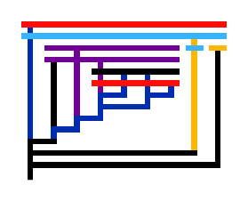

A package for working with lambda calculus, including parsing, reduction, visualization.

## Usage

```typ
#import "@preview/lambda:0.1.0": *
#diagram(random-color(const.fact))
```



## examples

Examples can be found in the [examples](examples) directory.
