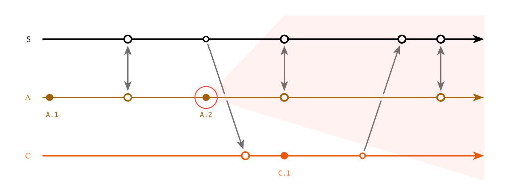

# lamportian-dramatis

Lamport diagrams for replicated systems: one timeline per replica, local events as dots on that timeline, and arrows for the messages that carry events from one replica to another.  The axis the timelines run along is logical time, in the sense of the clocks of [Time, Clocks, and the Ordering of Events in a Distributed System](https://lamport.azurewebsites.net/pubs/time-clocks.pdf); [`orientation`](https://lamportian-dramatis.github.io/reference#orientation) says which way it points, and the replicas stack across it.

> **Pre-1.0.**  This is young and still changing a lot.  Nothing here is a stable API until 1.0.0, so expect breaking changes between 0.x releases — argument names, defaults and the shape of what the helpers return are all still open.  A Typst import names an exact version, so nothing breaks under you: upgrading is always a deliberate edit.



That is [`gallery/overlays.typ`](gallery/overlays.typ), a complete standalone document and one of the worked examples that ship with the package:

```typ
#import "@preview/lamportian-dramatis:0.2.0": lamport-diagram, sync, below, above, send, recv, replica, event, draw
#import draw: *

#set page(width: 13cm, height: auto, margin: 0.4cm)
#set text(size: 10pt)

#lamport-diagram(
  replicas: (replica("S", above, color: luma(0)), replica("A", below), replica("C", below)),
  events: (
    "S": (sync("boot"), send("c-reads"), sync("a-pushes"), recv("c-pushes"), sync("a-catches-up")),
    "C": (recv("c-reads"), event(id: "c1")[`C.1`], send("c-pushes")),
    "A": ([`A.1`], sync("boot"), event(id: "a2")[`A.2`], sync("a-pushes"), sync("a-catches-up")),
  ),
  overlays: (
    backdrops: d => {
      let (column, point, replicas, span, col-gap, ..) = d
      let (_, ends) = span
      let lane-of = id => replicas.position(r => r == id)
      let (a, s, c) = (lane-of("A"), lane-of("S"), lane-of("C"))
      let apex = column("A", "a2")
      let crossing = column("C", -1) + 1 / col-gap
      let towards-c = (c - a) / (crossing - apex)
      line(
        point(apex, a),
        point(column("S", "a-pushes"), s - 0.4),
        point(ends, s - 0.4),
        point(ends, a + towards-c * (ends - apex)),
        close: true,
        fill: red.transparentize(93%),
        stroke: none,
      )
    },
    // Over the dot, under its label.
    marks: d => {
      let (mark, dot, mark-args, ..) = d
      let wash = red.transparentize(93%)

      circle(mark("A", "a2"), radius: dot * 3, stroke: red + 0.7pt)

      // Make the inners of the events have the same `wash` color of the future cone
      circle(..mark-args("S", 3), fill: wash)
      circle(..mark-args("S", 4), fill: wash)
      circle(..mark-args("S", 5), fill: wash)
      circle(..mark-args("A", 4), fill: wash)
      circle(..mark-args("A", 5), fill: wash)
    },
  ),
)
```

## Documentation

The reference lives at **[lamportian-dramatis.github.io](https://lamportian-dramatis.github.io/)**, and is the place to look up any of it:

- **[Guide](https://lamportian-dramatis.github.io/guide)** — how the columns are solved, how to read the marks, and how a diagram becomes a cross-referenced figure.
- **[Reference](https://lamportian-dramatis.github.io/reference)** — every function and every argument: `lamport-diagram`, `orientation`, `replica`, `event`, `send`, `recv`, `sync`, `idle`, `gap`, the label sides and the palette.
- **[Overlays](https://lamportian-dramatis.github.io/overlays)** — drawing your own CeTZ into a diagram, addressing its own points, at a layer of your choosing.
- **[Changelog](https://lamportian-dramatis.github.io/changelog)** — what each release changed.

## Dependencies

Drawing is done with [CeTZ](https://typst.app/universe/package/cetz/) 0.5.2.  The minimum Typst compiler is 0.14.0.

## Development

From a clone of the [repository](https://github.com/mvaled/lamportian-dramatis):

```sh
make check     # compile every gallery example; silence means the library still works
make gallery   # recompile the README's images
make docs      # refresh the images the documentation site serves
make publish   # stage the package into a clone of github.com/typst/packages
make uninstall # stop shadowing the published package (see below)
```

The documentation site at [lamportian-dramatis.github.io](https://lamportian-dramatis.github.io/) is the `docs/` submodule — the [`lamportian-dramatis.github.io`](https://github.com/lamportian-dramatis/lamportian-dramatis.github.io) repository, which GitHub Pages builds with its own Jekyll.  Clone with `--recurse-submodules`, or run `git submodule update --init` in an existing clone.  Prose is edited in place under `docs/` and committed there; `make docs` is what carries the gallery images across.  Commit the moved submodule pointer here too, so that a revision of this repository names the documentation that went with it.

The gallery examples import the package by its published spec rather than by a relative path, which is what the Universe linter asks for.  So `check`, `gallery` and `publish` all first run `install`, which copies the working tree over `@preview/lamportian-dramatis:0.2.0` in your [local package directory](https://github.com/typst/packages?tab=readme-ov-file#local-packages).  That copy shadows whatever Typst Universe would otherwise serve, so run `make uninstall` when you are done working on the package.

## License

MIT — see [LICENSE](LICENSE).
