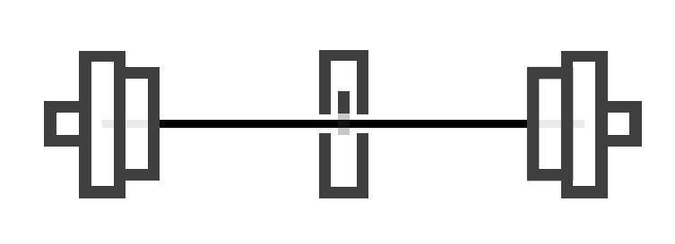
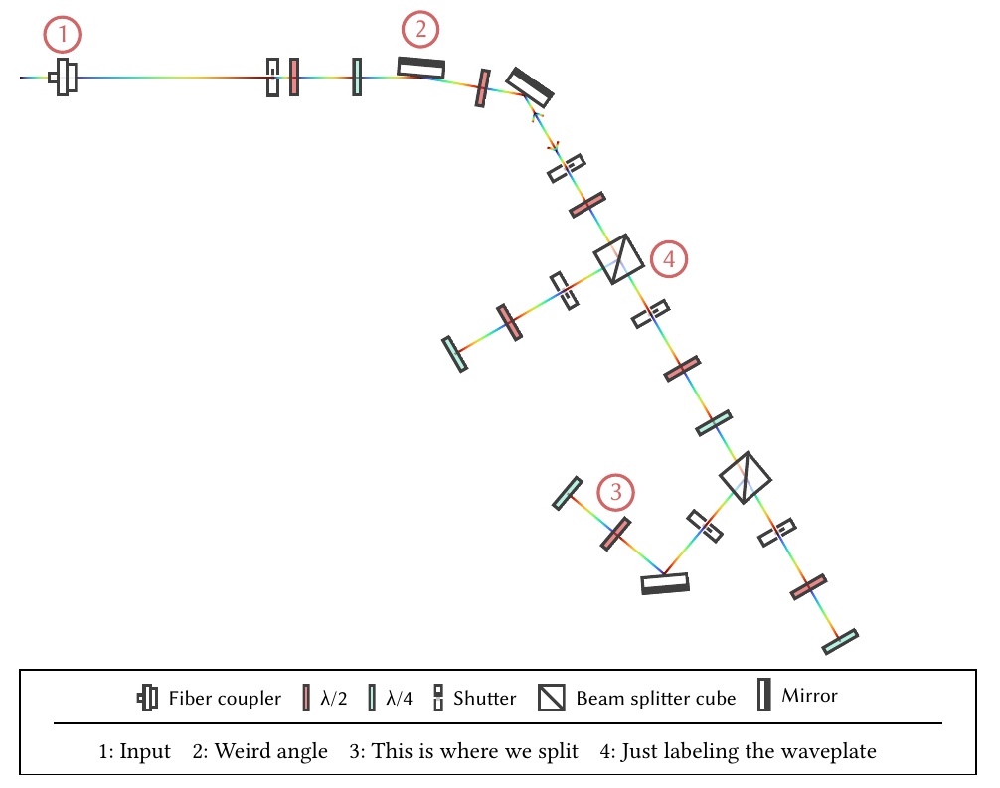

Laserly
===

A package to render 2D laser optic assemblies, which can be used in theses or documentations. Previously, I created these assemblies in inkscape, which becomes bothersome when the assembly needs to be changed. Being able to program the assembly makes it easy to insert new optical elements and the alignment will always be guaranteed.

General usage
---

```
#import "@preview/laserly:0.1.0": assemble, element

#context {
  let objs = assemble((
    element("fiber_coupler", dist: -20pt),
    element("shutter"),
    element("fiber_coupler", rot: 180deg)
  ))

  objs.content
}
```

With this example, a new assembly is created which contains a fiber coupler (as laser output), a shutter and a second fiber coupler (as laser input). The following is a more thorough example:



```
#import "@preview/laserly:0.1.0": legend, assemble, element, arrow, splitter, mirror

#context {
  let objs = assemble(stroke:1pt+gradient.linear(..color.map.turbo), (
    element("fiber_coupler", dist: 20pt, info_pos: top, info_num: 1),
    element("shutter", dist: 100pt),
    element("lambda-DIV-2", dist: 10pt),
    element("lambda-DIV-4"),
    mirror(rot: 5deg, info_pos: top, info_num: 2),
    element("lambda-DIV-2"),
    mirror(rot: 25deg, dist: 20pt),
    arrow(dir:-1, dist: 10pt),
    arrow(dir:1, dist: 20pt),
    element("shutter", dist: 10pt),
    element("lambda-DIV-2", dist: 20pt),
    splitter(
      info_pos: right,
      info_num: 4,
      rot: 0deg,
      (element("shutter"), element("lambda-DIV-2"), element("lambda-DIV-4"),
        splitter(
          rot: -10deg,
          (element("shutter"), element("lambda-DIV-2"), element("lambda-DIV-4")),

          (element("shutter"), mirror(rot: 45deg), element("lambda-DIV-2", info_pos: top, info_num: 3), element("lambda-DIV-4"))
        )),

      (element("shutter"), element("lambda-DIV-2"), element("lambda-DIV-4")),
    ),
  ))

  objs.content

  legend(objs.elements,
    labels: ("Input",
      "Weird angle",
      "This is where we split",
      "Just labeling the waveplate"),
    alt-text: (("Beamsplitter", "PBS"), ("Cavity", "Scanning Cavity"))
  )
}


#context {
  let objs = assemble((
    element("fiber_coupler", dist: -20pt),
    element("shutter"),
    element("fiber_coupler", rot: 180deg)
  ))

  objs.content
}
```



# Documentation

## Functions

### `assemble`
The main function used to create an assembly. The `objs` parameter requires function calls to `element(...)`, `mirror(...)`, `splitter(...)`, or `arrow(...)`.
Its return value is used to render the assembly.

**Optional Parameters:**
- `rot` [degrees, default: `0deg`]: Global rotation of the assembly
- `stroke` [stroke, default: `1pt+black`]: Stroke style of the laser

**Required Parameters:**
- `objs` [array]: All objects contained within the assembly.

**Returns:**
- `objs`, containing:
  - `objs.content` (for rendering)
  - `objs.elements` (for legend)

---

### `combine-assemblies`
**Required Parameters:**
- `assemblies` [vararg of all assemblies]

---

### `legend`
This function creates a legend box.

**Optional Parameters:**
- `labels` [array, default: `()`]: Text for each label. Array position matches `label-num - 1` (e.g., if an element has `label-num: 4`, then `labels[3]` will be its text).
- `alt-text` [array of tuples, default: `()`]: Alternative text for the elements. For example, an element can be `("Beamsplitter", "PBS")`, renaming all "Beamsplitter" elements to "PBS".
- `pic-scale` [float, default: `0.7`]: Size of the elements in the legend
- `pic-text-size` [font size, default: `10pt`]: Size of the element name
- `info-text-size` [font size, default: `11pt`]: Size of the info text
- `pic-padding` [size, default: `0.5em`]: Distance between element text and picture
- `info-padding` [size, default: `0.7em`]: Distance to the info text

**Required Parameters:**
- `components`: Use `objs.elements` (the return from `assemble`)

---

## Elements (also functions)

### `element`
A general optical element.

**Optional Parameters:**
- `variant` [integer, default: `1`]: Elements can have different pictures. Try different integers (starting from 1) or check the assets folder.
- `dist` [size, default: `30pt`]: Distance to previous object
- `rot` [degrees, default: `0deg`]: Rotation of element
- `size` [float, default: `1.0`]: Size of the element
- `info-pos` [position (`none`   `top` | `right` | `bottom` | `left`), default: `none`]: Position of the info number (e.g., for labeling an element)
- `info-num` [integer, default: `-1`]: Number of the info (should be referenced in the legend)

**Required Parameters:**
- `type` [string]: A name referring to the element. Check the available names in the assets folder.

---

### `mirror`
An optical element to redirect a laser beam.

**Optional Parameters:**
- See optional parameters of `element`
- `type` [string, default: `"mirror"`]

---

### `splitter`
An optical element that can split a beam into two paths. The third path is used, e.g., in a configuration where a laser returns to the splitter.

**Optional Parameters:**
- See optional parameters of `element`
- `type` [string, default: `"beam_splitter_cube"`]
- `path3` [array]: All objects contained within the third path of the splitter. If empty, the path will not be used.

**Required Parameters:**
- `path1` [array]: All objects contained within the first path of the splitter
- `path2` [array]: All objects contained within the second path of the splitter

---

### `arrow`
Adds an arrow into the laser path.

**Optional Parameters:**
- `dist`, `size`, `info-pos`, `info-num`: See `element`
