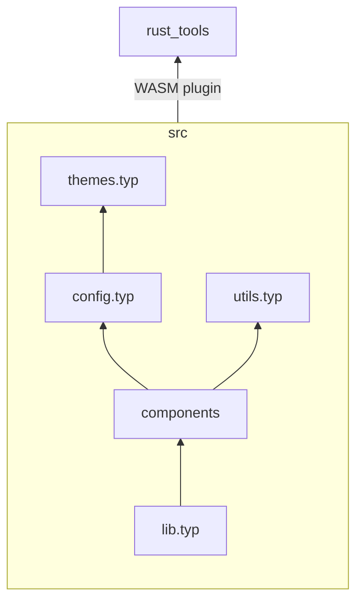
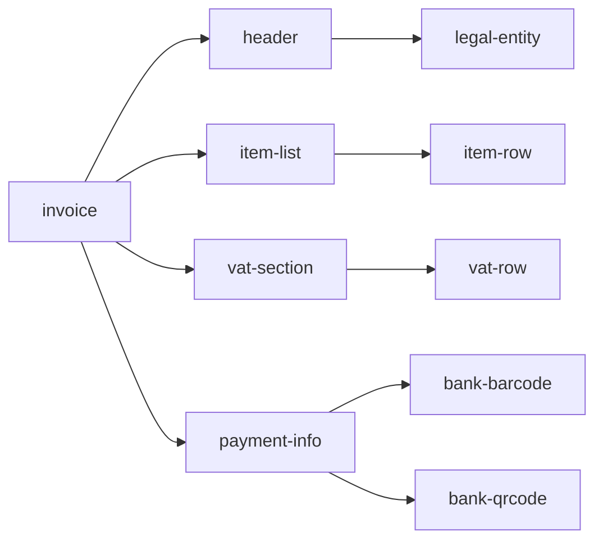

# Architecture

The source code is organized as follows:

- `rust_tools`: Rust wrappers of existing libraries or utility functions
- `src`: Typst source

The file structure:

The content of Typst files and directories:

- `utils/`: wrappers and data processing logic
- `components/`: visual components, mostly `content` type
- `config.typ`: configurations
- `lib.typ`: entrypoint, exposes public functions
- `themes.typ`: color themes

The dependency graph of components:

