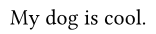
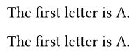
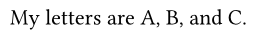
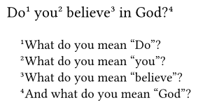
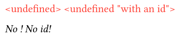
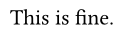
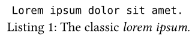

# `latedef`
*Use now, define later!*

## Basic usage
This package exposes a single function, `latedef-setup`.

```typst
#let (undef, def) = latedef-setup(simple: true)

My #undef is #undef.
#def("dog")
#def("cool")
```


Note that the definition doesn't actually have to come _after_ the usage,
but if you want to define something beforehand, you're better off using a variable instead.

```typst
#let (undef, def) = latedef-setup(simple: true)

// Instead of
#def("A")
The first letter is #undef.

// you should use
#let A = "A"
The first letter is #A.
```


## The `simple` parameter
When `simple: false` (which is the default), `undef` becomes a function you have to call.
It takes an optional positional or named parameter `id` of type `str`, which can be used to define things out of order.

```typst
#let (undef, def) = latedef-setup() // or `latedef-setup(simple: false)`

// Note that you can still call it without an id, which works just like when `simple: true`.
My letters are #undef("1"), #undef(id: "2"), and #undef().

// `def` now takes one positional and either another positional or a named parameter.
#def("C")
#def(id: "2", "B")
#def("1", "A")
```


## The `footnote` parameter
This is a convenience feature that automatically wraps `undef` in `footnote`,
either directly (when `simple: true`) or as a function (when `simple: false`).

This corresponds to LaTeX's `\footnotemark` and `\footnotetext`,
hence the different names in the example.

```typst
#let (fmark, ftext) = latedef-setup(simple: true, footnote: true)
Do#fmark you#fmark believe#fmark in God?#fmark

#let wdym = "What do you mean"
#ftext[#wdym "Do"?]
#ftext[#wdym "you"?]
#ftext[#wdym "believe"?]
#ftext[And w#wdym.slice(1) "God"?]
```


## The `stand-in` parameter
This is a function that takes a single positional parameter (`id`) of type `none | str`
and produces a stand-in value that gets shown when a late-defined value is missing a corresponding definition.

<!-- isolate-example -->
```typst
#let (undef, def) = latedef-setup()
// This is the default stand-in
#undef()
#undef("with an id")

// Custom stand-in
#let (undef, def) = latedef-setup(stand-in: id => emph[No #id!])
#undef()
#undef("id")
```


Since `stand-in` is a function, which is only called when a definition is actually missing,
you can even set it to panic to enforce that all late-defined values have a definiton.

<!-- fail-example -->
```typst
#let (undef, def) = latedef-setup(stand-in: id => panic("Missing definition for value with id " + repr(id)))
#undef()
#undef("id")
```
The output will look something like
```
error: panicked with: "Missing definition for value with id none"
  ┌─ example.typ:1:50
  │
  │ #let (undef, def) = latedef-setup(stand-in: id => panic("Missing definition for value with id " + repr(id)))
  │                                                   ^^^^^^^^^^^^^^^^^^^^^^^^^^^^^^^^^^^^^^^^^^^^^^^^^^^^^^^^^

error: panicked with: "Missing definition for value with id \"id\""
  ┌─ example.typ:1:50
  │
  │ #let (undef, def) = latedef-setup(stand-in: id => panic("Missing definition for value with id " + repr(id)))
  │                                                   ^^^^^^^^^^^^^^^^^^^^^^^^^^^^^^^^^^^^^^^^^^^^^^^^^^^^^^^^^
```

And there is no error when everything has a definition:
```typst
#let (undef, def) = latedef-setup(stand-in: id => panic("Missing definition for value with id " + repr(id)))
#undef() is #undef("id").
#def("This")
#def("id", "fine")
```


## The `group` parameter
Sometimes you may want to use multiple instances of `latedef` in parallel.
This is done using the `group` parameter, which can be `none` (the default) or any `str`.

Note that using `footnote: true` sets the default group to `"footnote"` instead.

```typst
// Use a group for the figure stuff...
#let (caption-undef, caption) = latedef-setup(simple: true, group: "figure")
#let figure = std.figure.with(caption: caption-undef)
// ...so you can still use the regular mechanism in parallel.
#let (undef, def) = latedef-setup(simple: true)

#figure(raw(block: true, lorem(5)))
#caption[The #undef _lorem ipsum_.]
#def("classic")
```

