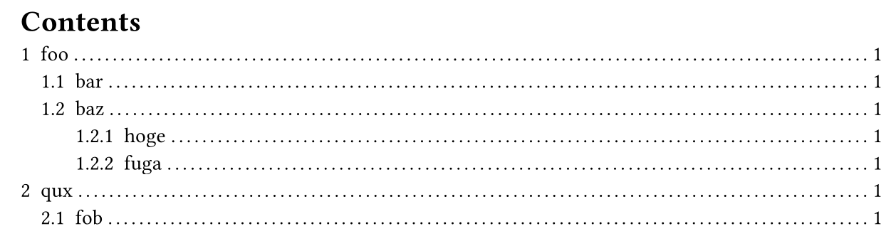

# LaTeX styles for Typst

The aim of the `latex-lookalike` package is to re-create the look and feel of LaTeX for Typst.

The styling of different components are kept separate, so users are free to pick and choose which styles to use (see [Styles](#Styles)).

## Example document

```bash
# Compile example document.
typst compile example/example.typ
```

## Styles

### Outline style

```typst
// Style outline as LaTeX "Table of contents".
#show: latex-lookalike.style-outline
```

Before (default Typst style):


After (with `latex-lookalike.style-outline` applied):


# Local development

Run the following commands to make the package available for local development to Typst under the import path `@local/latex-lookalike:0.1.0`.
```bash
git clone https://github.com/mewmew/latex-lookalike
mkdir -p ~/.local/share/typst/packages/local/latex-lookalike
ln -s "$(realpath latex-lookalike)"  ~/.local/share/typst/packages/local/latex-lookalike/0.1.0
```
