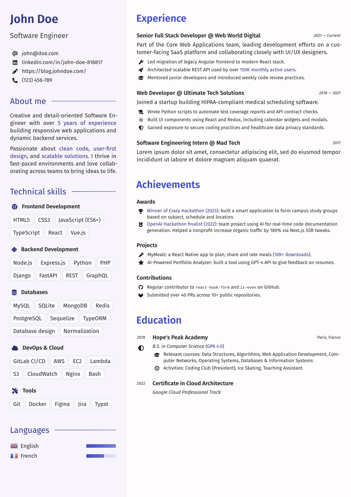

# lavandula

A modern, clean and customizable resume template in [Typst](https://typst.app/).




## Prerequisites

You will need the [Fira Sans](https://fonts.google.com/specimen/Fira+Sans) font installed on your system (if you are using the Typst web app, it is already included).

This template also uses Font Awesome icons via the [fontawesome](https://typst.app/universe/package/fontawesome) package. You will need to install the [Font Awesome 7 Desktop](https://fontawesome.com/download) fonts on your system, or upload them to your project folder if you use the Typst web app.

**Note: at this time, one of the template's components (`#skill-levels`) does not render properly in PDF exports because of a bug in Typst 0.13.1. You may use the latest development version to fix this (in the web app, go to your project's settings and change the compiler version).**


## Installation

**Typst web app:** go the [package's page](https://typst.app/universe/package/lavandula) and click *Create project in app*.

**Locally:** create a new Typst project from this template with `typst init @preview/lavandula:0.1.1`.


## Usage

Check out [`templates/main.typ`](templates/main.typ) for an example use. It should be rather exhaustive and self-explanatory on the usage of the different components. The template should work for CVs with both single and multiple pages.

### Customization

#### Colors

lavandula is built around a simple color philosophy: only two main colors are basically defined (`primary` and `secondary`), and all other colors stem from these two.

You can override the default color palette like this:

```typ
#show: lavandula-theme.with(
  custom-colors: (
    primary: rgb("#TBA"),
    secondary: rgb("#TBA"),
  ),
)
```

Note: you can also redefine `light` and `dark` inside `custom-colors`, which are notably used for background and text. You could technically switch to a dark mode by exchanging the roles of those two colors, although this has not been thoroughly tested and may not behave as expected.

#### Sidebar

You can change the sidebar's position and width using `sidebar-position` and `sidebar-width` in the `#cv` component.

```typ
#cv(
  sidebar-position: "left",  // "left" or "right"
  sidebar-width: 36%,
  sidebar: [
    // ...
  ],
  main-content: [
    // ...
  ],
)
```

#### Text sizes

The package exports a few predefined text sizes that you may use:

```typ
#let sizes = (
  text-b4: 20pt,
  text-b3: 17pt,
  text-b2: 14pt,
  text-b1: 12pt,
  text-default: 9.5pt,
  text-s1: 9pt,
  text-s2: 8pt,
  text-s3: 7pt,
)
```
