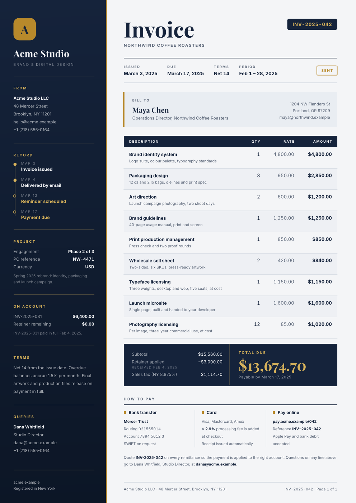

# ledger-rail

An invoice with a full-height navy rail for the sender, brass accents and
totals computed from the line items. Long invoices flow onto more pages: the
rail repeats, the table header repeats, and the total never splits.



Designed by [pdfs.build](https://pdfs.build), where this template can also be
rendered from JSON over an API.

## Getting started

In the web app, click "Start from template" and search for `ledger-rail`. On the
command line:

```sh
typst init @preview/ledger-rail:0.1.0
```

Or import the function into an existing document:

```typ
#import "@preview/ledger-rail:0.1.0": invoice

#show: invoice.with(
  company: "Acme Studio",
  rail: (
    (title: "From", body: ([*Acme Studio LLC*], "48 Mercer Street", "hello@acme.example")),
    (title: "Terms", body: [Net 14 from the issue date.]),
  ),
  number: "INV-2025-042",
  meta: (Issued: "March 3, 2025", Due: "March 17, 2025"),
  bill-to: (name: "Maya Chen", address: ("1204 NW Flanders St", "Portland, OR 97209")),
  items: (
    (description: "Brand identity system", detail: "Logo suite and colour palette", quantity: 1, price: 4800),
    (description: "Packaging design", quantity: 3, price: 950),
  ),
  tax: (label: "Sales tax (8.875%)", rate: 0.08875),
  payment: ((title: "Bank transfer", body: ("Mercer Trust", "Account 7894 5612 3")),),
)

Quote *INV-2025-042* with your payment.
```

The document body after the show rule becomes the closing note under the
payment details. See `template/main.typ` for every option in use.

## Fonts

The design uses two fonts, both under the SIL Open Font License 1.1 and free
from Google Fonts:

- [Playfair Display](https://fonts.google.com/specimen/Playfair+Display) for
  the title, names and total
- [Inter](https://fonts.google.com/specimen/Inter) for everything else

On the command line, install them or point Typst at them with
`typst compile --font-path fonts main.typ`. In the web app, if they are not in
the font list, upload the `.ttf` files into your project. Typst before 0.15
does not support variable fonts, so use the files from the `static` folder of
the Google Fonts download. To use other fonts, pass
`fonts: (display: "...", body: "...")`.

## Options

All parameters of `invoice` are named and optional.

| Parameter | Default | Description |
| --- | --- | --- |
| `company` | `"Company"` | Sender name at the top of the rail. |
| `tagline` | `none` | Small caps line under the company name. |
| `logo` | `auto` | `auto` draws a tile with the first letter of `company`. Pass content, e.g. `image("logo.svg", width: 37.5pt)`, or `none`. |
| `rail` | `()` | Rail sections, top to bottom. Each is a dictionary with a `title` and any of `body`, `rows`, `note` and `steps` (see below). |
| `rail-footer` | `none` | Fine print at the foot of the rail. |
| `number` | `"INV-0001"` | Invoice number, shown in the badge and the page footer. |
| `subtitle` | `none` | Small caps line under the title, e.g. the client's company. |
| `status` | `none` | Outlined badge at the end of the meta row, e.g. `"Paid"`. |
| `meta` | `(:)` | Key facts under the title, e.g. `(Issued: "May 1, 2026", Terms: "Net 14")`. |
| `bill-to` | `(name: "Client")` | `name`, and optionally `role` and `address`. |
| `items` | `()` | Line items as `(description:, detail:, quantity:, price:)`. `detail` is optional. |
| `currency` | `"$"` | Symbol placed before amounts. |
| `money` | `auto` | Custom formatter `value => str` for all amounts and rates. |
| `credit` | `none` | Amount deducted before tax, e.g. a retainer: `(label:, amount:, note:)`. |
| `tax` | `none` | Tax on the subtotal minus the credit: `(label:, rate:)`, with `rate` as a fraction. |
| `due-note` | `none` | Line under the total, e.g. `"Payable by March 17, 2025"`. |
| `payment` | `()` | Payment options shown side by side, as `(title:, body:)`. |
| `footer` | `none` | Left side of the page footer. |
| `paper` | `"a4"` | Paper size, e.g. `"us-letter"`. |
| `colors` | `(:)` | Overrides for `default-colors`: `ink`, `ink-deep`, `accent`, `accent-soft`, `canvas`, `surface`, `muted`, `rule`, `on-ink`. |
| `fonts` | `(:)` | Overrides for `(display: "Playfair Display", body: "Inter")`. |
| `labels` | `(:)` | Overrides for `default-labels`, to translate the fixed text. |

A rail section can combine these keys:

- `body`: content, or an array of lines joined with line breaks
- `rows`: a dictionary of key-value pairs, e.g. `("PO reference": "NW-4471")`
- `note`: small print after the rows
- `steps`: a timeline, as an array of `(date:, label:, done:)`; `done` is optional

The rail is page decoration: it repeats on every page and does not grow, so
keep its content short enough to fit the page height.

Wherever a parameter takes content or an array of lines, strings are the
easiest way to write email addresses. In markup, `@` starts a reference, so
write `[hello\@example.com]` there.

### Another language or currency

```typ
#import "@preview/ledger-rail:0.1.0": invoice, format-money

#show: invoice.with(
  money: v => format-money(v, currency: "", thousands: ".", decimal: ",") + " €",
  labels: (
    title: "Rechnung", bill-to: "Rechnung an", description: "Leistung",
    quantity: "Menge", price: "Preis", amount: "Betrag", subtotal: "Zwischensumme",
    total: "Gesamtbetrag", payment: "Zahlung", page: "Seite", of: "von",
  ),
  // ...
)
```

## License

The files in the `template/` directory are licensed under MIT-0, so documents
you create from the template carry no license obligations. All other files are
licensed under MIT. See [LICENSE](LICENSE) for both texts.
