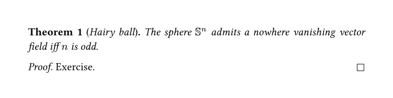

# Lemming
Provides customizable theorem-like and proof environments that aim to behave closely to the way native elements behave.
This package will upgrade to [native custom elements](https://github.com/typst/typst/issues/147), once they arrive.
For now it employs the great [elembic](https://typst.app/universe/package/elembic).



## Basic usage

First, create the environments you want to use. 
By default, the `supplement` of the environment will be a capitalized version of the `kind` specified.
If you want your environments to use a shared counter, set their `supplement` instead of `kind`.
```typ
#import "@preview/lemming:0.1.0" as lem

#let theorem = lem.environment.with(kind: "theorem")
#let lemma = lem.environment.with(kind: "lemma")
#let proof = lem.proof

// Unfortunately necessary for now to make references work
#show: lem.prepare()
```
Now, just use your environments in your document.

```typ
#theorem(name: "Noether")[
  #lorem(20)
]

#theorem(numbering: none, supplement: "Satz")[
  #lorem(20)
]
```

### Labels and references
Due to implementation constraints, you have to specify labels as below instead of attaching it at the back of your environments.
Hopefully, this will become unnecessary in the future.
```typ
#theorem(name: "Noether", label: <theorem:noether>)[
  #lorem(20)
]
```
If references do not work, make sure you have applied the following `show` rule.
```typ
#show: lem.prepare()
```

### Set rules
You can change the defaults of all parameters using `set` rules.
```typ
// Unnecessary as "1.1" is the default numbering
// Think: #set lem.environment(numbering: "1")
#show: lem.set_(lem.environment, numbering: "1")
```

### Show-Set rules
You can use `show set` rules too.
For example, you can make the body text `upright` instead of the default `italic`
```typ
// Think: #show lem.environment.body: set text(style: "normal")
#show lem.selector(lem.environment-body): set text(style: "normal")
```
Self-referential `show set` rules work a bit different than native ones.
```typ
// Think: #show lem.environment.where(kind: "theorem"): set lem.environment(
//   numbering: heading-subnumbering(
//     lem.environment.where(kind: "theorem"), 1, "H.1.1"
//   )
// )
#show: lem.cond-set(
  theorem, 
  numbering: heading-subnumbering(lem.counter-name("theorem"), 1, "H.1.1"),
)
```
This rules employs the `heading-subnumbering` function from the [discount](https://typst.app/universe/package/discount) package.


### Show rules
To customize the display of your environment even further, you can write a custom `show` rule.
```typ
// Think: #show lem.environment: box(stroke: blue)
 #show: lem.show_(lem.environment, it => box(stroke: blue, it))
```
These can be conditional too.
```typ
// Think: #show lem.environment.where(kind: "lemma"): it => box(stroke: red, inset: 0.5em, it)
#show: lem.show_(lemma, it => box(stroke: red, inset: 0.5em, it))
```
#### Fields
While writing your `show` rule, you can acess the following fields on `it`:
| name | type | description |
| -- | -- | -- |
| body | `content` | The body of the environment, required and positional. |
| name | `content \| none` | Additional note for the environment, for example the name of a theorem. |
| kind | `str` | The kind of math environment. Default: `"theorem"`|
| supplement | `content \| auto` | The word used for the environment. Defaults to the capizalized kind. |
| separator | `content` | The symbol between between the header and body. Default: `[. ]` | 
| numbering | `str \| function \| none` | How to number the environment. Accepts a numbering pattern or function. Default `"1.1"` |
| counter | `counter` | The counter corresponding to the environment, synthesized. |

## Proofs
The `proof` environment works similar and should do exactly what you expect.