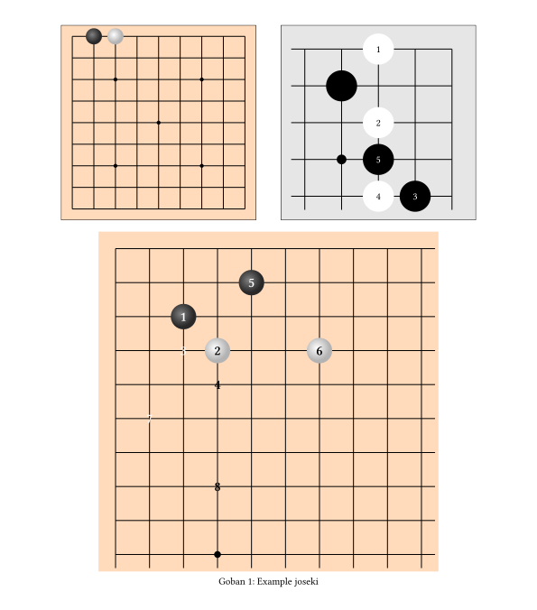

# Let's-Go: a goban drawing library for Typst

Draw a goban that will scale to the width of its parent.

The library exposes a generic `go-board` function which takes a size and stones to place.
For now the board will be a square, no possibility to draw a rectangular portion of a board.

`#go-board(size: 13, stones: ("ab", "ac", "ef"))`

The library also exposes functions `go-board-9`, `go-board-13`, and `go-board-19` which provide the sizes and the references marks for common goban sizes.

Here is the list of current customization arguments for the goban, you can find it in the source :
```
/// - stones (): List of stones to place ("ac", "ef", ...)
/// - size (int): Board size
/// - marks (): Reference marks to draw ("dd", "df", ...)
/// - padding (): Border padding
/// - board-fill (): Background fill
/// - mark-radius (): Reference marks radius
/// - stone-diameter-ratio (): Ratio of stone diameter to grid size
/// - black-stone (): Black stone to use
/// - white-stone (): White stone to use
/// - open-edges (): Which edges to extend a bit to mark that the board extends there
/// - open-edges-added-length (): Proportion to extend the edges
/// - add-played-number (): Add numbers showing the play order
```

Here are three example goban with different customizations.



```typst
#import "@preview/lets-go:0.1.0": go-board, go-board-9

#align(center, {
  // First goban, no customization
  box(stroke: black, width: 40%, go-board-9(stones: ("ab", "ac", "ef")))
  h(1cm)
  // Second goban with:
  // - stone parameters
  // - custom marks
  // - open edges to signify that this is a portion of a larger goban
  // - a different background color
  // - different black and white stones
  // - numbering of the plays
  box(stroke: black, width: 40%, go-board(
    size: 5,
    // Stones stay positioned from the top left corner
    stones: ((position: "ac", color: "white"), (position: "bb", skip-numbering: true), "cc", "ed", "ec", "dc"),
    marks: ("db",),
    mark-radius: 5%,
    open-edges: ("left", "bottom"),
    open-edges-added-length: 7%,
    padding: 2mm,
    board-fill: luma(90%),
    black-stone: move(dx: -50%, dy: -50%, circle(
      width: 100%,
      fill: black,
      stroke: white + 0.2pt,
    )),
    white-stone: move(dx: -50%, dy: -50%, circle(
      width: 100%,
      fill: white,
      stroke: black + 0.2pt,
    )),
    stone-diameter-ratio: 0.8,
    add-played-number: true,
  ))
})

// An example goban in a figure with adjusted font-size
#figure(
  {
    set text(size: 15pt, weight: "semibold")
    block(width: 70%, go-board(
      size: 10,
      stones: ("cc", "dd", "dc", "ed", "be", "dg", "fb", "hd"),
      add-played-number: true,
      open-edges: ("right", "bottom"),
      marks: ("dd", "jd"),
    ))
  },
  caption: [Example joseki],
  kind: "goban",
  supplement: [Goban],
)
```

# TODO

- Fix font sizing
- Add labels and annotations
- Enhance stone placement definition
- Add the possibility to parse from a SGF game record


# Contributing

This package is open to contributions, I don't have strong opinions on the direction it should take.
Don't hesitate to make pull requests, or to ask me to become a manager.