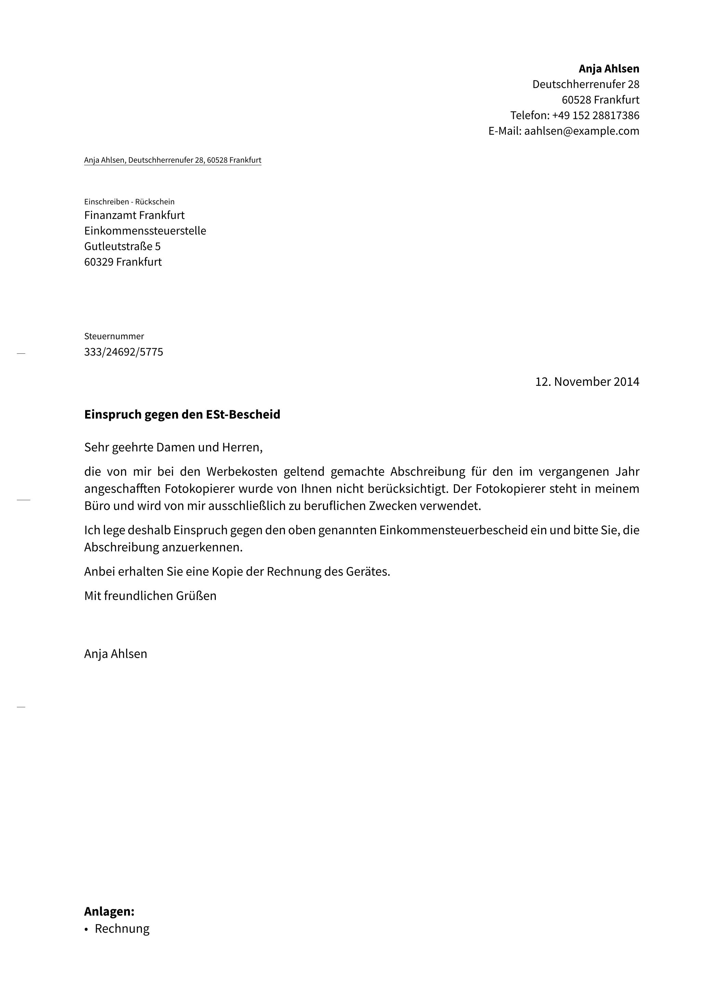

# typst-letter-pro
A template for creating business letters following the DIN 5008 standard.

## Overview
typst-letter-pro provides a convenient and professional way to generate business letters
with a standardized layout. The template follows the guidelines specified in the
DIN 5008 standard, ensuring that your letters adhere to the commonly accepted business
communication practices.

The goal of typst-letter-pro is to simplify the process of creating business letters
while maintaining a clean and professional appearance. It offers predefined sections
for the sender and recipient information, subject, date, header, footer and more.

## [Documentation](https://raw.githubusercontent.com/wiki/Sematre/typst-letter-pro/documentation-v3.0.0.pdf)

## Example
Text source: [Musterbrief Widerspruch gegen Einkommensteuerbescheid](https://web.archive.org/web/20230927152049/https://www.deutschepost.de/de/b/briefvorlagen/beschwerden.html#Einspruch)

### Preview ([PDF version](https://raw.githubusercontent.com/wiki/Sematre/typst-letter-pro/simple_letter.pdf))


### Code
```typst
#import "@preview/letter-pro:3.0.0": letter-simple

#set text(lang: "de")

#show: letter-simple.with(
  sender: (
    name: "Anja Ahlsen",
    address: "Deutschherrenufer 28, 60528 Frankfurt",
    extra: [
      Telefon: #link("tel:+4915228817386")[+49 152 28817386]\
      E-Mail: #link("mailto:aahlsen@example.com")[aahlsen\@example.com]\
    ],
  ),
  
  annotations: [Einschreiben - Rückschein],
  recipient: [
    Finanzamt Frankfurt\
    Einkommenssteuerstelle\
    Gutleutstraße 5\
    60329 Frankfurt
  ],
  
  reference-signs: (
    ([Steuernummer], [333/24692/5775]),
  ),
  
  date: "12. November 2014",
  subject: "Einspruch gegen den ESt-Bescheid",
)

Sehr geehrte Damen und Herren,

die von mir bei den Werbekosten geltend gemachte Abschreibung für den im
vergangenen Jahr angeschafften Fotokopierer wurde von Ihnen nicht berücksichtigt.
Der Fotokopierer steht in meinem Büro und wird von mir ausschließlich zu beruflichen
Zwecken verwendet.

Ich lege deshalb Einspruch gegen den oben genannten Einkommensteuerbescheid ein
und bitte Sie, die Abschreibung anzuerkennen.

Anbei erhalten Sie eine Kopie der Rechnung des Gerätes.

Mit freundlichen Grüßen
#v(1cm)
Anja Ahlsen

#v(1fr)
*Anlagen:*
- Rechnung
```

## Usage
### Preview repository
Import the package in your document:
```typst
#import "@preview/letter-pro:3.0.0": letter-simple
```

### Local namespace
Download the repository to the local package namespace using Git:
```sh
$ git clone -c advice.detachedHead=false https://github.com/Sematre/typst-letter-pro.git --depth 1 --branch v3.0.0 ~/.local/share/typst/packages/local/letter-pro/3.0.0
```

Then import the package in your document:
```typst
#import "@local/letter-pro:3.0.0": letter-simple
```

### Manual
Download the ``letter-pro-v3.0.0.typ`` file from the [releases page](https://github.com/Sematre/typst-letter-pro/releases) and place it next to your document file, e.g., using *wget*:

```sh
$ wget https://github.com/Sematre/typst-letter-pro/releases/download/v3.0.0/letter-pro-v3.0.0.typ
```

Then import the package in your document:
```typst
#import "letter-pro-v3.0.0.typ": letter-simple
```

## Contributing
Contributions to typst-letter-pro are welcome! If you encounter any issues or have
suggestions for improvements, please open an issue on GitHub or submit a pull request.

Before making any significant changes, please discuss your ideas with the project
maintainers to ensure they align with the project's goals and direction.

## Acknowledgments
This project is inspired by the following projects and resources:
* [Wikipedia / DIN 5008](https://de.wikipedia.org/wiki/DIN_5008)
* [Deutsche Post / DIN 5008 Vorlage](https://web.archive.org/web/20240223035339/https://www.deutschepost.de/de/b/briefvorlagen/normbrief-din-5008-vorlage.html)
* [Deutsche Post / Automationsfähige Briefsendungen](https://www.deutschepost.de/dam/dpag/images/P_p/printmailing/downloads/dp-automationsfaehige-briefsendungen-2024.pdf)
* [EDV Lehrgang / DIN-5008](https://www.edv-lehrgang.de/din-5008/)
* [Ludwig Austermann / typst-din-5008-letter](https://github.com/ludwig-austermann/typst-din-5008-letter)
* [Pascal Huber / typst-letter-template](https://github.com/pascal-huber/typst-letter-template)

## License
Distributed under the **MIT License**. See ``LICENSE`` for more information.
