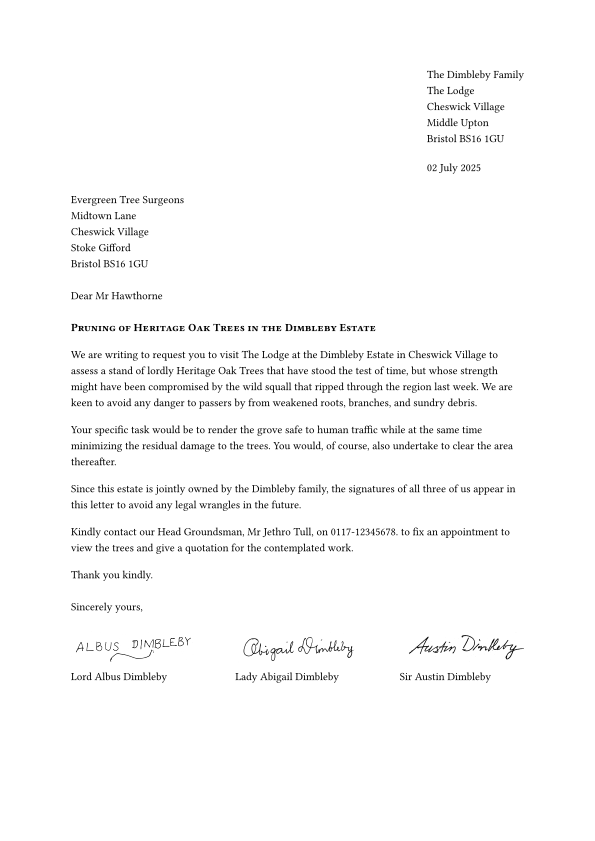

# The `letterloom` Package
<!-- markdownlint-disable MD033 -->
<div align="center">Version 0.1.0</div>

The `letterloom` package is a user-friendly and customizable template designed to streamline the creation of professional-looking letters.

## Getting Started

These instructions will get you a copy of the project up and running on the Typst web app.

```typ
#import "@preview/letterloom:0.1.0": *

#show: letterloom.with(
  // Sender's contact information (name and address)
  from: (
    name: "Sender's Name",
    address: [Sender's Address]
  ),

  // Recipient's contact information (name and address)
  to: (
    name: "Receiver's Name",
    address: [Receiver's Address]
  ),

  // Letter date (automatically set to today's date)
  date: datetime.today().display("[day padding:zero] [month repr:long] [year repr:full]"),

  // Opening greeting (e.g., "Dear Mr Hawthorne,")
  salutation: "Dear Receiver's Name,",

  // Letter subject line
  subject: "Subject",

  // Closing phrase (e.g., "Yours sincerely,")
  closing: "Yours sincerely,",

  // List of signatories with their names
  signatures: (
    (
      name: "Sender's Name",
      // signature: image() // Add your signature image here
    )
  ),
)

// Write the body of your letter here
```

### Installation

Prepare your development environment using these steps:

1. **Typst:** Install Typst (version 0.13.0 or higher) following the [official guide](https://github.com/typst/typst?tab=readme-ov-file#installation). Typst is the core tool required for this project.

1. **Just:** Install [Just](https://just.systems/man/en/introduction.html), a handy command runner for executing predefined tasks. You can install it using a package manager or by downloading a pre-built binary. Refer to the [available packages](https://just.systems/man/en/packages.html) for installation instructions specific to your operating system.

1. **tytanic:** Install [tytanic](https://tingerrr.github.io/tytanic/index.html), a library essential for testing and working with Typst projects. Use the [quickstart installation guide](https://tingerrr.github.io/tytanic/quickstart/install.html) to get it up and running.

1. **Clone the Repository:** Download the project's source code by cloning the repository to your local machine:

    ```bash
    git clone https://github.com/nandac/letterloom.git
    ```

    Your development environment is now ready.

### Next Steps

The package's source code resides in the `src` directory:

```bash
── src
│   ├── construct-outputs.typ
│   ├── lib.typ
│   └── validate-inputs.typ
```

Modify the files in this directory as needed.

### Running Tests

To validate the package functionality, execute the following command:

```bash
just test
```

To add a new test case execute:

```bash
tt new <test-case-name>
```

This will create a new folder with the following structure under the `tests` directory:

```bash
├── <test-case-name>
│   ├── .gitignore
│   ├── ref
│   │   └── 1.png
│   └── test.typ
```

You may then write your tests in the `test.typ` file.

For more information on writing tests using tytanic please see this [guide](https://typst-community.github.io/tytanic/guides/tests.html).

Once you have written your test run:

```bash
just update
just test
```

Ensure all tests pass before submitting changes to maintain code quality.

To test the package with an actual Typst file, install the `letterloom` package locally in the `preview` location by running:

```bash
just install-preview
```

Once installed, import it into your Typst file using:

```typ
#import "@preview/letterloom:0.1.0": *
```

This allows experimentation with the package before finalizing updates.

### Releasing a New Version

Follow these steps to release a new version of the package:

1. **Update Version Number:**

   * Increment the major and/or minor version number in all files referencing the old version.

1. **Update CHANGELOG:**

   * Document added features, modifications, and optionally include a migration guide for the new version in `CHANGELOG.md`.

1. **Commit Changes:**

   * Push your updates to the repository:

     ```bash
     git add .
     git commit -m "Bump version and update CHANGELOG"
     git push
     ```

1. **Tag the Release:**

   * Create and push a new tag for the version:

     ```bash
     git tag -a v<version> -m "<release-text>"
     git push --tags origin
     ```

1. **Create a Pull Request:**

    * The release action in GitHub will create a branch in your fork of typst-packages.
    * Use this branch to open a pull request in the main [Typst Packages repository](https://github.com/typst/packages).

## Usage

Here is a basic example for creating a letter with the `letterloom` package:

```typ
#show: letterloom.with(
  from: (
    name: "The Dimbleby Family",
    address: [The Lodge \
              Cheswick Village \
              Middle Upton \
              Bristol BS16 1GU]
  ),
  to: (
    name: "Evergreen Tree Surgeons",
    address: [Midtown Lane \
              Cheswick Village \
              Stoke Gifford \
              Bristol BS16 1GU]
  ),
  date: datetime.today().display("[day padding:zero] [month repr:long] [year repr:full]"),
  salutation: "Dear Mr Hawthorne",
  subject: text(weight: "bold")[#smallcaps("Pruning of Heritage Oak Trees in the Dimbleby Estate")],
  closing: "Sincerely yours,",
  signatures: (
    (
      name: "Lord Albus Dimbleby",
      signature: image("images/albus-sig.png")
    ),
    (
      name: "Lady Abigail Dimbleby",
      signature: image("images/abigail-sig.png")
    ),
    (
      name: "Sir Austin Dimbleby",
      signature: image("images/austin-sig.png")
    ),
  ),
)

We are writing to request you to visit The Lodge at the Dimbleby Estate in Cheswick Village to assess a stand of lordly Heritage Oak Trees that have stood the test of time, but whose strength might have been compromised by the wild squall that ripped through the region last week. We are keen to avoid any danger to passers by from weakened roots, branches, and sundry debris.

Your specific task would be to render the grove safe to human traffic while at the same time minimizing the residual damage to the trees. You would, of course, also undertake to clear the area thereafter.

Since this estate is jointly owned by the Dimbleby family, the signatures of all three of us appear in this letter to avoid any legal wrangles in the future.

Kindly contact our Head Groundsman, Mr Jethro Tull, on 0117-12345678. to fix an appointment to view the trees and give a quotation for the contemplated work.

Thank you kindly.
```

<picture>
  <source media="(prefers-color-scheme: dark)" srcset="./thumbnail-dark.svg">
  
</picture>

For a detailed overview of all options and features, consult the package's official manual, which provides examples and comprehensive usage instructions.

## Acknowledgments

Grateful thanks to the Typst community on [Discord](https://discord.com/channels/1054443721975922748/1069937650125000807) for their invaluable guidance and support during development.
