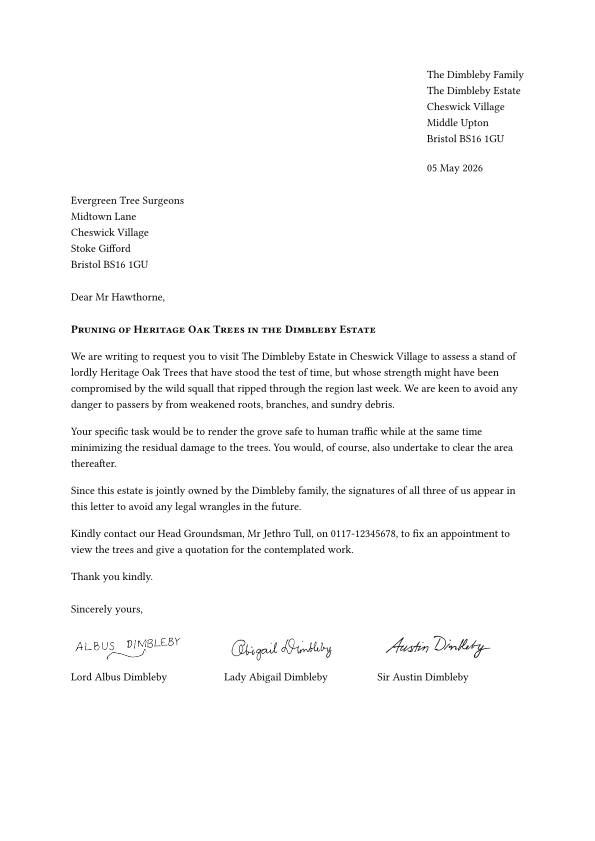

# The `letterloom` Package
<!-- markdownlint-disable MD033 -->
<div align="center">Version 3.0.0</div>

Meet `letterloom`, a highly customizable and user-friendly template designed to streamline the creation of professional correspondence. Whether you are drafting a formal business proposal or a personal note, `letterloom` ensures your letters are consistently polished, elegant, and tailored to your exact preferences.

## Key Features

* **Multiple Signatures:** Seamlessly support single or multiple signatures, complete with optional titles and affiliations.

* **Custom Letterheads:** Easily integrate branded letterheads with flexible layout and positioning options.

* **Smart Enclosures:** List attached documents within the letter, and optionally embed them as appended pages.

* **Customizable Labels:** Fully adapt labels and text to suit your needs.

* **Configurable Fields:** Gain complete control over your document structure — every required field can be toggled as optional.

## How It Works

Out of the box, `letterloom` adheres to the strict conventions of formal English business correspondence, intelligently structuring the sender address, date, recipient, subject, body, closing, and signatures. However, it also grants you ultimate control over typography, alignment, and optional elements.

The package handles all vertical spacing, page geometry, and letterhead placement automatically. This ensures a flawless, consistent layout regardless of your content's length or the paper size used.

## Requirements

Typst 0.14.0 or higher is required to use this package.

## Usage

Here is a simple example showing the essential arguments needed to use the `letterloom` package:

```typ
#import "@preview/letterloom:3.0.0": *

#show: letterloom.with(
  // Sender's contact information (name and address)
  from-name: "The Dimbleby Family",
  from-address: [
    The Dimbleby Estate \
    Cheswick Village \
    Middle Upton \
    Bristol BS16 1GU
  ],

  // Recipient's contact information (name and address)
  to-name: "Evergreen Tree Surgeons",
  to-address: [
    Midtown Lane \
    Cheswick Village \
    Stoke Gifford \
    Bristol BS16 1GU
  ],

  // Letter date (automatically set to today's date)
  date: datetime.today().display("[day padding:zero] [month repr:long] [year repr:full]"),

  // Opening greeting
  salutation: "Dear Mr Hawthorne,",

  // Letter subject line
  subject: text(weight: "bold")[#smallcaps("Pruning of Heritage Oak Trees in the Dimbleby Estate")],

  // Closing phrase
  closing: "Sincerely yours,",

  // List of signatures with their name, optional signature image and affiliation
  signatures: (
    (
      name: "Lord Albus Dimbleby",
      signature: image("images/albus-sig.png"),
    ),
    (
      name: "Lady Abigail Dimbleby",
      signature: image("images/abigail-sig.png"),
    ),
    (
      name: "Sir Austin Dimbleby",
      signature: image("images/austin-sig.png"),
    ),
  ),
)

// Letter content
We are writing to request you to visit The Dimbleby Estate in Cheswick Village to assess a stand of lordly Heritage Oak Trees that have stood the test of time, but whose strength might have been compromised by the wild squall that ripped through the region last week. We are keen to avoid any danger to passers by from weakened roots, branches, and sundry debris.

Your specific task would be to render the grove safe to human traffic while at the same time minimizing the residual damage to the trees. You would, of course, also undertake to clear the area thereafter.

Since this estate is jointly owned by the Dimbleby family, the signatures of all three of us appear in this letter to avoid any legal wrangles in the future.

Kindly contact our Head Groundsman, Mr Jethro Tull, on 0117-12345678, to fix an appointment to view the trees and give a quotation for the contemplated work.

Thank you kindly.
```

<picture>
  <source media="(prefers-color-scheme: dark)" srcset="./thumbnail-dark.svg">
  
</picture>

To create a new letter project run the following command in your terminal:

```bash
typst init @preview/letterloom:3.0.0
```

This will generate a ready-to-use letter project in your current directory.

Alternatively, you may create a new project directly in the [Typst webapp](https://typst.app/app?template=letterloom&version=3.0.0).

For a detailed overview of all options and features, consult the package's [official manual](docs/manual.pdf), which provides comprehensive usage instructions and a more elaborate example.

## Development

If you wish to contribute to this package you may follow the steps below to prepare your development environment:

1. **Typst:** Install Typst (version 0.14.0 or higher) following the [official guide](https://github.com/typst/typst?tab=readme-ov-file#installation). Typst is the core tool required for this project.

1. **Just:** Install [Just](https://just.systems/man/en/introduction.html), a handy command runner for executing predefined tasks. You can install it using a package manager or by downloading a pre-built binary. Refer to the [available packages](https://just.systems/man/en/packages.html) for installation instructions specific to your operating system.

1. **tytanic:** Install [tytanic](https://tingerrr.github.io/tytanic/index.html), a library essential for testing and working with Typst projects. Use the [quickstart installation guide](https://tingerrr.github.io/tytanic/quickstart/install.html) to get it up and running.

1. **Clone the Repository:** Download the project's source code by cloning the repository to your local machine:

    ```bash
    git clone https://github.com/nandac/letterloom.git
    ```

    Your development environment is now ready.

### Next Steps

The package's source code resides in the `src` directory:

```bash
── src
│   ├── construct-outputs.typ
│   ├── lib.typ
│   └── validate-inputs.typ
```

Modify the files in this directory as needed.

### Running Tests

To validate the package functionality, execute the following command:

```bash
just test
```

To add a new test case execute:

```bash
tt new <test-case-name>
```

This will create a new folder with the following structure under the `tests` directory:

```bash
├── <test-case-name>
│   ├── .gitignore
│   ├── ref
│   │   └── 1.png
│   └── test.typ
```

You may then write your tests in the `test.typ` file.

For more information on writing tests using tytanic please see this [guide](https://typst-community.github.io/tytanic/guides/tests.html).

Once you have written your test run:

```bash
just update
just test
```

Ensure all tests pass before submitting changes to maintain code quality.

To test the package with an actual Typst file, install the `letterloom` package locally in the `preview` location by running:

```bash
just install-preview
```

Once installed, import it into your Typst file using:

```typ
#import "@preview/letterloom:3.0.0": *
```

This allows experimentation with the package before finalizing updates.

### Releasing a New Version

Follow these steps to release a new version of the package:

1. **Update Version Number:**

   * Increment the major and/or minor version number in all files referencing the old version.

1. **Update CHANGELOG:**

   * Document added features, modifications, and optionally include a migration guide for the new version in `CHANGELOG.md`.
   * Use the guidelines given at [Keep a Changelog](https://keepachangelog.com/en/1.1.0/).

1. **Commit Changes:**

   * Push your updates to the repository:

     ```bash
     git add .
     git commit -m "Bump version and update CHANGELOG"
     git push
     ```

1. **Tag the Release:**

   * Create and push a new tag for the version:

     ```bash
     git tag -a v<version> -m "<release-text>"
     git push --tags origin
     ```

1. **Create a Pull Request:**

    * The release action in GitHub will create a branch in your fork of typst-packages.
    * Use this branch to open a pull request in the main [Typst Packages repository](https://github.com/typst/packages).

## Acknowledgments

Special thanks to the Typst community on [Discord](https://discord.com/channels/1054443721975922748/1069937650125000807) for their guidance and support during this package's early development.
