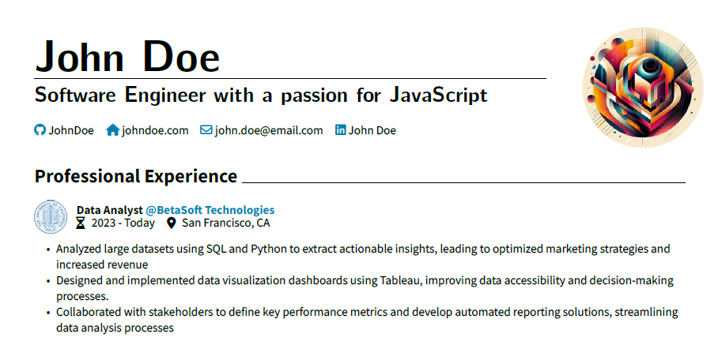

# CV Template in Typst

This is my CV template written in Typst. You can find a two example CVs in this repository as PDFs:

- [German CV](https://github.com/AnsgarLichter/light-cv/blob/main/cv-de.pdf)
- [English CV](https://github.com/AnsgarLichter/light-cv/blob/main/cv-en.pdf)

## Setup

To use the CV you have to install the font awesome fonts for the icons to work. Please refer to the [guide from the font awesome package](https://github.com/duskmoon314/typst-fontawesome).

## Customization

In the folder `settings` you will a file `styles.typ` which includes all used styles. You can customize them as you want to.

## Multi Language Support

If you want to add a new language, copy the `cv-en.typ` and rename it. Afterwards you can adapt the text correspondingly. Maybe I will introduce i18n in the future.

## Insipration

A big thanks to [brilliant-CV](https://github.com/mintyfrankie/brilliant-CV) as this project was an inspiraton for my CV and for the scripting.

## Questions & Issues

If you have questions, plase create a [discussion](https://github.com/AnsgarLichter/light-cv/discussions).
If you have an issue, please create an [issue](https://github.com/AnsgarLichter/light-cv/issues).
