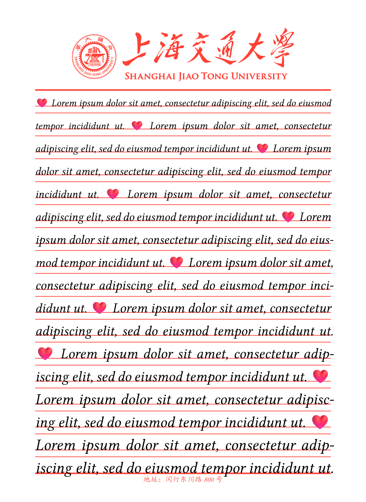
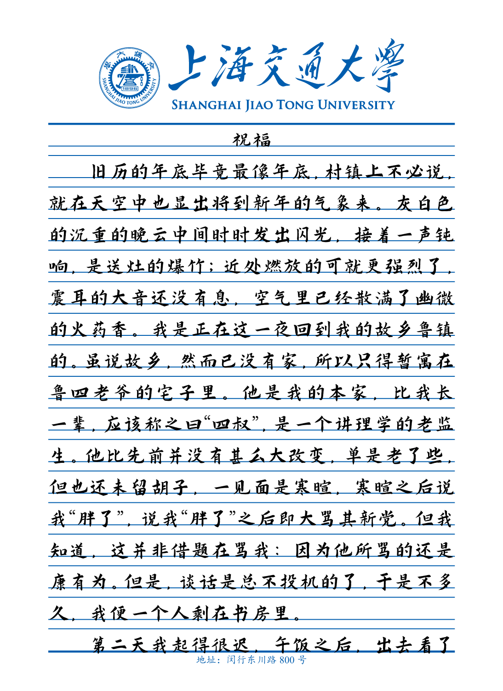

# linedx2-sjtu
上海交通大学双线纸的非官方复刻。Unofficial reproduction of Shanghai Jiao Tong University's double-lined paper.

> This template uses a fixed line spacing for different font sizes to align with the horizontal lines on the paper itself.
```typst
#import "@preview/linedx2-sjtu:0.1.0": template
#show: template
#set text(style: "italic")
#set par(justify: true)

#for i in range(15, 25) [
  #set text(size: i * 1pt)
  #emoji.heart #lorem(14)
]
```


> The template allows color changes and is suitable for handwritten fonts.
```typst
#import "@preview/linedx2-sjtu:0.1.0": template, footer
#import "@preview/kouhu:0.2.0": kouhu

#show: template.with(
  fill: blue.darken(20%),
  footer: fill => {
    set text(font: ("Times New Roman", "KaiTi"))
    footer(fill)
  },
)
// 演示秋鸿楷 https://mp.weixin.qq.com/s/CRnRsYu8ymlG9_oK6wmBag
#set text(font: "Slideqiuhong", size: 22pt)
#set par(justify: true, first-line-indent: 2em)

#align(center)[祝福]
#kouhu(builtin-text: "zhufu")
```

